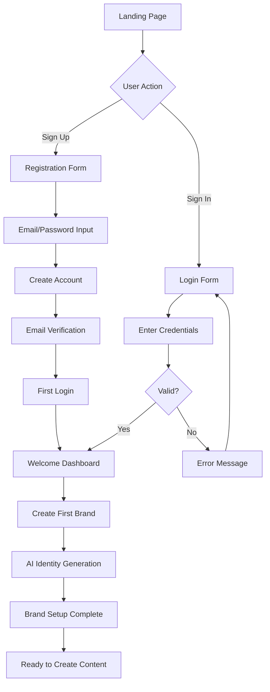
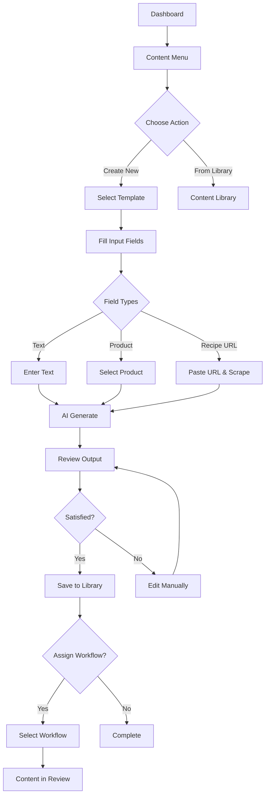
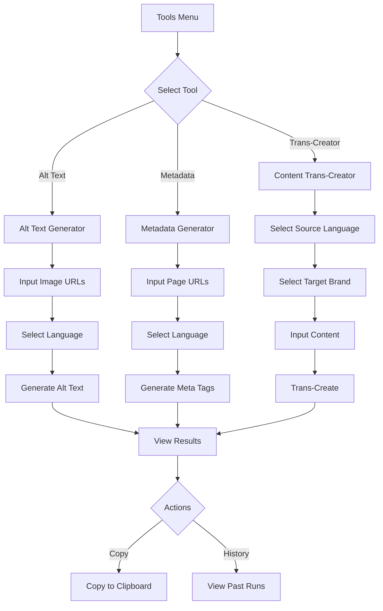
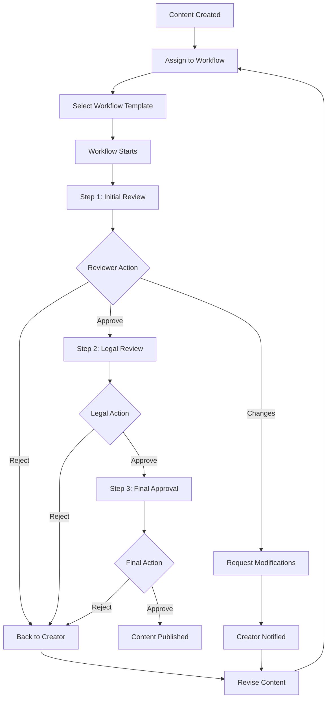
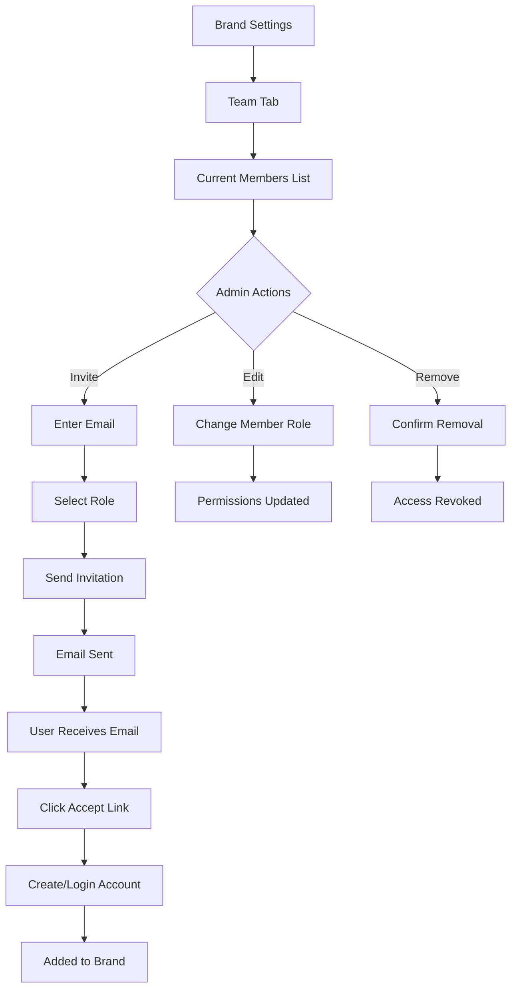
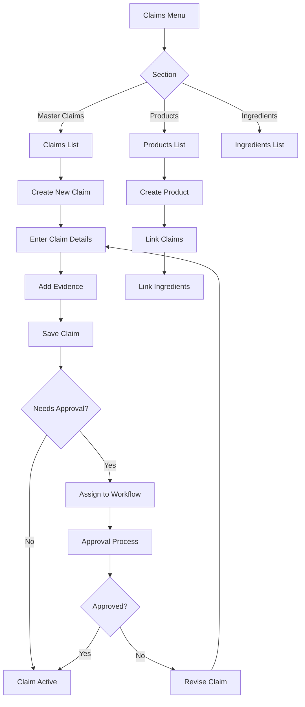

# MixerAI 2.0 User Flow Diagrams

## Visual User Journey Maps

### 1. New User Onboarding Flow



### 2. Content Creation Flow



### 3. AI Tools Workflow



### 4. Workflow Management Flow



### 5. Brand Team Management Flow



### 6. Claims Management Flow



---

## User Interaction Points

### Critical Decision Points 🔴
1. **Registration vs Login** - Clear CTAs needed
2. **Template Selection** - Must show preview/description
3. **Workflow Assignment** - Optional but important
4. **Approval/Rejection** - Clear consequences
5. **Role Assignment** - Permission implications

### Data Entry Points 📝
1. **Registration Form** - Email, password
2. **Brand Creation** - Name, URL, settings
3. **Content Fields** - Various input types
4. **Team Invitations** - Email, role selection
5. **Claims Entry** - Text, evidence, categories

### AI Integration Points 🤖
1. **Brand Identity** - Auto-generation on creation
2. **Content Generation** - Per template field
3. **Alt Text** - Batch image processing
4. **Metadata** - SEO optimization
5. **Trans-Creation** - Language adaptation

### Notification Triggers 📧
1. **Account Creation** - Welcome email
2. **Password Reset** - Reset link
3. **Team Invitation** - Invite email
4. **Workflow Assignment** - Task notification
5. **Workflow Updates** - Status changes
6. **Content Approval** - Completion notice

---

## Error Handling Flows

### Authentication Errors
```
Invalid Credentials → Error Message → Retry
Account Locked → Contact Support → Unlock Process
Email Not Verified → Resend Email → Verification
```

### Data Validation Errors
```
Invalid Input → Field Highlight → Error Message → Correction
Required Field → Prevent Submit → Show Required → Fill Field
Format Error → Show Example → Retry Input
```

### API/Network Errors
```
Timeout → Retry Option → Queue for Later
Rate Limit → Show Wait Time → Retry After Delay
Server Error → Error Page → Report Option → Fallback Action
```

### Permission Errors
```
Unauthorized → Show Message → Redirect to Allowed Area
Insufficient Role → Request Access → Admin Notification
Expired Session → Auto Logout → Login Prompt
```

---

## Success Metrics

### User Flow Completion Rates
- **Onboarding**: Target 80% completion
- **Content Creation**: Target 90% success
- **Workflow Execution**: Target 95% completion
- **Team Invitations**: Target 70% acceptance

### Time to Complete
- **Registration**: < 2 minutes
- **Brand Setup**: < 5 minutes
- **Content Creation**: < 10 minutes
- **AI Generation**: < 30 seconds
- **Workflow Step**: < 5 minutes

### Error Recovery
- **Form Errors**: < 3 attempts
- **API Retries**: < 2 attempts
- **Session Recovery**: Automatic
- **Data Persistence**: No loss on error