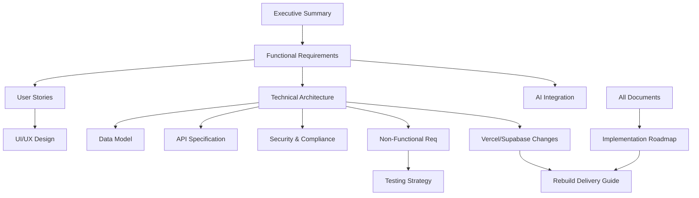

# MixerAI 2.0 Product Requirements Documentation
## Master Index

Version: 1.0  
Date: December 2024  
Status: Complete Rebuild from Scratch

---

## 📋 Document Overview

This master index provides navigation to all Product Requirements Documentation (PRD) for MixerAI 2.0. These documents collectively define a complete enterprise content management and AI generation platform designed for multi-brand organizations.

### 🎯 Purpose

MixerAI 2.0 enables marketing teams to:
- Create, manage, and approve content at scale across multiple brands
- Leverage AI for content generation while maintaining brand consistency
- Ensure regulatory compliance across global markets
- Streamline workflows and collaboration

### 📁 Document Structure

All documents are interconnected and should be read in the recommended order for full context. Cross-references are marked with `[→ Document Name]`.

---

## 📚 Core Documentation

### 1. [Executive Summary and Vision](./01-EXECUTIVE-SUMMARY.md)
**Purpose**: High-level overview of MixerAI 2.0's vision, goals, and value proposition  
**Audience**: Executives, stakeholders, product leadership  
**Contents**: Vision statement, business objectives, success metrics, market positioning

### 2. [Functional Requirements](./02-FUNCTIONAL-REQUIREMENTS.md)
**Purpose**: Detailed specification of all system features and capabilities  
**Audience**: Product managers, developers, QA engineers  
**Contents**: Feature specifications, acceptance criteria, user permissions matrix

### 3. [User Stories and Workflows](./03-USER-STORIES-WORKFLOWS.md)
**Purpose**: User journey mapping and detailed workflow specifications  
**Audience**: UX designers, developers, product managers  
**Contents**: User personas, journey maps, workflow diagrams, use cases

### 4. [Technical Architecture](./04-TECHNICAL-ARCHITECTURE.md)
**Purpose**: System design and technical implementation guidelines  
**Audience**: Architects, senior developers, DevOps engineers  
**Contents**: Architecture patterns, technology stack, scalability design, integration points

### 5. [Data Model and Schema](./05-DATA-MODEL-SCHEMA.md)
**Purpose**: Complete database design and data relationships  
**Audience**: Database engineers, backend developers  
**Contents**: Entity relationships, schema definitions, data governance, migration strategy

### 6. [API Specification](./06-API-SPECIFICATION.md)
**Purpose**: Comprehensive API design and endpoint documentation  
**Audience**: Backend developers, frontend developers, integration partners  
**Contents**: RESTful endpoints, GraphQL schema, authentication, rate limiting

### 7. [UI/UX Guidelines and Design System](./07-UI-UX-DESIGN-SYSTEM.md)
**Purpose**: User interface standards and component library  
**Audience**: UI/UX designers, frontend developers  
**Contents**: Design principles, component library, interaction patterns, accessibility

### 8. [Security and Compliance Requirements](./08-SECURITY-COMPLIANCE.md)
**Purpose**: Security architecture and regulatory compliance specifications  
**Audience**: Security engineers, compliance officers, developers  
**Contents**: Authentication/authorization, data protection, compliance frameworks, audit requirements

### 9. [AI Integration Specifications](./09-AI-INTEGRATION.md)
**Purpose**: Detailed AI capabilities and integration requirements  
**Audience**: AI/ML engineers, backend developers, product managers  
**Contents**: AI features, prompt engineering, model requirements, performance targets

### 10. [Non-Functional Requirements](./10-NON-FUNCTIONAL-REQUIREMENTS.md)
**Purpose**: Performance, reliability, and operational requirements  
**Audience**: Architects, DevOps, QA engineers  
**Contents**: Performance targets, availability SLAs, scalability requirements, monitoring

### 11. [Testing Strategy](./11-TESTING-STRATEGY.md)
**Purpose**: Comprehensive testing approach and quality assurance  
**Audience**: QA engineers, developers, DevOps  
**Contents**: Test types, coverage targets, automation strategy, performance testing

### 12. [Implementation Roadmap](./12-IMPLEMENTATION-ROADMAP.md)
**Purpose**: Phased delivery plan and release strategy  
**Audience**: Product managers, engineering leadership, stakeholders  
**Contents**: Release phases, timelines, dependencies, risk mitigation

### 13. [Rebuild Delivery Guide](./13-REBUILD-DELIVERY-GUIDE.md) 🆕
**Purpose**: Critical path for successful architecture implementation during rebuild  
**Audience**: Development team, architects, tech leads  
**Contents**: Phase 0 validation, architecture checkpoints, red flags, migration strategy

### 14. [Vercel/Supabase Architecture Changes](./VERCEL-SUPABASE-CHANGES.md) 🆕
**Purpose**: Summary of infrastructure updates from Kubernetes to Vercel/Supabase  
**Audience**: All stakeholders, development team  
**Contents**: Architecture changes, cost implications, technical benefits, tradeoffs

### 15. [Implementation Details](./14-IMPLEMENTATION-DETAILS.md) 🆕
**Purpose**: Detailed business logic and configuration specifications  
**Audience**: Development team  
**Contents**: Business rules, AI prompts, workflow logic, error handling, UI specifications

---

## 🔄 Document Relationships

---

## 📖 Reading Guide

### For Product Managers
1. Start with [Executive Summary](./01-EXECUTIVE-SUMMARY.md)
2. Review [Functional Requirements](./02-FUNCTIONAL-REQUIREMENTS.md)
3. Study [User Stories and Workflows](./03-USER-STORIES-WORKFLOWS.md)
4. Understand [AI Integration](./09-AI-INTEGRATION.md)
5. Review [Implementation Roadmap](./12-IMPLEMENTATION-ROADMAP.md)

### For Developers
1. Review [Technical Architecture](./04-TECHNICAL-ARCHITECTURE.md)
2. Study [Data Model](./05-DATA-MODEL-SCHEMA.md)
3. Reference [API Specification](./06-API-SPECIFICATION.md)
4. Understand [Security Requirements](./08-SECURITY-COMPLIANCE.md)
5. Review [Testing Strategy](./11-TESTING-STRATEGY.md)

### For Rebuild Implementation Team 🔴 CRITICAL
1. **FIRST**: Read [Rebuild Delivery Guide](./13-REBUILD-DELIVERY-GUIDE.md) - This is your north star
2. Review [Vercel/Supabase Changes](./VERCEL-SUPABASE-CHANGES.md)
3. Study [Technical Architecture](./04-TECHNICAL-ARCHITECTURE.md) with platform updates
4. Understand [Data Model](./05-DATA-MODEL-SCHEMA.md) especially RLS requirements
5. Complete Phase 0 validation before proceeding

### For Designers
1. Start with [User Stories](./03-USER-STORIES-WORKFLOWS.md)
2. Study [UI/UX Guidelines](./07-UI-UX-DESIGN-SYSTEM.md)
3. Review [Functional Requirements](./02-FUNCTIONAL-REQUIREMENTS.md)
4. Understand [Non-Functional Requirements](./10-NON-FUNCTIONAL-REQUIREMENTS.md)

---

## 🔄 Version History

| Version | Date | Changes | Author |
|---------|------|---------|---------|
| 1.0 | Dec 2024 | Initial complete PRD suite | Product Team |

---

## 📞 Contacts

**Product Owner**: [Product Manager Name]  
**Technical Lead**: [Tech Lead Name]  
**UX Lead**: [UX Lead Name]  
**Document Maintainer**: [Maintainer Name]

---

## ⚖️ Document Status

All documents in this PRD suite are considered **FINAL** for the initial build phase. Changes require formal change management process and version updates across all affected documents.

**Last Updated**: December 2024  
**Next Review**: Post-Phase 1 Implementation