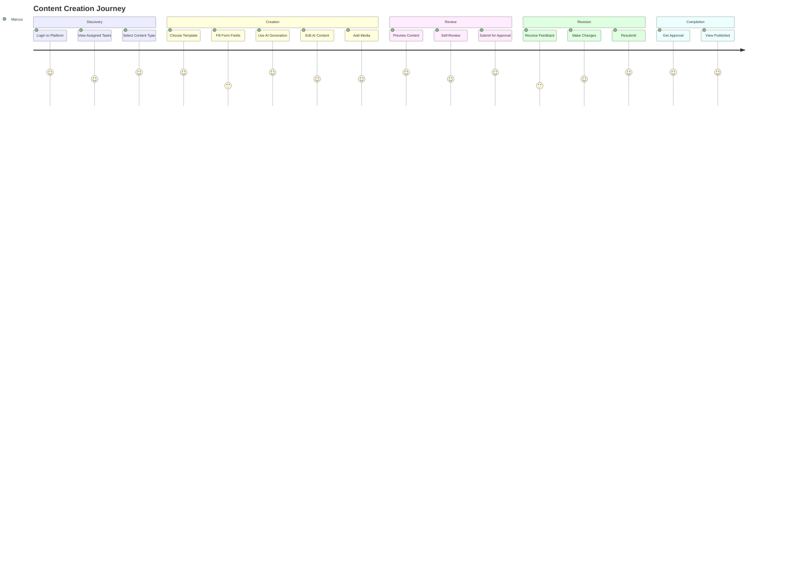
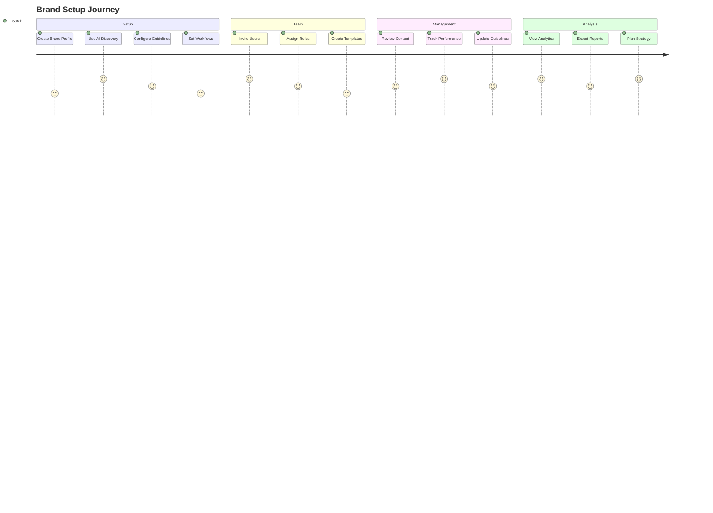
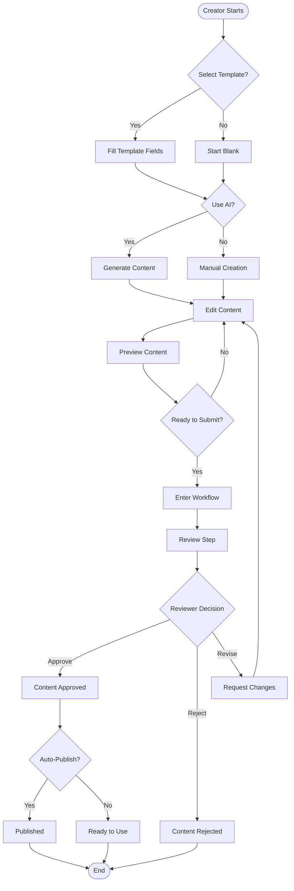
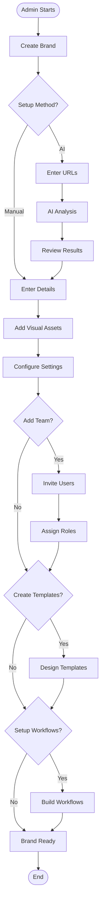
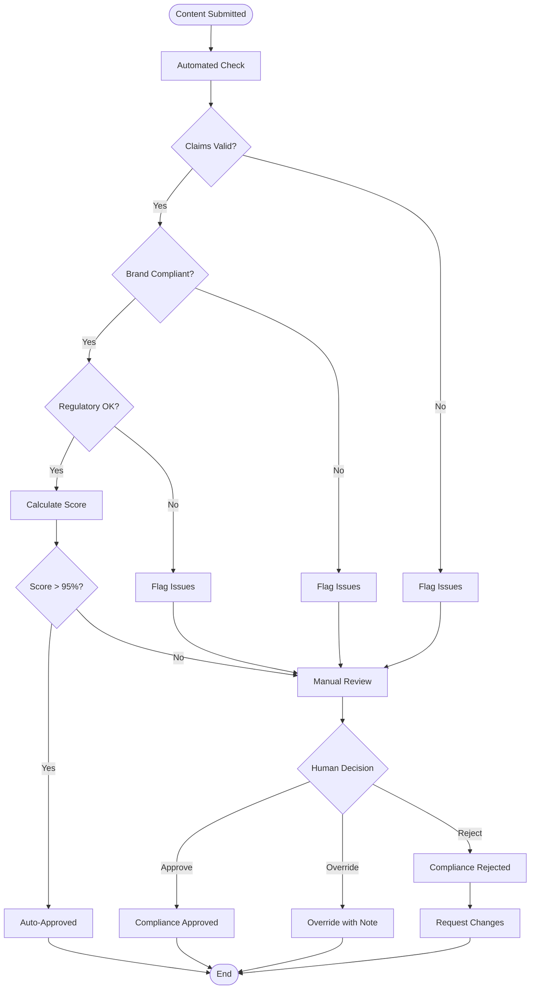

# MixerAI 2.0 User Stories and Workflows
## User Journeys and Process Documentation

Version: 1.0  
Date: December 2024  
[← Back to Functional Requirements](./02-FUNCTIONAL-REQUIREMENTS.md) | [Next: Technical Architecture →](./04-TECHNICAL-ARCHITECTURE.md)

---

## 📋 Table of Contents

1. [User Personas](#1-user-personas)
2. [User Journey Maps](#2-user-journey-maps)
3. [Epic User Stories](#3-epic-user-stories)
4. [Detailed User Stories](#4-detailed-user-stories)
5. [Workflow Diagrams](#5-workflow-diagrams)
6. [Use Case Scenarios](#6-use-case-scenarios)

---

## 1. User Personas

### 1.1 Primary Personas

#### Sarah Chen - Global Brand Manager
**Background**: 
- 10+ years in brand management
- Manages 5 brands across 20 markets
- Reports to CMO

**Goals**:
- Ensure brand consistency globally
- Speed up content production
- Maintain regulatory compliance
- Track content performance

**Pain Points**:
- Inconsistent brand messaging across markets
- Slow approval processes
- Difficulty tracking content usage
- Manual compliance checking

**Tech Comfort**: High

---

#### Marcus Rodriguez - Content Creator
**Background**:
- 5 years in content marketing
- Creates 20+ pieces weekly
- Works across 3 brands

**Goals**:
- Create engaging content quickly
- Meet tight deadlines
- Maintain quality standards
- Reduce revision cycles

**Pain Points**:
- Writer's block
- Repetitive tasks
- Unclear brand guidelines
- Multiple revision requests

**Tech Comfort**: Medium-High

---

#### Emma Thompson - Compliance Officer
**Background**:
- Legal/regulatory background
- Reviews all external content
- Manages claims database

**Goals**:
- Ensure 100% compliance
- Speed up review process
- Document all decisions
- Educate content teams

**Pain Points**:
- Manual claim checking
- Inconsistent submissions
- Lack of audit trail
- Repeated violations

**Tech Comfort**: Medium

---

### 1.2 Secondary Personas

#### David Kim - Regional Marketing Manager
**Background**:
- Manages APAC region
- Adapts global content locally
- 7 years experience

**Goals**:
- Localize content effectively
- Maintain brand essence
- Meet local regulations
- Optimize for local culture

**Pain Points**:
- Poor translations
- Cultural mismatches
- Local compliance issues
- Slow adaptation process

---

#### Lisa Johnson - External Agency Partner
**Background**:
- Creative director at agency
- Works with multiple clients
- Creates campaign content

**Goals**:
- Understand brand guidelines
- Get quick approvals
- Access brand assets
- Collaborate efficiently

**Pain Points**:
- Limited brand access
- Unclear feedback
- Version control issues
- Communication delays

---

## 2. User Journey Maps

### 2.1 Content Creator Journey

### 2.2 Brand Manager Journey

---

## 3. Epic User Stories

### EPIC-001: Brand Onboarding
**As a** Brand Manager  
**I want to** set up my brand quickly and comprehensively  
**So that** my team can start creating compliant content immediately

**Acceptance Criteria**:
- Complete brand setup in under 30 minutes
- AI assists in discovering brand attributes
- All team members invited and assigned roles
- Initial templates and workflows configured
- First content piece created within 1 hour

---

### EPIC-002: AI-Powered Content Creation
**As a** Content Creator  
**I want to** leverage AI to create content faster  
**So that** I can focus on strategy and creativity rather than repetitive tasks

**Acceptance Criteria**:
- Reduce content creation time by 70%
- Maintain brand voice in all generated content
- Support for 15+ languages
- Easy editing of AI suggestions
- Learn from user preferences over time

---

### EPIC-003: Compliance Management
**As a** Compliance Officer  
**I want to** automate claim validation and tracking  
**So that** we avoid regulatory issues and fines

**Acceptance Criteria**:
- 100% of content checked against claims database
- Real-time validation during creation
- Clear audit trail for all decisions
- Automated compliance reports
- Integration with regulatory updates

---

### EPIC-004: Global Collaboration
**As a** Regional Manager  
**I want to** adapt global content for my market  
**So that** it resonates with local audiences while maintaining brand consistency

**Acceptance Criteria**:
- Access to all global content
- AI-powered transcreation tools
- Local compliance checking
- Cultural adaptation suggestions
- Maintain version relationships

---

## 4. Detailed User Stories

### 4.1 Authentication & Access

#### US-001: First-Time Login
**As a** new user  
**I want to** complete my profile setup easily  
**So that** I can start using the platform immediately

**Acceptance Criteria**:
- [ ] Email verification works within 2 minutes
- [ ] Password requirements are clearly shown
- [ ] Profile wizard guides through setup
- [ ] Brand assignment is automatic from invitation
- [ ] Welcome tutorial is offered

**Priority**: High  
**Story Points**: 3

---

#### US-002: Brand Switching
**As a** multi-brand user  
**I want to** switch between brands seamlessly  
**So that** I can work efficiently across my assignments

**Acceptance Criteria**:
- [ ] Brand switcher in main navigation
- [ ] Current brand clearly indicated
- [ ] Permissions update immediately
- [ ] Recent brands shown first
- [ ] Keyboard shortcut available

**Priority**: High  
**Story Points**: 2

---

### 4.2 Content Management

#### US-003: Quick Content Creation
**As a** Content Creator  
**I want to** create content from templates  
**So that** I maintain consistency and save time

**Acceptance Criteria**:
- [ ] Template gallery is searchable
- [ ] Preview shows all fields
- [ ] Auto-save works every 30 seconds
- [ ] Progress indicator shows completion
- [ ] Can save and resume later

**Priority**: High  
**Story Points**: 5

---

#### US-004: AI Content Generation
**As a** Content Creator  
**I want to** generate content with one click  
**So that** I can overcome writer's block and meet deadlines

**Acceptance Criteria**:
- [ ] Generate all fields simultaneously
- [ ] Regenerate individual fields
- [ ] Edit inline after generation
- [ ] Loading indicators during generation
- [ ] Error handling for failures

**Priority**: High  
**Story Points**: 8

---

#### US-005: Content Review
**As a** Reviewer  
**I want to** provide clear feedback on content  
**So that** creators can make necessary changes quickly

**Acceptance Criteria**:
- [ ] Inline commenting on specific sections
- [ ] Overall feedback field
- [ ] Approve/Reject/Revise options
- [ ] Version comparison available
- [ ] Email notification to creator

**Priority**: High  
**Story Points**: 5

---

### 4.3 Brand Management

#### US-006: Brand Discovery
**As a** Brand Manager  
**I want to** generate brand profile from our website  
**So that** I save time and ensure accuracy

**Acceptance Criteria**:
- [ ] Accept multiple URLs
- [ ] Show analysis progress
- [ ] Extract key brand elements
- [ ] Allow editing of results
- [ ] Save as brand profile

**Priority**: Medium  
**Story Points**: 8

---

#### US-007: Team Management
**As a** Brand Manager  
**I want to** manage my team efficiently  
**So that** everyone has appropriate access and responsibilities

**Acceptance Criteria**:
- [ ] Bulk invite up to 50 users
- [ ] Set roles during invitation
- [ ] Track invitation status
- [ ] Manage existing users
- [ ] Export user list

**Priority**: High  
**Story Points**: 5

---

### 4.4 Workflow Management

#### US-008: Workflow Creation
**As a** Brand Manager  
**I want to** create custom approval workflows  
**So that** content follows our review process

**Acceptance Criteria**:
- [ ] Visual workflow builder
- [ ] Drag-drop step creation
- [ ] Conditional branching
- [ ] Test mode available
- [ ] Template workflows provided

**Priority**: Medium  
**Story Points**: 13

---

#### US-009: Task Management
**As a** Reviewer  
**I want to** manage my review tasks efficiently  
**So that** I don't become a bottleneck

**Acceptance Criteria**:
- [ ] Unified task inbox
- [ ] Priority indicators
- [ ] Due date visibility
- [ ] Bulk actions
- [ ] Calendar view

**Priority**: High  
**Story Points**: 5

---

### 4.5 AI Tools

#### US-010: Alt Text Generation
**As a** Content Creator  
**I want to** generate alt text for images automatically  
**So that** our content is accessible

**Acceptance Criteria**:
- [ ] Upload images or provide URLs
- [ ] Batch processing support
- [ ] Multi-language generation
- [ ] Edit generated text
- [ ] Copy to clipboard

**Priority**: Medium  
**Story Points**: 5

---

#### US-011: Metadata Generation
**As a** Content Creator  
**I want to** generate SEO metadata automatically  
**So that** our content performs well in search

**Acceptance Criteria**:
- [ ] Analyze page content
- [ ] Generate title and description
- [ ] Character count validation
- [ ] Preview in SERP format
- [ ] Keyword suggestions

**Priority**: Medium  
**Story Points**: 5

---

#### US-012: Content Transcreation
**As a** Regional Manager  
**I want to** adapt content for my market  
**So that** it resonates culturally while maintaining message

**Acceptance Criteria**:
- [ ] Select source and target language
- [ ] Show side-by-side comparison
- [ ] Explain adaptations made
- [ ] Maintain brand voice
- [ ] Flag potential issues

**Priority**: High  
**Story Points**: 8

---

### 4.6 Claims Management

#### US-013: Claims Configuration
**As a** Compliance Officer  
**I want to** manage product claims efficiently  
**So that** all content uses approved language

**Acceptance Criteria**:
- [ ] Hierarchical claim structure
- [ ] Country-specific rules
- [ ] Bulk import/export
- [ ] Version control
- [ ] Approval workflow

**Priority**: High  
**Story Points**: 8

---

#### US-014: Claims Validation
**As a** Content Creator  
**I want to** know if my content is compliant  
**So that** I avoid compliance issues

**Acceptance Criteria**:
- [ ] Real-time validation
- [ ] Clear error messages
- [ ] Suggested alternatives
- [ ] Override with reason
- [ ] Compliance score

**Priority**: High  
**Story Points**: 5

---

### 4.7 Analytics & Reporting

#### US-015: Performance Dashboard
**As a** Brand Manager  
**I want to** track content performance  
**So that** I can optimize our strategy

**Acceptance Criteria**:
- [ ] Real-time metrics
- [ ] Customizable widgets
- [ ] Drill-down capability
- [ ] Export to PDF/Excel
- [ ] Scheduled reports

**Priority**: Medium  
**Story Points**: 8

---

#### US-016: Personal Productivity
**As a** Content Creator  
**I want to** track my productivity  
**So that** I can improve my efficiency

**Acceptance Criteria**:
- [ ] Personal dashboard
- [ ] Creation metrics
- [ ] Approval rates
- [ ] Time tracking
- [ ] Goal setting

**Priority**: Low  
**Story Points**: 5

---

## 5. Workflow Diagrams

### 5.1 Content Creation Workflow

### 5.2 Brand Onboarding Workflow

### 5.3 Compliance Review Workflow

---

## 6. Use Case Scenarios

### 6.1 Scenario: Global Product Launch

**Context**: Sarah (Brand Manager) needs to create marketing materials for a new product launching in 15 countries.

**Steps**:
1. Sarah creates a product launch template with required fields
2. She configures AI prompts to include product benefits
3. Content team creates master content in English
4. System generates localized versions for all 15 markets
5. Regional managers review and adjust for cultural fit
6. Compliance team validates all claims per country
7. Legal approves via workflow
8. Content published to brand portal

**Success Metrics**:
- Time to market: 2 weeks (vs. 6 weeks traditional)
- Compliance rate: 100%
- Local relevance score: 4.5/5

---

### 6.2 Scenario: Emergency Recall Communication

**Context**: Emma (Compliance Officer) needs to communicate a product recall across all markets within 24 hours.

**Steps**:
1. Emma uses recall template with pre-approved language
2. System identifies affected markets automatically
3. AI generates country-specific versions with regulations
4. Emergency workflow bypasses normal approval
5. Senior management approves via mobile
6. Communications sent to all channels
7. Audit trail automatically generated

**Success Metrics**:
- Time to communicate: 4 hours
- Regulatory compliance: 100%
- Message consistency: 100%

---

### 6.3 Scenario: Seasonal Campaign Creation

**Context**: Marcus (Content Creator) needs to create Black Friday content for 5 brands.

**Steps**:
1. Marcus accesses Black Friday template gallery
2. Selects templates for each brand
3. Uses AI to generate initial content
4. Customizes offers and imagery per brand
5. Submits all for parallel review
6. Receives feedback in consolidated view
7. Makes bulk updates across brands
8. All content approved in single day

**Success Metrics**:
- Content pieces created: 50+
- Time saved: 80%
- Revision rounds: 1

---

### 6.4 Scenario: Agency Collaboration

**Context**: Lisa (Agency Partner) creates campaign content for client brand.

**Steps**:
1. Lisa receives guest access invitation
2. Reviews brand guidelines and assets
3. Creates campaign concepts in platform
4. Uses AI to ensure brand voice
5. Submits for client review
6. Participates in feedback discussions
7. Finalizes approved content
8. Exports for production

**Success Metrics**:
- Onboarding time: 30 minutes
- Approval cycles: 2 (vs. 5 typically)
- Client satisfaction: High

---

## 📊 User Story Priority Matrix

| Story | Impact | Effort | Priority | Sprint |
|-------|--------|--------|----------|--------|
| US-001 | High | Low | P0 | 1 |
| US-002 | High | Low | P0 | 1 |
| US-003 | High | Medium | P0 | 2 |
| US-004 | High | High | P0 | 3 |
| US-005 | High | Medium | P0 | 2 |
| US-006 | Medium | High | P1 | 4 |
| US-007 | High | Medium | P0 | 2 |
| US-008 | Medium | High | P1 | 5 |
| US-009 | High | Medium | P0 | 3 |
| US-010 | Medium | Medium | P1 | 4 |
| US-011 | Medium | Medium | P1 | 4 |
| US-012 | High | High | P0 | 3 |
| US-013 | High | High | P0 | 3 |
| US-014 | High | Medium | P0 | 3 |
| US-015 | Medium | High | P1 | 5 |
| US-016 | Low | Medium | P2 | 6 |

---

## 🔄 Workflow Best Practices

### Design Principles
1. **Minimize Steps**: No workflow should exceed 5 steps
2. **Clear Actions**: Each step has single, clear action
3. **Parallel Processing**: Enable simultaneous reviews
4. **Smart Routing**: Auto-assign based on workload
5. **Escape Hatches**: Allow escalation and bypass

### Common Workflows

1. **Simple Approval** (2 steps)
   - Create → Review → Publish

2. **Standard Marketing** (4 steps)
   - Create → Brand Review → Legal Review → Publish

3. **Regulated Content** (5 steps)
   - Create → Compliance Check → Medical Review → Legal Review → Final Approval

4. **Multi-Market** (3 steps + parallel)
   - Create → Local Adaptation (parallel) → Central Approval → Publish

---

[← Back to Functional Requirements](./02-FUNCTIONAL-REQUIREMENTS.md) | [Next: Technical Architecture →](./04-TECHNICAL-ARCHITECTURE.md)