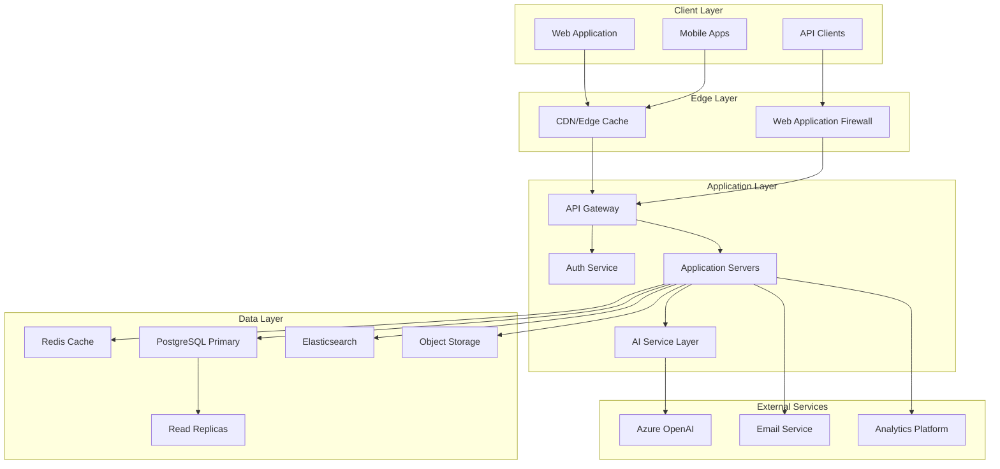

# MixerAI 2.0 Technical Architecture
## System Design and Implementation Guidelines

Version: 1.0  
Date: December 2024  
[← Back to User Stories](./03-USER-STORIES-WORKFLOWS.md) | [Next: Data Model →](./05-DATA-MODEL-SCHEMA.md)

---

## 📋 Table of Contents

1. [Architecture Overview](#1-architecture-overview)
2. [Technology Stack](#2-technology-stack)
3. [System Components](#3-system-components)
4. [Infrastructure Design](#4-infrastructure-design)
5. [Security Architecture](#5-security-architecture)
6. [Integration Architecture](#6-integration-architecture)
7. [Performance Architecture](#7-performance-architecture)
8. [Deployment Architecture](#8-deployment-architecture)

---

## 1. Architecture Overview

### 1.1 High-Level Architecture



### 1.2 Architecture Principles

#### Domain-Driven Design (DDD)
- **Bounded Contexts**: Content, Brand, User, AI, Workflow, Claims
- **Aggregates**: Maintain consistency boundaries
- **Domain Events**: Asynchronous communication between contexts
- **Repository Pattern**: Abstract data access

#### Event-Driven Architecture
- **Event Sourcing**: Complete audit trail of all changes
- **CQRS**: Separate read and write models for optimization
- **Event Bus**: Decoupled communication between services
- **Saga Pattern**: Manage distributed transactions

#### Cloud-Native Design
- **Containerization**: All services in Docker containers
- **Orchestration**: Kubernetes for container management
- **Service Mesh**: Istio for service communication
- **Observability**: OpenTelemetry for distributed tracing

---

## 2. Technology Stack

### 2.1 Frontend Technologies

#### Web Application
```yaml
Framework: Next.js 14 (App Router)
Language: TypeScript 5.0+
Styling: Tailwind CSS 3.0
UI Components: shadcn/ui (Radix UI primitives)
State Management: Zustand + React Query
Forms: React Hook Form + Zod
Build Tool: Turbopack
Testing: Jest + React Testing Library + Playwright
```

#### Mobile Applications
```yaml
Framework: React Native
Language: TypeScript
Navigation: React Navigation 6
State: Redux Toolkit + RTK Query
UI: Native Base + Custom Components
Testing: Jest + Detox
```

### 2.2 Backend Technologies

#### Application Services
```yaml
Runtime: Node.js 20 LTS
Framework: NestJS
Language: TypeScript 5.0+
API: GraphQL (Apollo Server) + REST
ORM: Prisma
Validation: class-validator + class-transformer
Testing: Jest + Supertest
Documentation: OpenAPI/Swagger
```

#### Microservices
```yaml
Communication: gRPC + Protocol Buffers
Message Queue: RabbitMQ
Event Streaming: Apache Kafka
Service Discovery: Consul
Configuration: Vault
```

### 2.3 Data Technologies

#### Primary Database
```yaml
Database: PostgreSQL 15
Extensions:
  - pgvector (AI embeddings)
  - pg_trgm (fuzzy search)
  - uuid-ossp (UUID generation)
  - pgcrypto (encryption)
Connection Pool: PgBouncer
Backup: Continuous archiving with PITR
```

#### Caching & Search
```yaml
Cache: Redis 7.0 (with Redis Modules)
Search: Elasticsearch 8.0
Vector Store: Pinecone (for AI context)
Time Series: TimescaleDB (metrics)
```

#### Object Storage
```yaml
Provider: AWS S3 / Azure Blob Storage
CDN: CloudFront / Azure CDN
Image Processing: Sharp + ImageMagick
Video Processing: FFmpeg
```

### 2.4 AI/ML Stack

```yaml
Primary: Azure OpenAI Service
Fallback: OpenAI API
Alternative: Anthropic Claude API
Embeddings: text-embedding-ada-002
Local Models: ONNX Runtime
ML Framework: TensorFlow.js
Prompt Management: LangChain
```

### 2.5 Infrastructure

```yaml
Hosting Platform: Vercel
Database Platform: Supabase
Edge Network: Vercel Global Edge Network
Serverless Runtime: Node.js 20
API Framework: Next.js 14 App Router
CDN: Vercel Edge Cache
Monitoring: Vercel Analytics + Monitoring
Logging: Vercel Logs + Datadog Integration
APM: Sentry + Vercel Speed Insights
```

---

## 3. System Components

### 3.1 Core Services

#### Authentication Service
```typescript
interface AuthService {
  // User authentication
  login(credentials: LoginDto): Promise<AuthTokens>
  logout(userId: string): Promise<void>
  refresh(refreshToken: string): Promise<AuthTokens>
  
  // Session management
  validateSession(token: string): Promise<Session>
  extendSession(sessionId: string): Promise<void>
  revokeAllSessions(userId: string): Promise<void>
  
  // MFA
  enableMFA(userId: string): Promise<MFASecret>
  verifyMFA(userId: string, code: string): Promise<boolean>
  
  // SSO
  initiateSAML(provider: string): Promise<SAMLRequest>
  handleSAMLResponse(response: SAMLResponse): Promise<User>
}
```

#### Brand Service
```typescript
interface BrandService {
  // Brand management
  createBrand(data: CreateBrandDto): Promise<Brand>
  updateBrand(id: string, data: UpdateBrandDto): Promise<Brand>
  generateBrandProfile(urls: string[]): Promise<BrandProfile>
  
  // User management
  assignUser(brandId: string, userId: string, role: Role): Promise<void>
  removeUser(brandId: string, userId: string): Promise<void>
  
  // Configuration
  updateSettings(brandId: string, settings: BrandSettings): Promise<void>
  assignWorkflows(brandId: string, workflows: string[]): Promise<void>
}
```

#### Content Service
```typescript
interface ContentService {
  // CRUD operations
  create(data: CreateContentDto): Promise<Content>
  update(id: string, data: UpdateContentDto): Promise<Content>
  delete(id: string): Promise<void>
  
  // Versioning
  createVersion(contentId: string): Promise<Version>
  compareVersions(v1: string, v2: string): Promise<Diff>
  restoreVersion(contentId: string, versionId: string): Promise<Content>
  
  // Search
  search(query: SearchQuery): Promise<SearchResults>
  suggest(partial: string): Promise<Suggestions>
  
  // Bulk operations
  bulkUpdate(ids: string[], updates: Partial<Content>): Promise<void>
  bulkDelete(ids: string[]): Promise<void>
}
```

#### AI Service
```typescript
interface AIService {
  // Content generation
  generateFromTemplate(template: Template, context: Context): Promise<GeneratedContent>
  generateField(field: Field, context: Context): Promise<string>
  
  // Enhancements
  generateMetadata(url: string, content?: string): Promise<Metadata>
  generateAltText(imageUrl: string, lang: string): Promise<string>
  transcreateContent(content: string, targetLang: string): Promise<string>
  
  // Analysis
  analyzeBrand(urls: string[]): Promise<BrandAnalysis>
  reviewClaims(claims: Claim[], country: string): Promise<ClaimReview[]>
  
  // Optimization
  suggestTitles(content: string, count: number): Promise<string[]>
  extractKeywords(content: string): Promise<string[]>
}
```

### 3.2 Domain Models

#### Content Aggregate
```typescript
class Content {
  id: UUID
  brandId: UUID
  templateId?: UUID
  type: ContentType
  status: ContentStatus
  
  // Content data
  title: string
  fields: Map<string, any>
  metadata: Metadata
  
  // Versioning
  version: number
  versions: Version[]
  
  // Workflow
  workflowId?: UUID
  currentStep?: WorkflowStep
  
  // Audit
  createdBy: UUID
  createdAt: DateTime
  updatedBy: UUID
  updatedAt: DateTime
  
  // Methods
  publish(): void
  archive(): void
  submitForReview(): void
  approve(): void
  reject(reason: string): void
}
```

#### Brand Aggregate
```typescript
class Brand {
  id: UUID
  name: string
  description: string
  
  // Identity
  identity: BrandIdentity
  toneOfVoice: string
  guardrails: string[]
  colors: BrandColors
  logo?: Media
  
  // Configuration
  country: Country
  language: Language
  allowedContentTypes: ContentType[]
  workflows: Workflow[]
  
  // Users
  users: UserBrandRole[]
  
  // Relationships
  masterClaimBrands: UUID[]
  
  // Methods
  assignUser(userId: UUID, role: Role): void
  removeUser(userId: UUID): void
  updateIdentity(identity: Partial<BrandIdentity>): void
}
```

### 3.3 Event System

#### Domain Events
```typescript
// Content events
class ContentCreatedEvent {
  contentId: UUID
  brandId: UUID
  userId: UUID
  timestamp: DateTime
}

class ContentPublishedEvent {
  contentId: UUID
  brandId: UUID
  publishedBy: UUID
  timestamp: DateTime
}

// Workflow events
class WorkflowStartedEvent {
  workflowId: UUID
  contentId: UUID
  initiatedBy: UUID
  timestamp: DateTime
}

class WorkflowCompletedEvent {
  workflowId: UUID
  contentId: UUID
  outcome: 'approved' | 'rejected'
  timestamp: DateTime
}

// AI events
class AIGenerationRequestedEvent {
  requestId: UUID
  type: AIGenerationType
  userId: UUID
  brandId: UUID
  timestamp: DateTime
}

class AIGenerationCompletedEvent {
  requestId: UUID
  success: boolean
  tokensUsed: number
  duration: number
  timestamp: DateTime
}
```

---

## 4. Infrastructure Design

### 4.1 Deployment Architecture

#### Vercel Deployment Strategy
```yaml
Project Structure:
  - Production: mixerai.com
  - Staging: staging.mixerai.com  
  - Preview: PR-based deployments
  - Development: Local Next.js dev server

Build Configuration:
  - Framework: Next.js 14
  - Node Version: 20.x
  - Package Manager: npm
  - Build Command: npm run build
  - Output Directory: .next

Function Configuration:
  - Runtime: Node.js 20.x
  - Memory: 1024 MB (default), 3008 MB (AI routes)
  - Timeout: 10s (default), 60s (AI routes)
  - Regions: Auto (Edge Network)
```

#### Serverless Architecture
```yaml
API Routes:
  /api/auth/*:
    - Edge Runtime for speed
    - JWT validation
    - Session management
    
  /api/content/*:
    - Serverless Functions
    - Database connections
    - File processing
    
  /api/ai/*:
    - Serverless Functions
    - Extended timeout (60s)
    - Higher memory allocation
    
  /api/realtime/*:
    - Supabase Realtime
    - WebSocket connections
    - Live updates

Static Assets:
  - Automatic optimization
  - Global CDN distribution
  - Image optimization API
  - Font optimization

Environment Management:
  - Production secrets
  - Preview env variables
  - Automatic HTTPS
  - Custom domains
```

### 4.2 Network Architecture

#### Vercel Edge Network
```yaml
Global Distribution:
  - Edge locations worldwide
  - Automatic routing to nearest region
  - DDoS protection built-in
  - SSL/TLS termination at edge

Middleware Configuration:
  - Authentication checks
  - Rate limiting (using KV store)
  - CORS policies
  - Request validation
  - Logging and analytics

Caching Strategy:
  - Static assets: Immutable, 1 year
  - API responses: Cache-Control headers
  - ISR pages: On-demand revalidation
  - Edge caching: Stale-while-revalidate
```

#### API Architecture
```yaml
Next.js App Router:
  - File-based routing
  - Route handlers for APIs
  - Middleware for cross-cutting concerns
  - Streaming responses support

Supabase Integration:
  - Direct database queries
  - Row Level Security (RLS)
  - Realtime subscriptions
  - Storage API for files
  - Auth integration

Rate Limiting:
  - Vercel KV for counters
  - Sliding window algorithm
  - Per-user and per-IP limits
  - Configurable thresholds
```

### 4.3 Data Architecture

#### Supabase Database
```yaml
PostgreSQL Configuration:
  - Version: 15.x (managed by Supabase)
  - Plan: Pro tier (8 vCPU, 32GB RAM)
  - Connection pooling: Supavisor
  - Max connections: 200
  - Storage: 500GB included

Supabase Features:
  - Row Level Security (RLS)
  - Realtime subscriptions
  - Database webhooks
  - Point-in-time recovery (7 days)
  - Daily backups (30 day retention)
  - Read replicas (optional)

Connection Management:
  - Pooler URL for serverless
  - Direct connection for migrations
  - SSL required
  - Connection limits per function
```

#### Caching Strategy
```yaml
Cache Layers:
  L1: Next.js in-memory cache
  L2: Vercel KV (Redis-compatible)
  L3: Vercel Edge Cache (CDN)

Cache Patterns:
  - ISR for content pages
  - SWR for client-side data
  - KV for session data
  - Edge caching for API responses

TTL Strategy:
  - User sessions: 8 hours (KV)
  - Brand data: stale-while-revalidate
  - Content: ISR with on-demand updates
  - AI responses: 24 hours (KV)
```

---

## 5. Security Architecture

### 5.1 Authentication & Authorization

#### Multi-Factor Authentication
```typescript
interface MFAStrategy {
  TOTP: {
    algorithm: 'SHA256'
    digits: 6
    period: 30
    window: 1
  }
  
  WebAuthn: {
    rpId: 'mixerai.com'
    rpName: 'MixerAI'
    attestation: 'direct'
    userVerification: 'required'
  }
  
  Backup: {
    codes: 10
    length: 8
    algorithm: 'random'
  }
}
```

#### Authorization Model
```typescript
// Attribute-Based Access Control (ABAC)
interface Policy {
  subject: {
    userId: UUID
    roles: Role[]
    attributes: Map<string, any>
  }
  
  resource: {
    type: ResourceType
    id: UUID
    brandId: UUID
    attributes: Map<string, any>
  }
  
  action: Action
  
  conditions: Condition[]
}

// Example policy
const canEditContent: Policy = {
  subject: { roles: ['editor', 'admin'] },
  resource: { type: 'content' },
  action: 'edit',
  conditions: [
    { attribute: 'resource.brandId', operator: 'in', value: 'subject.brands' },
    { attribute: 'resource.status', operator: '!=', value: 'published' }
  ]
}
```

### 5.2 Data Security

#### Encryption at Rest
```yaml
Database:
  - Transparent Data Encryption (TDE)
  - Column-level encryption for PII
  - Key rotation every 90 days

File Storage:
  - AES-256 encryption
  - Customer-managed keys (CMK)
  - Versioned encryption keys

Secrets Management:
  - HashiCorp Vault
  - Dynamic secrets for databases
  - Automatic rotation
  - Audit logging
```

#### Encryption in Transit
```yaml
External Traffic:
  - TLS 1.3 minimum
  - Strong cipher suites only
  - HSTS with preload
  - Certificate pinning for mobile

Internal Traffic:
  - mTLS between services
  - Service mesh encryption
  - No plain HTTP allowed
  - Certificate rotation
```

### 5.3 Security Controls

#### Input Validation
```typescript
// Zod schema example
const CreateContentSchema = z.object({
  title: z.string()
    .min(1)
    .max(200)
    .regex(/^[^<>]*$/, 'No HTML allowed'),
    
  brandId: z.string().uuid(),
  
  fields: z.record(z.string(), z.any())
    .refine(fields => {
      // Custom validation logic
      return Object.keys(fields).length <= 50
    }, 'Too many fields'),
    
  metadata: MetadataSchema.optional()
})

// Sanitization
const sanitizeHtml = (html: string): string => {
  return DOMPurify.sanitize(html, {
    ALLOWED_TAGS: ['p', 'br', 'strong', 'em', 'u', 'a'],
    ALLOWED_ATTR: ['href', 'target']
  })
}
```

#### Rate Limiting
```typescript
interface RateLimitConfig {
  endpoints: {
    '/api/auth/*': {
      window: '15m',
      max: 10,
      keyBy: 'ip'
    },
    '/api/ai/*': {
      window: '15m',
      max: 50,
      keyBy: 'user'
    },
    '/api/*': {
      window: '15m',
      max: 100,
      keyBy: 'user'
    }
  },
  
  storage: 'redis',
  
  responses: {
    tooManyRequests: {
      status: 429,
      message: 'Rate limit exceeded',
      headers: {
        'Retry-After': '{{retryAfter}}',
        'X-RateLimit-Limit': '{{limit}}',
        'X-RateLimit-Remaining': '{{remaining}}',
        'X-RateLimit-Reset': '{{reset}}'
      }
    }
  }
}
```

---

## 6. Integration Architecture

### 6.1 External Service Integration

#### AI Provider Integration
```typescript
interface AIProviderAdapter {
  // Provider-agnostic interface
  generateCompletion(prompt: string, options: CompletionOptions): Promise<string>
  generateEmbedding(text: string): Promise<number[]>
  
  // Provider-specific implementations
  providers: {
    azureOpenAI: AzureOpenAIProvider
    openAI: OpenAIProvider
    anthropic: AnthropicProvider
  }
  
  // Fallback strategy
  fallbackChain: ['azureOpenAI', 'openAI', 'anthropic']
  
  // Circuit breaker per provider
  circuitBreakers: Map<string, CircuitBreaker>
}

class AIServiceFacade {
  async generate(request: AIRequest): Promise<AIResponse> {
    // Select best provider based on:
    // - Request type
    // - Cost optimization
    // - Availability
    // - Performance metrics
    
    const provider = this.selectProvider(request)
    
    try {
      return await this.executeWithFallback(provider, request)
    } catch (error) {
      // Log, metric, alert
      throw new AIServiceError('All providers failed', error)
    }
  }
}
```

#### Email Service Integration
```typescript
interface EmailProvider {
  send(email: Email): Promise<EmailResult>
  getBounces(): Promise<Bounce[]>
  getComplaints(): Promise<Complaint[]>
}

class EmailService {
  providers: {
    primary: SendGridProvider
    fallback: AWSEmailProvider
  }
  
  async send(email: Email): Promise<void> {
    // Template rendering
    const rendered = await this.renderTemplate(email.template, email.data)
    
    // Send with retry and fallback
    await this.sendWithFallback({
      ...email,
      html: rendered.html,
      text: rendered.text
    })
    
    // Track delivery
    await this.trackEmail(email)
  }
}
```

### 6.2 Internal Service Communication

#### Service Discovery
```yaml
Consul Configuration:
  Services:
    - name: auth-service
      port: 3000
      tags: ['api', 'v1']
      health_check:
        http: http://localhost:3000/health
        interval: 10s
        
    - name: content-service
      port: 3001
      tags: ['api', 'v1']
      health_check:
        grpc: localhost:3001
        interval: 10s

  Key/Value Store:
    - /config/features/flags
    - /config/services/limits
    - /config/security/policies
```

#### Inter-Service Communication
```typescript
// gRPC service definition
service ContentService {
  rpc CreateContent(CreateContentRequest) returns (Content);
  rpc GetContent(GetContentRequest) returns (Content);
  rpc UpdateContent(UpdateContentRequest) returns (Content);
  rpc DeleteContent(DeleteContentRequest) returns (Empty);
  
  // Streaming for bulk operations
  rpc BulkCreateContent(stream CreateContentRequest) returns (stream Content);
}

// Event-driven communication
interface EventBus {
  publish<T extends DomainEvent>(event: T): Promise<void>
  subscribe<T extends DomainEvent>(
    eventType: string,
    handler: (event: T) => Promise<void>
  ): Subscription
}

// Saga orchestration
class ContentPublishingSaga {
  steps = [
    this.validateContent,
    this.checkCompliance,
    this.generateMetadata,
    this.publishToChannels,
    this.notifyStakeholders
  ]
  
  compensations = [
    this.unpublishContent,
    this.revertMetadata,
    this.notifyFailure
  ]
}
```

### 6.3 API Design

#### GraphQL Schema
```graphql
type Query {
  # Brand queries
  brand(id: ID!): Brand
  brands(filter: BrandFilter, pagination: Pagination): BrandConnection!
  
  # Content queries
  content(id: ID!): Content
  contents(filter: ContentFilter, pagination: Pagination): ContentConnection!
  searchContent(query: String!, options: SearchOptions): SearchResults!
  
  # User queries
  me: User!
  user(id: ID!): User
  users(filter: UserFilter, pagination: Pagination): UserConnection!
}

type Mutation {
  # Brand mutations
  createBrand(input: CreateBrandInput!): Brand!
  updateBrand(id: ID!, input: UpdateBrandInput!): Brand!
  deleteBrand(id: ID!): Boolean!
  
  # Content mutations
  createContent(input: CreateContentInput!): Content!
  updateContent(id: ID!, input: UpdateContentInput!): Content!
  publishContent(id: ID!): Content!
  
  # AI mutations
  generateContent(input: GenerateContentInput!): GeneratedContent!
  generateMetadata(url: String!): Metadata!
}

type Subscription {
  # Real-time updates
  contentStatusChanged(brandId: ID!): ContentStatusUpdate!
  workflowProgress(contentId: ID!): WorkflowUpdate!
  aiGenerationProgress(requestId: ID!): AIProgress!
}
```

#### REST API Design
```yaml
API Standards:
  - RESTful resource naming
  - Consistent HTTP methods
  - Standard status codes
  - HATEOAS links
  - API versioning in URL

Response Format:
  Success:
    {
      "success": true,
      "data": { ... },
      "meta": {
        "timestamp": "2024-12-01T12:00:00Z",
        "version": "1.0"
      }
    }
    
  Error:
    {
      "success": false,
      "error": {
        "code": "VALIDATION_ERROR",
        "message": "Invalid input",
        "details": [ ... ],
        "requestId": "uuid"
      }
    }
    
  Pagination:
    {
      "data": [ ... ],
      "pagination": {
        "page": 1,
        "pageSize": 20,
        "totalPages": 10,
        "totalItems": 200
      },
      "links": {
        "self": "/api/v1/contents?page=1",
        "next": "/api/v1/contents?page=2",
        "prev": null,
        "first": "/api/v1/contents?page=1",
        "last": "/api/v1/contents?page=10"
      }
    }
```

---

## 7. Performance Architecture

### 7.1 Performance Requirements

```yaml
Response Times:
  - API: p95 < 200ms, p99 < 500ms
  - Web: First Paint < 1s, TTI < 3s
  - Search: < 100ms
  - AI Generation: < 5s

Throughput:
  - API: 10,000 req/s
  - WebSocket: 50,000 concurrent
  - Background Jobs: 1,000/s

Resource Limits:
  - CPU: 80% max sustained
  - Memory: 85% max
  - Disk I/O: 70% max
  - Network: 1Gbps per pod
```

### 7.2 Optimization Strategies

#### Database Optimization
```sql
-- Indexes for common queries
CREATE INDEX idx_content_brand_status ON contents(brand_id, status) WHERE deleted_at IS NULL;
CREATE INDEX idx_content_search ON contents USING gin(to_tsvector('english', title || ' ' || content));
CREATE INDEX idx_users_email ON users(lower(email));

-- Materialized views for analytics
CREATE MATERIALIZED VIEW content_analytics AS
SELECT 
  brand_id,
  DATE_TRUNC('day', created_at) as date,
  COUNT(*) as content_count,
  COUNT(CASE WHEN status = 'published' THEN 1 END) as published_count
FROM contents
GROUP BY brand_id, DATE_TRUNC('day', created_at);

-- Partitioning for large tables
CREATE TABLE contents_2024 PARTITION OF contents
FOR VALUES FROM ('2024-01-01') TO ('2025-01-01');
```

#### Caching Strategy
```typescript
class CacheService {
  // Multi-level caching
  private memoryCache: LRUCache
  private redisCache: RedisClient
  
  async get<T>(key: string): Promise<T | null> {
    // L1: Memory cache (fastest)
    const memResult = this.memoryCache.get(key)
    if (memResult) return memResult
    
    // L2: Redis cache
    const redisResult = await this.redisCache.get(key)
    if (redisResult) {
      this.memoryCache.set(key, redisResult)
      return redisResult
    }
    
    return null
  }
  
  // Cache warming
  async warmCache(): Promise<void> {
    // Pre-load frequently accessed data
    const brands = await this.brandService.getPopular()
    const templates = await this.templateService.getActive()
    
    await Promise.all([
      ...brands.map(b => this.set(`brand:${b.id}`, b)),
      ...templates.map(t => this.set(`template:${t.id}`, t))
    ])
  }
}
```

#### Query Optimization
```typescript
// N+1 query prevention with DataLoader
class ContentLoader extends DataLoader<string, Content> {
  async batchLoad(ids: string[]): Promise<Content[]> {
    const contents = await db.content.findMany({
      where: { id: { in: ids } },
      include: {
        brand: true,
        creator: true,
        assignees: true
      }
    })
    
    // Maintain order
    return ids.map(id => contents.find(c => c.id === id))
  }
}

// GraphQL resolver optimization
const resolvers = {
  Content: {
    brand: (content, args, { loaders }) => 
      loaders.brand.load(content.brandId),
    creator: (content, args, { loaders }) => 
      loaders.user.load(content.creatorId)
  }
}
```

### 7.3 Scalability Design

#### Horizontal Scaling
```yaml
Service Scaling:
  API Services:
    - Min replicas: 3
    - Max replicas: 50
    - Target CPU: 70%
    - Scale up rate: 100% (double)
    - Scale down rate: 10% (gradual)
    
  AI Services:
    - Min replicas: 2
    - Max replicas: 20
    - Custom metric: pending_requests
    - Target value: 10
    
  Background Workers:
    - Min replicas: 5
    - Max replicas: 100
    - Queue depth metric
    - Target: 100 messages

Database Scaling:
  Read Replicas:
    - Auto-add at 80% CPU
    - Max replicas: 5
    - Load balancing: Least connections
    
  Connection Pooling:
    - Dynamic pool sizing
    - Max connections: 1000
    - Overflow: 20%
```

#### Scaling Configuration
```yaml
Vercel Auto-scaling:
  Functions:
    - Automatic based on load
    - No configuration needed
    - Global distribution
    
  Function Sizing:
    Standard Routes:
      - Memory: 1024 MB
      - Timeout: 10s
    AI Routes:
      - Memory: 3008 MB  
      - Timeout: 60s
      
  Supabase Scaling:
    - Compute: 8 vCPU baseline
    - Upgrade path: 16, 32, 64 vCPU
    - Storage: Auto-scaling
    - Connections: Pooler handles scaling
```

---

## 8. Deployment Architecture

### 8.1 CI/CD Pipeline

```yaml
Vercel Git Integration:
  1. Source:
    - GitHub integration
    - Branch protection rules
    - PR preview deployments
    
  2. Build:
    - Automatic Next.js optimization
    - Dependency caching
    - Environment variable injection
    - Build-time checks
    
  3. Quality Checks:
    - ESLint/TypeScript checks
    - Unit tests (via GitHub Actions)
    - Lighthouse CI
    - Bundle size analysis
    
  4. Deploy:
    - Automatic deployments
    - Instant rollbacks
    - Preview URLs for PRs
    - Production promotion
    
  5. Monitor:
    - Vercel Analytics
    - Speed Insights
    - Error tracking (Sentry)
    - Custom monitoring
```

### 8.2 Environment Strategy

```yaml
Environments:
  Local Development:
    - Next.js dev server
    - Local Supabase (optional)
    - Hot module replacement
    - Debug tools enabled
    
  Preview (PR Deployments):
    - Unique URL per PR
    - Isolated env variables
    - Comments in GitHub
    - Shareable previews
    
  Staging:
    - staging.mixerai.com
    - Production-like data
    - Full feature set
    - Performance testing
    
  Production:
    - mixerai.com
    - Automatic SSL
    - Global distribution
    - Zero-downtime deploys
```

### 8.3 Observability

#### Monitoring Stack
```yaml
Vercel Native:
  - Analytics: User and performance metrics
  - Speed Insights: Core Web Vitals
  - Functions: Execution logs
  - Build Logs: Deployment details
  
Integrations:
  - Sentry: Error tracking
  - Datadog: APM and logs
  - LogDNA: Log aggregation
  - Custom webhooks
  
Supabase Monitoring:
  - Database metrics dashboard
  - Query performance insights
  - Realtime connection stats
  - Storage usage tracking
```

#### Key Metrics
```yaml
Business Metrics:
  - Content creation rate
  - AI generation success rate
  - User engagement
  - Time to publish
  
Technical Metrics:
  - API latency (p50, p95, p99)
  - Error rate by endpoint
  - Database query time
  - Cache hit rate
  
Infrastructure Metrics:
  - CPU/Memory utilization
  - Disk I/O
  - Network throughput
  - Pod restart rate
```

---

## 📊 Architecture Decision Records (ADRs)

### ADR-001: Microservices vs Modular Monolith
**Decision**: Start with modular monolith, prepare for microservices  
**Rationale**: Faster initial development, easier debugging, simpler deployment  
**Consequences**: Need clear module boundaries, eventual migration path

### ADR-002: GraphQL vs REST
**Decision**: GraphQL for primary API, REST for specific use cases  
**Rationale**: Better client flexibility, reduced over-fetching, type safety  
**Consequences**: Learning curve, complexity in caching, need for rate limiting

### ADR-003: PostgreSQL vs NoSQL
**Decision**: PostgreSQL as primary database  
**Rationale**: ACID compliance, rich querying, JSON support, proven scale  
**Consequences**: Need proper indexing, connection pooling, read replicas

### ADR-004: Azure OpenAI vs Direct OpenAI
**Decision**: Azure OpenAI as primary, OpenAI as fallback  
**Rationale**: Enterprise SLA, data residency, compliance, security  
**Consequences**: Potential vendor lock-in, need fallback strategy

---

[← Back to User Stories](./03-USER-STORIES-WORKFLOWS.md) | [Next: Data Model →](./05-DATA-MODEL-SCHEMA.md)