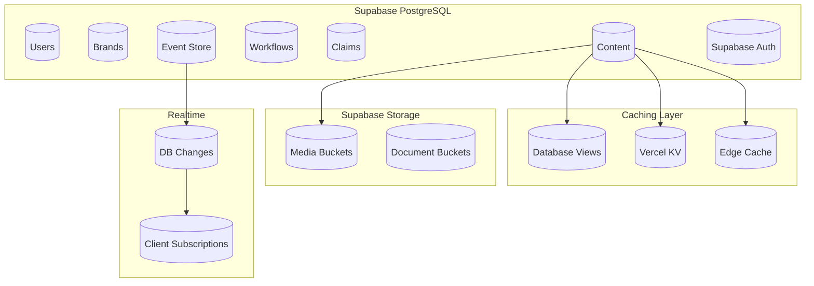
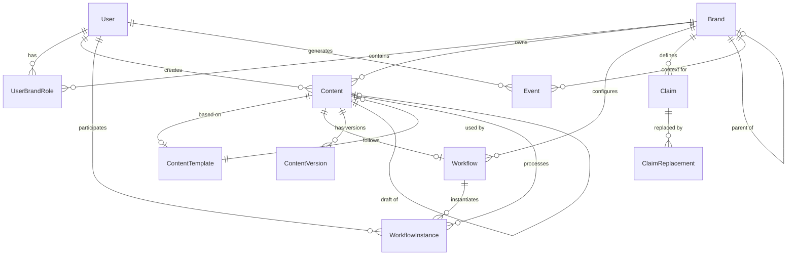

# MixerAI 2.0 Data Model and Schema
## Database Design and Data Architecture

Version: 1.0  
Date: December 2024  
[← Back to Technical Architecture](./04-TECHNICAL-ARCHITECTURE.md) | [Next: API Specification →](./06-API-SPECIFICATION.md)

---

## 📋 Table of Contents

1. [Data Architecture Overview](#1-data-architecture-overview)
2. [Core Domain Models](#2-core-domain-models)
3. [Database Schema](#3-database-schema)
4. [Data Relationships](#4-data-relationships)
5. [Data Governance](#5-data-governance)
6. [Migration Strategy](#6-migration-strategy)
7. [Performance Optimization](#7-performance-optimization)
8. [Data Security](#8-data-security)

---

## 1. Data Architecture Overview

### 1.1 Database Strategy



### 1.2 Multi-Tenant Architecture

#### Data Isolation Strategy
- **Row-Level Security (RLS)**: Automatic filtering by brand_id
- **Schema Separation**: Shared schema with tenant identification
- **Connection Pooling**: Tenant-aware connection management
- **Query Performance**: Partition large tables by brand_id

#### Tenant Identification
```sql
-- Enable RLS on all tenant tables
ALTER TABLE content ENABLE ROW LEVEL SECURITY;

-- Policy for brand isolation
CREATE POLICY brand_isolation ON content
    FOR ALL
    USING (brand_id = current_setting('app.current_brand_id')::uuid);

-- Function to set current brand context
CREATE FUNCTION set_current_brand(brand_id uuid) RETURNS void AS $$
BEGIN
    PERFORM set_config('app.current_brand_id', brand_id::text, true);
END;
$$ LANGUAGE plpgsql;
```

---

## 2. Core Domain Models

### 2.1 User Domain

#### User Entity
```typescript
interface User {
  id: UUID                        // Primary key
  email: string                   // Unique, lowercase
  passwordHash?: string           // Null for SSO users
  firstName: string
  lastName: string
  avatar?: string                 // URL to profile image
  phone?: string
  timezone: string                // IANA timezone
  language: string                // ISO 639-1 code
  
  // Authentication
  emailVerified: boolean
  emailVerifiedAt?: DateTime
  lastLoginAt?: DateTime
  loginCount: number
  failedLoginAttempts: number
  lockedUntil?: DateTime
  
  // MFA
  mfaEnabled: boolean
  mfaSecret?: string              // Encrypted
  mfaBackupCodes?: string[]       // Encrypted
  
  // Metadata
  metadata: Record<string, any>   // JSONB
  createdAt: DateTime
  updatedAt: DateTime
  deletedAt?: DateTime            // Soft delete
}
```

#### User-Brand Relationship
```typescript
interface UserBrandRole {
  id: UUID
  userId: UUID
  brandId: UUID
  role: 'admin' | 'editor' | 'viewer'
  
  // Permissions
  permissions: string[]           // Additional permissions
  restrictions: string[]          // Explicit denials
  
  // Activity
  lastAccessedAt: DateTime
  accessCount: number
  
  // Metadata
  assignedBy: UUID
  assignedAt: DateTime
  expiresAt?: DateTime           // Temporary access
}
```

### 2.2 Brand Domain

#### Brand Entity
```typescript
interface Brand {
  id: UUID
  name: string                    // Unique
  slug: string                    // URL-friendly, unique
  description?: string
  
  // Identity
  identity: {
    mission?: string
    vision?: string
    values?: string[]
    usp?: string                  // Unique selling proposition
  }
  
  // Brand Voice
  toneOfVoice?: string
  communicationStyle?: string
  brandPersonality?: string[]
  
  // Guidelines
  guardrails: string[]            // Content rules
  keyMessages?: string[]
  targetAudience?: string
  
  // Localization
  country: string                 // ISO 3166-1 alpha-2
  language: string                // ISO 639-1
  currency?: string               // ISO 4217
  
  // Visual Identity
  logo?: {
    url: string
    altText: string
    type: 'light' | 'dark' | 'full'
  }
  colors: {
    primary: string               // Hex color
    secondary?: string
    accent?: string
  }
  
  // Configuration
  settings: {
    contentTypes: string[]        // Allowed content types
    features: string[]            // Enabled features
    integrations: Record<string, any>
  }
  
  // Relationships
  parentBrandId?: UUID            // For sub-brands
  masterClaimBrandIds: UUID[]     // Linked claim brands
  
  // Metadata
  metadata: Record<string, any>
  createdBy: UUID
  createdAt: DateTime
  updatedAt: DateTime
  deletedAt?: DateTime
}
```

### 2.3 Content Domain

#### Content Entity
```typescript
interface Content {
  id: UUID
  brandId: UUID
  templateId?: UUID
  type: ContentType
  
  // Content Data
  title: string
  slug: string                    // URL-friendly
  fields: Record<string, any>     // Dynamic fields from template
  
  // Rich Content
  body?: string                   // HTML content
  excerpt?: string                // Plain text summary
  
  // SEO
  metadata: {
    metaTitle?: string
    metaDescription?: string
    keywords?: string[]
    ogImage?: string
    canonicalUrl?: string
  }
  
  // Status
  status: ContentStatus
  publishedAt?: DateTime
  publishedBy?: UUID
  scheduledFor?: DateTime
  expiresAt?: DateTime
  
  // Workflow
  workflowId?: UUID
  currentStepId?: UUID
  workflowData?: Record<string, any>
  
  // Version Control
  version: number
  versionNote?: string
  isDraft: boolean
  parentId?: UUID                 // For drafts/versions
  
  // Analytics
  views: number
  shares: number
  engagement: Record<string, any>
  
  // Metadata
  tags: string[]
  categories: string[]
  customFields: Record<string, any>
  
  createdBy: UUID
  createdAt: DateTime
  updatedBy: UUID
  updatedAt: DateTime
  deletedAt?: DateTime
}

enum ContentStatus {
  DRAFT = 'draft',
  PENDING_REVIEW = 'pending_review',
  IN_REVIEW = 'in_review',
  APPROVED = 'approved',
  SCHEDULED = 'scheduled',
  PUBLISHED = 'published',
  ARCHIVED = 'archived',
  REJECTED = 'rejected'
}
```

#### Content Template
```typescript
interface ContentTemplate {
  id: UUID
  name: string
  description?: string
  icon?: string
  
  // Template Configuration
  fields: TemplateField[]
  layout?: string                 // Layout template
  
  // AI Configuration
  aiEnabled: boolean
  aiPrompts: Record<string, string>
  
  // Validation
  validationRules: ValidationRule[]
  
  // Usage
  brandIds: UUID[]                // Assigned brands
  contentTypes: string[]          // Applicable types
  isActive: boolean
  
  // Metadata
  category?: string
  tags: string[]
  usage: {
    count: number
    lastUsedAt?: DateTime
  }
  
  createdBy: UUID
  createdAt: DateTime
  updatedAt: DateTime
}

interface TemplateField {
  id: string
  name: string
  label: string
  type: FieldType
  
  // Configuration
  required: boolean
  defaultValue?: any
  placeholder?: string
  helpText?: string
  
  // Validation
  validation?: {
    min?: number
    max?: number
    pattern?: string
    options?: any[]
  }
  
  // AI
  aiEnabled: boolean
  aiPrompt?: string
  
  // UI
  order: number
  width?: 'full' | 'half' | 'third'
  conditional?: {
    field: string
    operator: string
    value: any
  }
}
```

### 2.4 Workflow Domain

#### Workflow Entity
```typescript
interface Workflow {
  id: UUID
  name: string
  description?: string
  
  // Workflow Design
  steps: WorkflowStep[]
  transitions: WorkflowTransition[]
  
  // Configuration
  type: 'sequential' | 'parallel' | 'conditional'
  timeoutHours?: number
  escalationRules?: EscalationRule[]
  
  // Assignment
  brandIds: UUID[]
  contentTypes: string[]
  isDefault: boolean
  isActive: boolean
  
  // Metadata
  version: number
  createdBy: UUID
  createdAt: DateTime
  updatedAt: DateTime
}

interface WorkflowStep {
  id: UUID
  workflowId: UUID
  name: string
  type: 'review' | 'approval' | 'notification' | 'automated'
  
  // Assignment
  assignmentType: 'user' | 'role' | 'group' | 'dynamic'
  assignees: string[]             // User IDs, roles, or groups
  
  // Configuration
  required: boolean
  allowSkip: boolean
  requireAllApprovals: boolean    // For multiple assignees
  timeoutHours?: number
  
  // Actions
  actions: WorkflowAction[]
  
  // UI
  order: number
  formFields?: FormField[]
  instructions?: string
}
```

### 2.5 Claims Domain

#### Claim Entity
```typescript
interface Claim {
  id: UUID
  brandId: UUID
  
  // Claim Data
  type: 'master' | 'product' | 'ingredient'
  level: 'brand' | 'product' | 'ingredient'
  
  text: {
    original: string
    [language: string]: string    // Translations
  }
  
  // Status
  status: 'allowed' | 'disallowed' | 'mandatory'
  
  // Applicability
  countries: string[]             // ISO codes, empty = all
  products?: UUID[]               // Specific products
  ingredients?: string[]          // Specific ingredients
  
  // Validity
  effectiveFrom: DateTime
  effectiveTo?: DateTime
  
  // Compliance
  regulatoryReferences?: string[]
  documentationUrls?: string[]
  notes?: string
  
  // Replacements
  replacements?: {
    country: string
    replacement: string
    reason: string
  }[]
  
  // Metadata
  version: number
  createdBy: UUID
  createdAt: DateTime
  updatedBy: UUID
  updatedAt: DateTime
  deletedAt?: DateTime
}
```

### 2.6 AI Domain

#### AI Generation Record
```typescript
interface AIGeneration {
  id: UUID
  userId: UUID
  brandId: UUID
  
  // Request
  type: AIGenerationType
  model: string
  prompt: string
  parameters: Record<string, any>
  
  // Response
  output?: string
  tokensUsed: number
  latencyMs: number
  cost?: number
  
  // Status
  status: 'pending' | 'completed' | 'failed'
  error?: string
  
  // Context
  contentId?: UUID
  templateId?: UUID
  metadata: Record<string, any>
  
  // Tracking
  createdAt: DateTime
  completedAt?: DateTime
}

enum AIGenerationType {
  CONTENT_GENERATION = 'content_generation',
  BRAND_ANALYSIS = 'brand_analysis',
  METADATA_GENERATION = 'metadata_generation',
  ALT_TEXT = 'alt_text',
  TRANSCREATION = 'transcreation',
  CLAIM_REVIEW = 'claim_review',
  TITLE_SUGGESTION = 'title_suggestion'
}
```

---

## 3. Database Schema

### 3.1 User Tables

```sql
-- Users table
CREATE TABLE users (
    id UUID PRIMARY KEY DEFAULT gen_random_uuid(),
    email VARCHAR(255) UNIQUE NOT NULL,
    email_normalized VARCHAR(255) UNIQUE NOT NULL,
    password_hash VARCHAR(255),
    first_name VARCHAR(100) NOT NULL,
    last_name VARCHAR(100) NOT NULL,
    avatar_url TEXT,
    phone VARCHAR(50),
    timezone VARCHAR(50) NOT NULL DEFAULT 'UTC',
    language CHAR(2) NOT NULL DEFAULT 'en',
    
    -- Authentication
    email_verified BOOLEAN NOT NULL DEFAULT false,
    email_verified_at TIMESTAMPTZ,
    last_login_at TIMESTAMPTZ,
    login_count INTEGER NOT NULL DEFAULT 0,
    failed_login_attempts INTEGER NOT NULL DEFAULT 0,
    locked_until TIMESTAMPTZ,
    
    -- MFA
    mfa_enabled BOOLEAN NOT NULL DEFAULT false,
    mfa_secret TEXT,
    mfa_backup_codes TEXT[],
    
    -- Metadata
    metadata JSONB NOT NULL DEFAULT '{}',
    created_at TIMESTAMPTZ NOT NULL DEFAULT NOW(),
    updated_at TIMESTAMPTZ NOT NULL DEFAULT NOW(),
    deleted_at TIMESTAMPTZ,
    
    -- Indexes
    CONSTRAINT email_format CHECK (email ~* '^[A-Za-z0-9._%+-]+@[A-Za-z0-9.-]+\.[A-Z|a-z]{2,}$')
);

CREATE INDEX idx_users_email_normalized ON users(email_normalized) WHERE deleted_at IS NULL;
CREATE INDEX idx_users_last_login ON users(last_login_at DESC) WHERE deleted_at IS NULL;

-- User brand roles
CREATE TABLE user_brand_roles (
    id UUID PRIMARY KEY DEFAULT gen_random_uuid(),
    user_id UUID NOT NULL REFERENCES users(id) ON DELETE CASCADE,
    brand_id UUID NOT NULL REFERENCES brands(id) ON DELETE CASCADE,
    role VARCHAR(50) NOT NULL,
    
    -- Permissions
    permissions TEXT[] NOT NULL DEFAULT '{}',
    restrictions TEXT[] NOT NULL DEFAULT '{}',
    
    -- Activity
    last_accessed_at TIMESTAMPTZ,
    access_count INTEGER NOT NULL DEFAULT 0,
    
    -- Metadata
    assigned_by UUID REFERENCES users(id),
    assigned_at TIMESTAMPTZ NOT NULL DEFAULT NOW(),
    expires_at TIMESTAMPTZ,
    
    -- Constraints
    UNIQUE(user_id, brand_id),
    CHECK (role IN ('admin', 'editor', 'viewer'))
);

CREATE INDEX idx_user_brand_roles_user ON user_brand_roles(user_id);
CREATE INDEX idx_user_brand_roles_brand ON user_brand_roles(brand_id);
CREATE INDEX idx_user_brand_roles_role ON user_brand_roles(role);
```

### 3.2 Brand Tables

```sql
-- Brands table
CREATE TABLE brands (
    id UUID PRIMARY KEY DEFAULT gen_random_uuid(),
    name VARCHAR(255) UNIQUE NOT NULL,
    slug VARCHAR(255) UNIQUE NOT NULL,
    description TEXT,
    
    -- Identity
    identity JSONB NOT NULL DEFAULT '{}',
    tone_of_voice TEXT,
    communication_style TEXT,
    brand_personality TEXT[],
    
    -- Guidelines
    guardrails TEXT[] NOT NULL DEFAULT '{}',
    key_messages TEXT[],
    target_audience TEXT,
    
    -- Localization
    country CHAR(2) NOT NULL,
    language CHAR(2) NOT NULL,
    currency CHAR(3),
    
    -- Visual Identity
    logo JSONB,
    colors JSONB NOT NULL DEFAULT '{}',
    
    -- Configuration
    settings JSONB NOT NULL DEFAULT '{}',
    
    -- Relationships
    parent_brand_id UUID REFERENCES brands(id),
    master_claim_brand_ids UUID[] NOT NULL DEFAULT '{}',
    
    -- Metadata
    metadata JSONB NOT NULL DEFAULT '{}',
    created_by UUID NOT NULL REFERENCES users(id),
    created_at TIMESTAMPTZ NOT NULL DEFAULT NOW(),
    updated_at TIMESTAMPTZ NOT NULL DEFAULT NOW(),
    deleted_at TIMESTAMPTZ,
    
    -- Constraints
    CONSTRAINT valid_country CHECK (country ~ '^[A-Z]{2}$'),
    CONSTRAINT valid_language CHECK (language ~ '^[a-z]{2}$')
);

CREATE INDEX idx_brands_slug ON brands(slug) WHERE deleted_at IS NULL;
CREATE INDEX idx_brands_country ON brands(country) WHERE deleted_at IS NULL;
CREATE INDEX idx_brands_parent ON brands(parent_brand_id) WHERE deleted_at IS NULL;

-- Brand vetting agencies
CREATE TABLE brand_vetting_agencies (
    id UUID PRIMARY KEY DEFAULT gen_random_uuid(),
    brand_id UUID NOT NULL REFERENCES brands(id) ON DELETE CASCADE,
    agency_name VARCHAR(255) NOT NULL,
    priority INTEGER NOT NULL DEFAULT 0,
    is_active BOOLEAN NOT NULL DEFAULT true,
    metadata JSONB NOT NULL DEFAULT '{}',
    created_at TIMESTAMPTZ NOT NULL DEFAULT NOW()
);

CREATE INDEX idx_brand_vetting_agencies_brand ON brand_vetting_agencies(brand_id);
```

### 3.3 Content Tables

```sql
-- Content table
CREATE TABLE content (
    id UUID PRIMARY KEY DEFAULT gen_random_uuid(),
    brand_id UUID NOT NULL REFERENCES brands(id),
    template_id UUID REFERENCES content_templates(id),
    type VARCHAR(50) NOT NULL,
    
    -- Content Data
    title VARCHAR(500) NOT NULL,
    slug VARCHAR(500) NOT NULL,
    fields JSONB NOT NULL DEFAULT '{}',
    
    -- Rich Content
    body TEXT,
    excerpt TEXT,
    
    -- SEO
    metadata JSONB NOT NULL DEFAULT '{}',
    
    -- Status
    status VARCHAR(50) NOT NULL DEFAULT 'draft',
    published_at TIMESTAMPTZ,
    published_by UUID REFERENCES users(id),
    scheduled_for TIMESTAMPTZ,
    expires_at TIMESTAMPTZ,
    
    -- Workflow
    workflow_id UUID REFERENCES workflows(id),
    current_step_id UUID,
    workflow_data JSONB,
    
    -- Version Control
    version INTEGER NOT NULL DEFAULT 1,
    version_note TEXT,
    is_draft BOOLEAN NOT NULL DEFAULT true,
    parent_id UUID REFERENCES content(id),
    
    -- Analytics
    views INTEGER NOT NULL DEFAULT 0,
    shares INTEGER NOT NULL DEFAULT 0,
    engagement JSONB NOT NULL DEFAULT '{}',
    
    -- Metadata
    tags TEXT[] NOT NULL DEFAULT '{}',
    categories TEXT[] NOT NULL DEFAULT '{}',
    custom_fields JSONB NOT NULL DEFAULT '{}',
    
    created_by UUID NOT NULL REFERENCES users(id),
    created_at TIMESTAMPTZ NOT NULL DEFAULT NOW(),
    updated_by UUID NOT NULL REFERENCES users(id),
    updated_at TIMESTAMPTZ NOT NULL DEFAULT NOW(),
    deleted_at TIMESTAMPTZ,
    
    -- Constraints
    UNIQUE(brand_id, slug, version),
    CHECK (status IN ('draft', 'pending_review', 'in_review', 'approved', 'scheduled', 'published', 'archived', 'rejected'))
);

-- Indexes for performance
CREATE INDEX idx_content_brand_status ON content(brand_id, status) WHERE deleted_at IS NULL;
CREATE INDEX idx_content_type ON content(type) WHERE deleted_at IS NULL;
CREATE INDEX idx_content_published ON content(published_at DESC) WHERE deleted_at IS NULL AND status = 'published';
CREATE INDEX idx_content_scheduled ON content(scheduled_for) WHERE deleted_at IS NULL AND status = 'scheduled';
CREATE INDEX idx_content_workflow ON content(workflow_id, current_step_id) WHERE workflow_id IS NOT NULL;
CREATE INDEX idx_content_search ON content USING gin(to_tsvector('english', title || ' ' || COALESCE(body, '')));
CREATE INDEX idx_content_tags ON content USING gin(tags);

-- Content templates
CREATE TABLE content_templates (
    id UUID PRIMARY KEY DEFAULT gen_random_uuid(),
    name VARCHAR(255) NOT NULL,
    description TEXT,
    icon VARCHAR(100),
    
    -- Template Configuration
    fields JSONB NOT NULL,
    layout TEXT,
    
    -- AI Configuration
    ai_enabled BOOLEAN NOT NULL DEFAULT true,
    ai_prompts JSONB NOT NULL DEFAULT '{}',
    
    -- Validation
    validation_rules JSONB NOT NULL DEFAULT '{}',
    
    -- Usage
    brand_ids UUID[] NOT NULL DEFAULT '{}',
    content_types TEXT[] NOT NULL DEFAULT '{}',
    is_active BOOLEAN NOT NULL DEFAULT true,
    
    -- Metadata
    category VARCHAR(100),
    tags TEXT[] NOT NULL DEFAULT '{}',
    usage JSONB NOT NULL DEFAULT '{"count": 0}',
    
    created_by UUID NOT NULL REFERENCES users(id),
    created_at TIMESTAMPTZ NOT NULL DEFAULT NOW(),
    updated_at TIMESTAMPTZ NOT NULL DEFAULT NOW()
);

CREATE INDEX idx_content_templates_active ON content_templates(is_active);
CREATE INDEX idx_content_templates_brands ON content_templates USING gin(brand_ids);
```

### 3.4 Workflow Tables

```sql
-- Workflows
CREATE TABLE workflows (
    id UUID PRIMARY KEY DEFAULT gen_random_uuid(),
    name VARCHAR(255) NOT NULL,
    description TEXT,
    
    -- Workflow Design
    steps JSONB NOT NULL,
    transitions JSONB NOT NULL DEFAULT '[]',
    
    -- Configuration
    type VARCHAR(50) NOT NULL DEFAULT 'sequential',
    timeout_hours INTEGER,
    escalation_rules JSONB,
    
    -- Assignment
    brand_ids UUID[] NOT NULL DEFAULT '{}',
    content_types TEXT[] NOT NULL DEFAULT '{}',
    is_default BOOLEAN NOT NULL DEFAULT false,
    is_active BOOLEAN NOT NULL DEFAULT true,
    
    -- Metadata
    version INTEGER NOT NULL DEFAULT 1,
    created_by UUID NOT NULL REFERENCES users(id),
    created_at TIMESTAMPTZ NOT NULL DEFAULT NOW(),
    updated_at TIMESTAMPTZ NOT NULL DEFAULT NOW(),
    
    CHECK (type IN ('sequential', 'parallel', 'conditional'))
);

CREATE INDEX idx_workflows_active ON workflows(is_active);
CREATE INDEX idx_workflows_brands ON workflows USING gin(brand_ids);
CREATE INDEX idx_workflows_default ON workflows(is_default) WHERE is_active = true;

-- Workflow instances
CREATE TABLE workflow_instances (
    id UUID PRIMARY KEY DEFAULT gen_random_uuid(),
    workflow_id UUID NOT NULL REFERENCES workflows(id),
    content_id UUID NOT NULL REFERENCES content(id),
    
    -- State
    status VARCHAR(50) NOT NULL DEFAULT 'active',
    current_step_index INTEGER NOT NULL DEFAULT 0,
    
    -- Data
    context JSONB NOT NULL DEFAULT '{}',
    history JSONB NOT NULL DEFAULT '[]',
    
    -- Timing
    started_at TIMESTAMPTZ NOT NULL DEFAULT NOW(),
    completed_at TIMESTAMPTZ,
    deadline_at TIMESTAMPTZ,
    
    -- Metadata
    started_by UUID NOT NULL REFERENCES users(id),
    completed_by UUID REFERENCES users(id),
    
    CHECK (status IN ('active', 'completed', 'cancelled', 'failed', 'timeout'))
);

CREATE INDEX idx_workflow_instances_status ON workflow_instances(status) WHERE status = 'active';
CREATE INDEX idx_workflow_instances_content ON workflow_instances(content_id);
CREATE INDEX idx_workflow_instances_deadline ON workflow_instances(deadline_at) WHERE status = 'active';
```

### 3.5 Claims Tables

```sql
-- Claims
CREATE TABLE claims (
    id UUID PRIMARY KEY DEFAULT gen_random_uuid(),
    brand_id UUID NOT NULL REFERENCES brands(id),
    
    -- Claim Data
    type VARCHAR(50) NOT NULL,
    level VARCHAR(50) NOT NULL,
    text JSONB NOT NULL,
    
    -- Status
    status VARCHAR(50) NOT NULL,
    
    -- Applicability
    countries TEXT[] NOT NULL DEFAULT '{}',
    products UUID[],
    ingredients TEXT[],
    
    -- Validity
    effective_from TIMESTAMPTZ NOT NULL DEFAULT NOW(),
    effective_to TIMESTAMPTZ,
    
    -- Compliance
    regulatory_references TEXT[],
    documentation_urls TEXT[],
    notes TEXT,
    
    -- Replacements
    replacements JSONB,
    
    -- Metadata
    version INTEGER NOT NULL DEFAULT 1,
    created_by UUID NOT NULL REFERENCES users(id),
    created_at TIMESTAMPTZ NOT NULL DEFAULT NOW(),
    updated_by UUID NOT NULL REFERENCES users(id),
    updated_at TIMESTAMPTZ NOT NULL DEFAULT NOW(),
    deleted_at TIMESTAMPTZ,
    
    CHECK (type IN ('master', 'product', 'ingredient')),
    CHECK (level IN ('brand', 'product', 'ingredient')),
    CHECK (status IN ('allowed', 'disallowed', 'mandatory'))
);

CREATE INDEX idx_claims_brand ON claims(brand_id) WHERE deleted_at IS NULL;
CREATE INDEX idx_claims_status ON claims(status) WHERE deleted_at IS NULL;
CREATE INDEX idx_claims_countries ON claims USING gin(countries);
CREATE INDEX idx_claims_effective ON claims(effective_from, effective_to) WHERE deleted_at IS NULL;
```

### 3.6 Event Store

```sql
-- Event store for audit and event sourcing
CREATE TABLE events (
    id UUID PRIMARY KEY DEFAULT gen_random_uuid(),
    aggregate_id UUID NOT NULL,
    aggregate_type VARCHAR(100) NOT NULL,
    event_type VARCHAR(100) NOT NULL,
    event_version INTEGER NOT NULL DEFAULT 1,
    
    -- Event Data
    payload JSONB NOT NULL,
    metadata JSONB NOT NULL DEFAULT '{}',
    
    -- Context
    user_id UUID REFERENCES users(id),
    brand_id UUID REFERENCES brands(id),
    correlation_id UUID,
    causation_id UUID,
    
    -- Timestamp
    created_at TIMESTAMPTZ NOT NULL DEFAULT NOW(),
    
    -- Indexes for event sourcing
    UNIQUE(aggregate_id, event_version)
);

CREATE INDEX idx_events_aggregate ON events(aggregate_id, event_version);
CREATE INDEX idx_events_type ON events(event_type);
CREATE INDEX idx_events_created ON events(created_at DESC);
CREATE INDEX idx_events_correlation ON events(correlation_id) WHERE correlation_id IS NOT NULL;
```

---

## 4. Data Relationships

### 4.1 Entity Relationship Diagram



### 4.2 Key Relationships

#### User-Brand Relationship
- Many-to-Many through UserBrandRole
- Role-based permissions per brand
- Temporal access support (expires_at)
- Activity tracking per brand

#### Brand Hierarchy
- Self-referential for parent/child brands
- Inheritance of settings and templates
- Cross-brand claim relationships

#### Content Versioning
- Parent-child relationship for versions
- Draft/published separation
- Version branching support

#### Workflow Associations
- Workflows assigned to multiple brands
- Content follows single workflow instance
- Step assignments to users/roles

---

## 5. Data Governance

### 5.1 Data Classification

```yaml
PII (Personally Identifiable Information):
  High Sensitivity:
    - user.password_hash
    - user.mfa_secret
    - user.mfa_backup_codes
    
  Medium Sensitivity:
    - user.email
    - user.phone
    - user.first_name
    - user.last_name
    
  Low Sensitivity:
    - user.timezone
    - user.language
    - user.avatar_url

Business Critical:
  - brands.*
  - content.*
  - claims.*
  - workflows.*

Audit Required:
  - All create operations
  - All update operations
  - All delete operations
  - All permission changes
```

### 5.2 Data Retention

```yaml
Retention Policies:
  Users:
    Active: Indefinite
    Deleted: 7 years (soft delete)
    
  Content:
    Published: 7 years
    Draft: 90 days after last update
    Deleted: 30 days (soft delete)
    
  Events:
    Security: 7 years
    Audit: 7 years
    Analytics: 2 years
    Debug: 30 days
    
  AI Generations:
    Successful: 90 days
    Failed: 30 days
    
  Sessions:
    Active: 8 hours
    Expired: 24 hours
```

### 5.3 Data Quality Rules

```sql
-- Data quality constraints
ALTER TABLE users ADD CONSTRAINT valid_email 
    CHECK (email ~* '^[A-Za-z0-9._%+-]+@[A-Za-z0-9.-]+\.[A-Z|a-z]{2,}$');

ALTER TABLE brands ADD CONSTRAINT valid_slug 
    CHECK (slug ~ '^[a-z0-9-]+$');

ALTER TABLE content ADD CONSTRAINT title_not_empty 
    CHECK (length(trim(title)) > 0);

-- Data quality monitoring
CREATE VIEW data_quality_metrics AS
SELECT 
    'users_without_names' as metric,
    COUNT(*) as count
FROM users 
WHERE first_name IS NULL OR last_name IS NULL

UNION ALL

SELECT 
    'content_without_metadata' as metric,
    COUNT(*) as count
FROM content 
WHERE metadata = '{}' AND status = 'published';
```

---

## 6. Migration Strategy

### 6.1 Schema Versioning

```sql
-- Migration tracking table
CREATE TABLE schema_migrations (
    version VARCHAR(255) PRIMARY KEY,
    applied_at TIMESTAMPTZ NOT NULL DEFAULT NOW(),
    execution_time_ms INTEGER NOT NULL,
    checksum VARCHAR(64) NOT NULL
);

-- Migration template
-- Version: 2024_12_01_001_create_initial_schema.sql
BEGIN;

-- Migration logic here

INSERT INTO schema_migrations (version, execution_time_ms, checksum) 
VALUES ('2024_12_01_001', 0, 'checksum_here');

COMMIT;
```

### 6.2 Data Migration Approach

```yaml
Strategy: Blue-Green Migration
  
Phases:
  1. Schema Creation:
     - Create new schema in parallel
     - No downtime required
     
  2. Data Sync:
     - Initial bulk copy
     - CDC (Change Data Capture) for updates
     - Verify data integrity
     
  3. Validation:
     - Row counts match
     - Checksums match
     - Business logic tests pass
     
  4. Cutover:
     - Update application configuration
     - Monitor for issues
     - Keep old schema for rollback
     
  5. Cleanup:
     - After stability period
     - Archive old schema
     - Remove sync processes
```

### 6.3 Zero-Downtime Migrations

```sql
-- Example: Adding column without downtime
-- Step 1: Add nullable column
ALTER TABLE content ADD COLUMN new_field TEXT;

-- Step 2: Backfill data in batches
UPDATE content 
SET new_field = 'default_value' 
WHERE new_field IS NULL 
AND id IN (
    SELECT id FROM content 
    WHERE new_field IS NULL 
    LIMIT 1000
);

-- Step 3: Add constraint after backfill
ALTER TABLE content ALTER COLUMN new_field SET NOT NULL;
```

---

## 7. Performance Optimization

### 7.1 Indexing Strategy

```sql
-- Primary lookup patterns
CREATE INDEX idx_content_brand_type_status 
    ON content(brand_id, type, status) 
    WHERE deleted_at IS NULL;

-- Full-text search
CREATE INDEX idx_content_fts 
    ON content 
    USING gin(
        to_tsvector('english', 
            title || ' ' || 
            COALESCE(body, '') || ' ' || 
            COALESCE(fields::text, '')
        )
    );

-- JSONB queries
CREATE INDEX idx_content_fields 
    ON content 
    USING gin(fields jsonb_path_ops);

-- Time-based queries
CREATE INDEX idx_content_created_at 
    ON content(created_at DESC) 
    WHERE deleted_at IS NULL;

-- Partial indexes for common filters
CREATE INDEX idx_content_published_recent 
    ON content(published_at DESC) 
    WHERE status = 'published' 
    AND deleted_at IS NULL 
    AND published_at > NOW() - INTERVAL '30 days';
```

### 7.2 Partitioning Strategy

```sql
-- Partition large tables by date
CREATE TABLE content_2024 PARTITION OF content
    FOR VALUES FROM ('2024-01-01') TO ('2025-01-01');

CREATE TABLE content_2025 PARTITION OF content
    FOR VALUES FROM ('2025-01-01') TO ('2026-01-01');

-- Partition events by month
CREATE TABLE events_2024_12 PARTITION OF events
    FOR VALUES FROM ('2024-12-01') TO ('2025-01-01');
```

### 7.3 Materialized Views

```sql
-- Content analytics view
CREATE MATERIALIZED VIEW mv_content_analytics AS
SELECT 
    c.brand_id,
    c.type,
    DATE_TRUNC('day', c.created_at) as date,
    COUNT(*) as total_count,
    COUNT(*) FILTER (WHERE c.status = 'published') as published_count,
    COUNT(*) FILTER (WHERE c.status = 'draft') as draft_count,
    AVG(c.views) as avg_views,
    AVG(c.engagement->>'duration')::integer as avg_engagement_duration
FROM content c
WHERE c.deleted_at IS NULL
GROUP BY c.brand_id, c.type, DATE_TRUNC('day', c.created_at);

CREATE UNIQUE INDEX ON mv_content_analytics(brand_id, type, date);

-- Refresh strategy
CREATE OR REPLACE FUNCTION refresh_content_analytics()
RETURNS void AS $$
BEGIN
    REFRESH MATERIALIZED VIEW CONCURRENTLY mv_content_analytics;
END;
$$ LANGUAGE plpgsql;
```

---

## 8. Data Security

### 8.1 Encryption

```sql
-- Supabase provides encryption at rest by default
-- Additional column-level encryption for extra sensitive data
CREATE EXTENSION IF NOT EXISTS pgcrypto;

-- Encrypt sensitive data using Supabase Vault
-- Note: Supabase automatically encrypts database at rest
-- This is for additional application-level encryption

-- Store encryption keys in Supabase Vault
INSERT INTO vault.secrets (name, secret, description)
VALUES ('app_encryption_key', gen_random_uuid()::text, 'Application encryption key');

-- Function to encrypt using vault key
CREATE OR REPLACE FUNCTION encrypt_sensitive(data text)
RETURNS text AS $$
DECLARE
    encryption_key text;
BEGIN
    SELECT decrypted_secret INTO encryption_key
    FROM vault.decrypted_secrets
    WHERE name = 'app_encryption_key';
    
    RETURN encode(
        pgp_sym_encrypt(data, encryption_key, 'compress-algo=1, cipher-algo=aes256'),
        'base64'
    );
END;
$$ LANGUAGE plpgsql SECURITY DEFINER;
```

### 8.2 Row-Level Security

```sql
-- Enable RLS on all tables
ALTER TABLE content ENABLE ROW LEVEL SECURITY;
ALTER TABLE brands ENABLE ROW LEVEL SECURITY;
ALTER TABLE claims ENABLE ROW LEVEL SECURITY;

-- Content access policy
CREATE POLICY content_access ON content
    FOR ALL
    USING (
        -- User has access to brand
        brand_id IN (
            SELECT brand_id 
            FROM user_brand_roles 
            WHERE user_id = current_setting('app.current_user_id')::uuid
        )
    );

-- Brand access policy
CREATE POLICY brand_access ON brands
    FOR SELECT
    USING (
        -- User has role in brand
        id IN (
            SELECT brand_id 
            FROM user_brand_roles 
            WHERE user_id = current_setting('app.current_user_id')::uuid
        )
    );

-- Admin override policy
CREATE POLICY admin_override ON content
    FOR ALL
    USING (
        EXISTS (
            SELECT 1 
            FROM users 
            WHERE id = current_setting('app.current_user_id')::uuid
            AND metadata->>'is_platform_admin' = 'true'
        )
    );
```

### 8.3 Audit Logging

```sql
-- Audit trigger function
CREATE OR REPLACE FUNCTION audit_trigger()
RETURNS trigger AS $$
BEGIN
    INSERT INTO events (
        aggregate_id,
        aggregate_type,
        event_type,
        payload,
        user_id,
        brand_id
    ) VALUES (
        CASE WHEN TG_OP = 'DELETE' THEN OLD.id ELSE NEW.id END,
        TG_TABLE_NAME,
        TG_OP,
        jsonb_build_object(
            'old', to_jsonb(OLD),
            'new', to_jsonb(NEW),
            'changed_fields', 
            CASE 
                WHEN TG_OP = 'UPDATE' THEN 
                    (SELECT jsonb_object_agg(key, value) 
                     FROM jsonb_each(to_jsonb(NEW)) 
                     WHERE to_jsonb(NEW)->key IS DISTINCT FROM to_jsonb(OLD)->key)
                ELSE NULL 
            END
        ),
        current_setting('app.current_user_id', true)::uuid,
        CASE 
            WHEN TG_TABLE_NAME = 'content' THEN NEW.brand_id
            WHEN TG_TABLE_NAME = 'brands' THEN NEW.id
            ELSE NULL
        END
    );
    
    RETURN NEW;
END;
$$ LANGUAGE plpgsql;

-- Apply audit triggers
CREATE TRIGGER audit_content AFTER INSERT OR UPDATE OR DELETE ON content
    FOR EACH ROW EXECUTE FUNCTION audit_trigger();
    
CREATE TRIGGER audit_brands AFTER INSERT OR UPDATE OR DELETE ON brands
    FOR EACH ROW EXECUTE FUNCTION audit_trigger();
```

---

## 📊 Data Model Best Practices

### Naming Conventions
- Tables: Plural, snake_case (users, content_templates)
- Columns: Singular, snake_case (created_at, brand_id)
- Indexes: idx_table_columns (idx_content_brand_status)
- Constraints: table_constraint_type (users_email_unique)

### Data Types
- IDs: UUID (not serial)
- Timestamps: TIMESTAMPTZ (not TIMESTAMP)
- Money: DECIMAL(19,4) (not FLOAT)
- JSON: JSONB (not JSON)
- Arrays: Native arrays for simple lists

### Performance Guidelines
- Index foreign keys
- Partial indexes for filtered queries
- JSONB GIN indexes for JSON queries
- Materialized views for analytics
- Table partitioning for time-series data

---

[← Back to Technical Architecture](./04-TECHNICAL-ARCHITECTURE.md) | [Next: API Specification →](./06-API-SPECIFICATION.md)