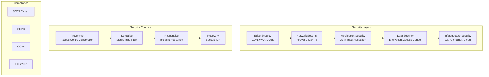

# MixerAI 2.0 Security and Compliance Requirements
## Enterprise Security Architecture and Regulatory Compliance

Version: 1.0  
Date: December 2024  
[← Back to Index](./00-MASTER-INDEX.md) | [Related: Technical Architecture](./04-TECHNICAL-ARCHITECTURE.md)

---

## 📋 Table of Contents

1. [Security Architecture Overview](#1-security-architecture-overview)
2. [Authentication & Identity Management](#2-authentication--identity-management)
3. [Authorization & Access Control](#3-authorization--access-control)
4. [Data Security & Encryption](#4-data-security--encryption)
5. [Application Security](#5-application-security)
6. [Infrastructure Security](#6-infrastructure-security)
7. [Compliance Requirements](#7-compliance-requirements)
8. [Audit & Monitoring](#8-audit--monitoring)
9. [Incident Response](#9-incident-response)
10. [Security Operations](#10-security-operations)

---

## 1. Security Architecture Overview

### 1.1 Security Framework



### 1.2 Security Principles

#### Defense in Depth
- Multiple layers of security controls
- No single point of failure
- Redundant security measures
- Assume breach methodology

#### Zero Trust Architecture
```yaml
Principles:
  - Never trust, always verify
  - Least privilege access
  - Assume breach
  - Verify explicitly
  - Continuous validation

Implementation:
  - Identity-based perimeter
  - Micro-segmentation
  - End-to-end encryption
  - Continuous monitoring
  - Risk-based access
```

#### Security by Design
- Security integrated from inception
- Privacy by default
- Secure defaults
- Fail securely
- Defense in depth

---

## 2. Authentication & Identity Management

### 2.1 Authentication Architecture

```typescript
interface AuthenticationSystem {
  // Primary authentication
  methods: {
    password: {
      requirements: {
        minLength: 12
        complexity: 'high' // uppercase, lowercase, number, special
        history: 5 // prevent reuse
        expiration: 90 // days
      }
      encryption: 'bcrypt'
      rounds: 12
    }
    
    sso: {
      protocols: ['SAML 2.0', 'OAuth 2.0', 'OpenID Connect']
      providers: ['Okta', 'Azure AD', 'Google Workspace']
      encryption: 'RSA-SHA256'
    }
    
    mfa: {
      methods: ['TOTP', 'WebAuthn', 'SMS', 'Email']
      required: ['admin_actions', 'sensitive_data_access']
      gracePeriod: 30 // days for new accounts
    }
  }
  
  // Session management
  sessions: {
    storage: 'Redis with encryption'
    duration: 8 * 60 * 60 // 8 hours
    renewal: 'sliding' // extends on activity
    concurrent: 5 // max sessions per user
    deviceTracking: true
  }
}
```

### 2.2 Multi-Factor Authentication (MFA)

```typescript
interface MFAImplementation {
  // TOTP (Time-based One-Time Password)
  totp: {
    algorithm: 'SHA256'
    digits: 6
    period: 30 // seconds
    window: 1 // accept previous/next code
    issuer: 'MixerAI'
    
    backup: {
      codes: 10
      length: 8
      storage: 'encrypted'
      singleUse: true
    }
  }
  
  // WebAuthn (FIDO2)
  webauthn: {
    rpId: 'mixerai.com'
    rpName: 'MixerAI'
    attestation: 'direct'
    userVerification: 'required'
    residentKey: 'preferred'
    
    authenticators: {
      platform: true // Touch ID, Face ID, Windows Hello
      crossPlatform: true // YubiKey, Titan
    }
  }
  
  // Risk-based authentication
  riskBased: {
    factors: [
      'location',
      'device',
      'behavior',
      'time'
    ],
    
    actions: {
      low: 'allow',
      medium: 'require_mfa',
      high: 'block_and_notify'
    }
  }
}
```

### 2.3 Single Sign-On (SSO)

```yaml
SAML Configuration:
  EntityID: https://mixerai.com/saml/metadata
  AssertionConsumerService: https://api.mixerai.com/auth/saml/callback
  SingleLogoutService: https://api.mixerai.com/auth/saml/logout
  
  Signing:
    Algorithm: RSA-SHA256
    Certificate: X.509
    
  Encryption:
    Algorithm: AES-256
    KeyTransport: RSA-OAEP
    
  Attributes:
    Required:
      - email
      - firstName
      - lastName
    Optional:
      - department
      - manager
      - groups

OAuth 2.0 / OIDC:
  AuthorizationEndpoint: https://api.mixerai.com/oauth/authorize
  TokenEndpoint: https://api.mixerai.com/oauth/token
  UserInfoEndpoint: https://api.mixerai.com/oauth/userinfo
  
  Flows:
    - authorization_code (with PKCE)
    - refresh_token
    
  Scopes:
    - openid
    - profile
    - email
    - brands:read
    - content:write
```

### 2.4 Account Security

```typescript
interface AccountSecurity {
  // Account lockout
  lockout: {
    threshold: 5 // failed attempts
    duration: 30 * 60 // 30 minutes
    incrementalDelay: true // increases with attempts
    
    captcha: {
      afterAttempts: 3
      provider: 'reCAPTCHA v3'
      threshold: 0.5
    }
  }
  
  // Password reset
  passwordReset: {
    tokenExpiration: 60 * 60 // 1 hour
    tokenLength: 32
    rateLimit: '3 per hour per email'
    notification: 'always' // notify on all attempts
    
    verification: {
      email: true
      securityQuestions: false // deprecated
      adminOverride: true // with audit
    }
  }
  
  // Account recovery
  recovery: {
    methods: ['email', 'admin_assisted']
    verification: 'multi_factor'
    auditLog: 'required'
    notification: 'all_sessions'
  }
}
```

---

## 3. Authorization & Access Control

### 3.1 Access Control Model

```typescript
// Attribute-Based Access Control (ABAC)
interface ABACPolicy {
  subject: {
    attributes: {
      userId: string
      roles: Role[]
      department?: string
      clearanceLevel?: number
      trainingCompleted?: string[]
    }
  }
  
  resource: {
    attributes: {
      type: ResourceType
      brandId?: string
      classification: 'public' | 'internal' | 'confidential' | 'restricted'
      owner?: string
      createdDate?: Date
    }
  }
  
  action: {
    type: 'read' | 'write' | 'delete' | 'admin'
    sensitivity: 'low' | 'medium' | 'high'
  }
  
  environment: {
    time?: TimeRange
    location?: GeoLocation
    networkZone?: 'internal' | 'external'
    deviceTrust?: 'managed' | 'unmanaged'
  }
  
  decision: (
    subject: Subject,
    resource: Resource,
    action: Action,
    environment: Environment
  ) => 'permit' | 'deny'
}
```

### 3.2 Role-Based Permissions

```yaml
Global Roles:
  platform_admin:
    description: "Full system access"
    permissions:
      - "*:*"
    restrictions:
      - require_mfa: always
      - ip_whitelist: required
      - audit_log: enhanced

Brand Roles:
  brand_admin:
    description: "Full brand management"
    permissions:
      - "brand:*"
      - "content:*"
      - "users:invite"
      - "workflows:*"
      - "analytics:view"
    restrictions:
      - scope: assigned_brands_only
      
  editor:
    description: "Content creation and editing"
    permissions:
      - "content:create"
      - "content:edit:own"
      - "content:edit:assigned"
      - "content:submit"
      - "ai:generate"
      - "analytics:view:own"
    restrictions:
      - scope: assigned_brands_only
      - content_status: ["draft", "revision"]
      
  viewer:
    description: "Read-only access"
    permissions:
      - "brand:view"
      - "content:view"
      - "analytics:view:basic"
    restrictions:
      - scope: assigned_brands_only
      - no_pii_access: true
```

### 3.3 Permission Inheritance

```typescript
interface PermissionHierarchy {
  // Permission inheritance rules
  inheritance: {
    brand_admin: ['editor', 'viewer'],
    editor: ['viewer'],
    viewer: []
  }
  
  // Permission composition
  compose(roles: Role[]): Permission[] {
    const permissions = new Set<Permission>()
    
    for (const role of roles) {
      // Add role permissions
      permissions.add(...role.permissions)
      
      // Add inherited permissions
      const inherited = this.inheritance[role.name] || []
      for (const inheritedRole of inherited) {
        permissions.add(...inheritedRole.permissions)
      }
    }
    
    return Array.from(permissions)
  }
  
  // Dynamic permissions
  dynamic: {
    content_owner: (userId: string, resource: Content) => {
      return resource.createdBy === userId
        ? ['content:edit', 'content:delete']
        : []
    },
    
    workflow_participant: (userId: string, workflow: Workflow) => {
      return workflow.participants.includes(userId)
        ? ['workflow:view', 'workflow:action']
        : []
    }
  }
}
```

### 3.4 API Access Control

```typescript
interface APIAccessControl {
  // API key management
  apiKeys: {
    format: 'mix_{environment}_{random32}'
    rotation: 90 // days
    scopes: ['read', 'write', 'admin']
    ipWhitelist: string[]
    rateLimit: 'custom'
    
    validation: {
      checksum: 'HMAC-SHA256'
      expiration: true
      revocation: 'immediate'
    }
  }
  
  // OAuth scopes
  oauthScopes: {
    'brands:read': 'View brand information',
    'brands:write': 'Create and modify brands',
    'content:read': 'View content',
    'content:write': 'Create and modify content',
    'ai:generate': 'Use AI generation features',
    'users:manage': 'Manage users and permissions'
  }
  
  // Resource-level permissions
  resourcePermissions: {
    '/api/v1/brands/{id}': {
      GET: 'brands:read',
      PUT: 'brands:write',
      DELETE: 'brands:admin'
    },
    '/api/v1/content/{id}': {
      GET: 'content:read',
      PUT: 'content:write',
      DELETE: 'content:admin'
    }
  }
}
```

---

## 4. Data Security & Encryption

### 4.1 Encryption Standards

```yaml
Encryption at Rest:
  Database:
    Method: Transparent Data Encryption (TDE)
    Algorithm: AES-256-GCM
    Key Management: AWS KMS / Azure Key Vault
    Key Rotation: 90 days
    
  File Storage:
    Method: Server-Side Encryption
    Algorithm: AES-256-GCM
    Key Hierarchy:
      - Master Key (in KMS)
      - Data Encryption Keys (per object)
    Customer Managed Keys: Supported
    
  Backups:
    Encryption: Required
    Algorithm: AES-256-GCM
    Key Storage: Separate from data
    Testing: Monthly restore tests

Encryption in Transit:
  External:
    Protocol: TLS 1.3 (minimum 1.2)
    Ciphers:
      - TLS_AES_256_GCM_SHA384
      - TLS_CHACHA20_POLY1305_SHA256
      - TLS_AES_128_GCM_SHA256
    HSTS: max-age=31536000; includeSubDomains; preload
    Certificate: EV SSL, 2048-bit RSA minimum
    
  Internal:
    Service-to-Service: mTLS required
    Database Connections: TLS required
    Cache Connections: TLS with auth
    Message Queue: TLS with SASL
```

### 4.2 Data Classification

```typescript
enum DataClassification {
  PUBLIC = 'public',           // Marketing content, published materials
  INTERNAL = 'internal',       // Internal docs, drafts
  CONFIDENTIAL = 'confidential', // User data, analytics
  RESTRICTED = 'restricted'    // PII, credentials, keys
}

interface DataHandling {
  [DataClassification.PUBLIC]: {
    encryption: 'optional',
    access: 'authenticated_users',
    retention: 'indefinite',
    audit: 'basic'
  },
  
  [DataClassification.INTERNAL]: {
    encryption: 'required_in_transit',
    access: 'authorized_users',
    retention: '7_years',
    audit: 'standard'
  },
  
  [DataClassification.CONFIDENTIAL]: {
    encryption: 'required_always',
    access: 'need_to_know',
    retention: '3_years',
    audit: 'enhanced',
    anonymization: 'supported'
  },
  
  [DataClassification.RESTRICTED]: {
    encryption: 'required_always',
    access: 'explicit_approval',
    retention: 'minimum_required',
    audit: 'comprehensive',
    tokenization: 'required'
  }
}
```

### 4.3 Key Management

```yaml
Key Management System:
  Provider: AWS KMS / Azure Key Vault / HashiCorp Vault
  
  Key Hierarchy:
    Master Keys:
      - Location: HSM
      - Algorithm: RSA-4096
      - Usage: Key encryption only
      - Rotation: Annual
      
    Data Encryption Keys:
      - Location: Encrypted in database
      - Algorithm: AES-256
      - Usage: Data encryption
      - Rotation: 90 days
      
    Application Keys:
      - JWT Signing: RS256, rotated monthly
      - API Keys: HMAC-SHA256
      - Session Keys: Generated per session
  
  Key Operations:
    Generation: FIPS 140-2 compliant
    Storage: Hardware Security Module (HSM)
    Distribution: Encrypted channels only
    Rotation: Automated with zero downtime
    Revocation: Immediate propagation
    
  Access Control:
    Principle: Least privilege
    Authentication: Multi-factor required
    Audit: All operations logged
    Separation: Key management separate from usage
```

### 4.4 Data Loss Prevention (DLP)

```typescript
interface DLPPolicies {
  // Content inspection
  contentInspection: {
    patterns: [
      {
        name: 'credit_card',
        regex: /\b\d{4}[\s\-]?\d{4}[\s\-]?\d{4}[\s\-]?\d{4}\b/,
        action: 'block',
        severity: 'high'
      },
      {
        name: 'social_security',
        regex: /\b\d{3}-\d{2}-\d{4}\b/,
        action: 'redact',
        severity: 'critical'
      },
      {
        name: 'api_key',
        regex: /mix_(live|test)_[a-zA-Z0-9]{32}/,
        action: 'block',
        severity: 'critical'
      }
    ],
    
    actions: {
      block: 'Prevent operation and alert',
      redact: 'Remove sensitive data',
      encrypt: 'Force encryption',
      alert: 'Allow but notify security'
    }
  }
  
  // Egress control
  egressControl: {
    allowedDomains: ['*.mixerai.com', 'approved-partners.com'],
    blockedCountries: ['sanctioned_list'],
    dataVolumeLimits: {
      hourly: '1GB',
      daily: '10GB'
    },
    
    fileTypeRestrictions: {
      blocked: ['.exe', '.dll', '.scr'],
      scanRequired: ['.zip', '.rar', '.7z']
    }
  }
}
```

---

## 5. Application Security

### 5.1 Secure Development Lifecycle

```yaml
SDLC Phases:
  Design:
    - Threat modeling (STRIDE)
    - Security requirements
    - Architecture review
    - Privacy impact assessment
    
  Development:
    - Secure coding standards
    - Security-focused code reviews
    - Static analysis (SAST)
    - Dependency scanning
    
  Testing:
    - Dynamic analysis (DAST)
    - Penetration testing
    - Security regression tests
    - Vulnerability scanning
    
  Deployment:
    - Security configuration review
    - Infrastructure scanning
    - Certificate validation
    - Access control verification
    
  Maintenance:
    - Security patch management
    - Vulnerability monitoring
    - Incident response
    - Security metrics
```

### 5.2 Input Validation & Sanitization

```typescript
interface InputValidation {
  // Validation strategies
  strategies: {
    whitelisting: {
      description: 'Allow only known good input',
      example: /^[a-zA-Z0-9\-\_]+$/
    },
    
    blacklisting: {
      description: 'Block known bad input',
      avoid: true,
      reason: 'Incomplete protection'
    },
    
    sanitization: {
      description: 'Clean potentially harmful input',
      libraries: ['DOMPurify', 'sanitize-html']
    },
    
    encoding: {
      description: 'Encode for output context',
      contexts: ['HTML', 'JavaScript', 'URL', 'SQL']
    }
  }
  
  // Common validations
  validators: {
    email: {
      pattern: /^[^\s@]+@[^\s@]+\.[^\s@]+$/,
      maxLength: 254,
      normalize: 'lowercase'
    },
    
    uuid: {
      pattern: /^[0-9a-f]{8}-[0-9a-f]{4}-4[0-9a-f]{3}-[89ab][0-9a-f]{3}-[0-9a-f]{12}$/i,
      version: 4
    },
    
    url: {
      protocols: ['http', 'https'],
      requireTld: true,
      maxLength: 2048
    },
    
    html: {
      allowedTags: ['p', 'br', 'strong', 'em', 'u', 'a', 'ul', 'ol', 'li'],
      allowedAttributes: {
        'a': ['href', 'target']
      },
      stripEmpty: true
    }
  }
}
```

### 5.3 API Security

```typescript
interface APISecurityControls {
  // Rate limiting
  rateLimiting: {
    algorithm: 'sliding_window',
    storage: 'Redis',
    
    limits: {
      authenticated: {
        requests: 1000,
        window: '15m'
      },
      unauthenticated: {
        requests: 100,
        window: '15m'
      },
      ai_endpoints: {
        requests: 50,
        window: '1h',
        cost_based: true
      }
    },
    
    headers: {
      'X-RateLimit-Limit': 'limit',
      'X-RateLimit-Remaining': 'remaining',
      'X-RateLimit-Reset': 'reset_time'
    }
  }
  
  // CORS configuration
  cors: {
    origins: [
      'https://app.mixerai.com',
      'https://staging.mixerai.com'
    ],
    methods: ['GET', 'POST', 'PUT', 'DELETE', 'OPTIONS'],
    headers: ['Content-Type', 'Authorization', 'X-Brand-Context'],
    credentials: true,
    maxAge: 86400
  }
  
  // Security headers
  securityHeaders: {
    'Strict-Transport-Security': 'max-age=31536000; includeSubDomains; preload',
    'X-Content-Type-Options': 'nosniff',
    'X-Frame-Options': 'DENY',
    'X-XSS-Protection': '1; mode=block',
    'Content-Security-Policy': "default-src 'self'; ...",
    'Referrer-Policy': 'strict-origin-when-cross-origin',
    'Permissions-Policy': 'camera=(), microphone=(), geolocation=()'
  }
}
```

### 5.4 Vulnerability Management

```yaml
Vulnerability Scanning:
  Static Analysis (SAST):
    Tools:
      - SonarQube
      - Checkmarx
      - Veracode
    Frequency: Every commit
    Blocking: High/Critical findings
    
  Dynamic Analysis (DAST):
    Tools:
      - OWASP ZAP
      - Burp Suite Enterprise
    Frequency: Weekly
    Scope: All external endpoints
    
  Dependency Scanning:
    Tools:
      - Snyk
      - WhiteSource
      - GitHub Dependabot
    Frequency: Daily
    Auto-PR: For patches
    
  Container Scanning:
    Tools:
      - Trivy
      - Clair
      - Twistlock
    Timing: Pre-deployment
    Policy: No critical vulnerabilities

Penetration Testing:
  Frequency: Quarterly
  Scope: Full application and infrastructure
  Provider: Certified third-party
  Remediation: 30-day SLA for critical findings
```

---

## 6. Infrastructure Security

### 6.1 Platform Security

```yaml
Vercel Security:
  Network Protection:
    - DDoS protection: Built-in, automatic
    - SSL/TLS: Auto-provisioned certificates
    - Edge Network: Global firewall rules
    - Rate limiting: Configurable per route
    
  Access Control:
    - Team members: Role-based access
    - Deploy permissions: GitHub integration
    - Environment variables: Encrypted at rest
    - Preview deployments: Access control
    
  Security Features:
    - HTTPS only: Enforced
    - Security headers: Automatic
    - CSP: Configurable
    - CORS: Per-route configuration

Supabase Security:
  Database Security:
    - Row Level Security (RLS): Enforced
    - SSL connections: Required
    - Connection pooling: Managed
    - Backup encryption: Automatic
    
  Authentication:
    - JWT tokens: Secure by default
    - MFA support: Built-in
    - Session management: Configurable
    - OAuth providers: Pre-integrated
    
  Access Control:
    - API keys: Scoped (anon/service)
    - Database roles: Granular permissions
    - Storage policies: Per-bucket security
    - Realtime: Channel-level auth
```

### 6.2 Application Security

```typescript
interface ApplicationSecurity {
  // Serverless function security
  functions: {
    runtime: {
      isolation: 'per_request',
      memory_limits: 'enforced',
      timeout_limits: 'configurable',
      cold_start_protection: 'automatic'
    },
    
    environment: {
      variables: 'encrypted_at_rest',
      secrets: 'vercel_env_vault',
      access: 'function_scoped',
      rotation: 'supported'
    },
    
    network: {
      outbound: 'allowed_with_limits',
      private_ips: 'not_exposed',
      vpc_peering: 'not_available'
    }
  }
  
  // Edge security
  edge: {
    middleware: {
      authentication: 'jwt_validation',
      rate_limiting: 'kv_backed',
      geo_blocking: 'configurable',
      bot_protection: 'built_in'
    },
    
    headers: {
      security_headers: 'automatic',
      custom_headers: 'per_route',
      csp: 'strict_by_default',
      cors: 'configurable'
    },
    
    caching: {
      sensitive_data: 'no_cache',
      user_content: 'private',
      static_assets: 'public_immutable'
    }
  }
  
  // Database security
  database: {
    connections: {
      ssl: 'required',
      pooling: 'supabase_managed',
      direct_access: 'restricted',
      connection_limits: 'per_function'
    },
    
    access_control: {
      rls: 'enforced',
      policies: 'per_table',
      roles: 'least_privilege',
      audit: 'built_in'
    },
    
    data_protection: {
      encryption_at_rest: 'automatic',
      backups: 'encrypted',
      pitr: '7_days',
      deletion: 'soft_delete'
    }
  }
}
```

### 6.3 Secrets Management

```yaml
Secrets Architecture:
  Storage:
    Vercel: Environment Variables (encrypted)
    Supabase: Vault (service keys)
    Additional: Vercel KV for runtime secrets
    Audit: Access logs via Vercel dashboard
    
  Types:
    Database Credentials:
      Storage: Vercel env vars
      Format: Supabase connection strings
      Access: Function-scoped
      
    API Keys:
      Storage: Vercel env vars
      Format: Prefixed (MIX_)
      Visibility: Preview/Production separated
      
    Service Keys:
      Azure OpenAI: Env var
      Resend: Env var
      Monitoring: Env var
      
    Supabase Keys:
      Anon Key: Public (client-side)
      Service Key: Private (server-side)
      JWT Secret: Automatic
      
  Development:
    Local: .env files (git-ignored)
    Sharing: Never through chat/email
    Dummy: Use fake values in examples
    Documentation: Reference only, no values
```

---

## 7. Compliance Requirements

### 7.1 Regulatory Compliance

```yaml
GDPR (General Data Protection Regulation):
  Requirements:
    - Lawful basis for processing
    - Explicit consent management
    - Right to access (data portability)
    - Right to erasure (right to be forgotten)
    - Right to rectification
    - Privacy by design
    - Data minimization
    - Purpose limitation
    
  Implementation:
    - Consent management platform
    - Data retention policies
    - Automated data deletion
    - Privacy impact assessments
    - DPO appointment
    - Breach notification (72 hours)
    
CCPA (California Consumer Privacy Act):
  Requirements:
    - Right to know
    - Right to delete
    - Right to opt-out
    - Right to non-discrimination
    
  Implementation:
    - Privacy policy updates
    - Do Not Sell mechanism
    - Consumer request portal
    - Data inventory maintenance

SOC2 Type II:
  Trust Principles:
    - Security
    - Availability
    - Processing Integrity
    - Confidentiality
    - Privacy
    
  Controls:
    - Access controls
    - Change management
    - Risk assessment
    - Incident response
    - Vendor management
    - Business continuity
```

### 7.2 Industry Standards

```yaml
ISO 27001:
  Domains:
    - Information security policies
    - Organization of information security
    - Human resource security
    - Asset management
    - Access control
    - Cryptography
    - Physical security
    - Operations security
    - Communications security
    - System acquisition and development
    - Supplier relationships
    - Incident management
    - Business continuity
    - Compliance

PCI DSS (if processing payments):
  Requirements:
    - Build and maintain secure networks
    - Protect cardholder data
    - Maintain vulnerability management
    - Implement strong access control
    - Monitor and test networks
    - Maintain information security policy
    
HIPAA (if handling health data):
  Safeguards:
    - Administrative
    - Physical
    - Technical
    - Organizational
```

### 7.3 Data Residency & Sovereignty

```typescript
interface DataResidency {
  regions: {
    'US': {
      primary: 'us-east-1',
      backup: 'us-west-2',
      compliance: ['CCPA', 'HIPAA']
    },
    'EU': {
      primary: 'eu-central-1',
      backup: 'eu-west-1',
      compliance: ['GDPR']
    },
    'UK': {
      primary: 'eu-west-2',
      backup: 'eu-west-1',
      compliance: ['UK-GDPR']
    }
  }
  
  policies: {
    dataLocation: 'User data stays in region of origin',
    crossBorder: 'Explicit consent required',
    backups: 'Same region as primary',
    processing: 'Local processing where required'
  }
  
  implementation: {
    routing: 'Geo-based load balancing',
    storage: 'Region-specific buckets',
    database: 'Regional read replicas',
    cdn: 'Regional edge locations'
  }
}
```

---

## 8. Audit & Monitoring

### 8.1 Audit Logging

```typescript
interface AuditLog {
  // Required fields
  event: {
    id: string          // Unique event ID
    timestamp: string   // ISO 8601 format
    type: string        // Event category
    action: string      // Specific action
    outcome: 'success' | 'failure'
  }
  
  actor: {
    id: string          // User/system ID
    type: 'user' | 'system' | 'api'
    ip: string          // Source IP
    userAgent?: string  // Browser/client info
    sessionId?: string  // Session identifier
  }
  
  resource: {
    type: string        // Resource type
    id: string          // Resource ID
    brandId?: string    // Brand context
    previous?: any      // Previous state
    current?: any       // New state
  }
  
  metadata: {
    requestId: string   // Correlation ID
    duration?: number   // Operation duration
    errorCode?: string  // If failed
    additionalInfo?: Record<string, any>
  }
}

// Audit events to log
const AUDIT_EVENTS = [
  // Authentication
  'auth.login',
  'auth.logout',
  'auth.failed_login',
  'auth.password_reset',
  'auth.mfa_enabled',
  
  // Authorization
  'authz.permission_granted',
  'authz.permission_denied',
  'authz.role_assigned',
  'authz.role_removed',
  
  // Data access
  'data.view',
  'data.create',
  'data.update',
  'data.delete',
  'data.export',
  
  // Configuration
  'config.security_update',
  'config.permission_change',
  'config.integration_added'
]
```

### 8.2 Security Monitoring

```yaml
Security Information and Event Management (SIEM):
  Platform: Splunk / ELK / Datadog
  
  Data Sources:
    - Application logs
    - Infrastructure logs
    - Network flow logs
    - Authentication logs
    - API access logs
    - Database query logs
    
  Correlation Rules:
    Failed Logins:
      Condition: >5 failed logins in 5 minutes
      Action: Alert + Temporary block
      
    Privilege Escalation:
      Condition: Role change to admin
      Action: Alert security team
      
    Data Exfiltration:
      Condition: >1000 records exported
      Action: Alert + Manager approval
      
    Suspicious API Usage:
      Condition: Unusual pattern detected
      Action: Rate limit + Investigation
      
  Dashboards:
    - Security overview
    - Failed authentication attempts
    - API usage patterns
    - Data access trends
    - Compliance violations
    - Threat indicators
```

### 8.3 Security Metrics

```typescript
interface SecurityMetrics {
  // Key Risk Indicators (KRIs)
  kris: {
    'unpatched_vulnerabilities': {
      threshold: 0, // critical
      measurement: 'count',
      frequency: 'daily'
    },
    
    'failed_login_rate': {
      threshold: 5, // percent
      measurement: 'percentage',
      frequency: 'hourly'
    },
    
    'privileged_access_usage': {
      threshold: 10, // percent above baseline
      measurement: 'deviation',
      frequency: 'daily'
    }
  }
  
  // Key Performance Indicators (KPIs)
  kpis: {
    'patch_compliance': {
      target: 100, // percent
      measurement: 'percentage',
      sla: '30_days'
    },
    
    'security_training_completion': {
      target: 100, // percent
      measurement: 'percentage',
      frequency: 'annual'
    },
    
    'incident_response_time': {
      target: 60, // minutes
      measurement: 'minutes',
      priority: 'critical'
    }
  }
  
  // Reporting
  reporting: {
    executive: 'monthly',
    operational: 'weekly',
    technical: 'daily',
    compliance: 'quarterly'
  }
}
```

---

## 9. Incident Response

### 9.1 Incident Response Plan

```yaml
Incident Response Phases:
  1. Preparation:
    - IR team defined
    - Contact lists current
    - Playbooks documented
    - Tools ready
    - Training completed
    
  2. Detection & Analysis:
    - Alert received
    - Initial triage
    - Severity classification
    - Impact assessment
    - Stakeholder notification
    
  3. Containment:
    - Immediate containment
    - Evidence preservation
    - System isolation
    - Access revocation
    
  4. Eradication:
    - Root cause analysis
    - Vulnerability remediation
    - Malware removal
    - System hardening
    
  5. Recovery:
    - System restoration
    - Monitoring enhanced
    - Validation testing
    - Normal operations
    
  6. Lessons Learned:
    - Post-mortem meeting
    - Documentation update
    - Process improvement
    - Training updates
```

### 9.2 Incident Classification

```typescript
enum IncidentSeverity {
  CRITICAL = 1,  // Data breach, system compromise
  HIGH = 2,      // Service disruption, attempted breach
  MEDIUM = 3,    // Policy violation, minor impact
  LOW = 4        // Anomaly detection, no impact
}

interface IncidentResponse {
  [IncidentSeverity.CRITICAL]: {
    notification: ['CTO', 'CISO', 'Legal', 'CEO'],
    timeframe: '15 minutes',
    escalation: 'automatic',
    communication: 'war room',
    externalParties: ['law enforcement', 'regulators']
  },
  
  [IncidentSeverity.HIGH]: {
    notification: ['Security team', 'IT management'],
    timeframe: '1 hour',
    escalation: 'on-call',
    communication: 'incident channel',
    externalParties: ['affected customers']
  },
  
  [IncidentSeverity.MEDIUM]: {
    notification: ['Security team'],
    timeframe: '4 hours',
    escalation: 'business hours',
    communication: 'ticket system'
  },
  
  [IncidentSeverity.LOW]: {
    notification: ['Security analyst'],
    timeframe: '24 hours',
    escalation: 'as needed',
    communication: 'email'
  }
}
```

### 9.3 Breach Response

```yaml
Data Breach Response:
  Immediate Actions (0-4 hours):
    - Contain the breach
    - Preserve evidence
    - Assess scope
    - Activate IR team
    - Begin investigation
    
  Short Term (4-72 hours):
    - Complete assessment
    - Legal consultation
    - Regulatory notification (GDPR: 72hr)
    - Customer communication plan
    - Remediation started
    
  Medium Term (3-30 days):
    - Customer notification
    - Credit monitoring offered
    - Full remediation
    - Security improvements
    - Regulatory filing
    
  Long Term (30+ days):
    - Process improvements
    - Training updates
    - Third-party assessment
    - Compliance validation
    - Litigation preparation
```

---

## 10. Security Operations

### 10.1 Security Team Structure

```yaml
Security Organization:
  CISO:
    Reports to: CEO
    Responsibilities:
      - Security strategy
      - Risk management
      - Compliance oversight
      - Board reporting
      
  Security Engineering:
    Responsibilities:
      - Security architecture
      - Tool implementation
      - Security automation
      - DevSecOps
      
  Security Operations:
    Responsibilities:
      - 24/7 monitoring
      - Incident response
      - Threat hunting
      - Vulnerability management
      
  Compliance & Risk:
    Responsibilities:
      - Regulatory compliance
      - Risk assessments
      - Policy management
      - Audit coordination
      
  Security Awareness:
    Responsibilities:
      - Training programs
      - Phishing simulations
      - Security culture
      - Communication
```

### 10.2 Security Processes

```typescript
interface SecurityProcesses {
  changeManagement: {
    requirements: [
      'Security review for all changes',
      'Automated security testing',
      'Rollback plan required',
      'Post-change validation'
    ],
    
    approvals: {
      low_risk: ['Team lead'],
      medium_risk: ['Team lead', 'Security'],
      high_risk: ['Team lead', 'Security', 'Management']
    }
  }
  
  accessManagement: {
    onboarding: {
      backgroundCheck: 'required',
      accessRequest: 'manager_approved',
      trainingRequired: ['security_awareness', 'data_handling'],
      provisioning: 'automated'
    },
    
    periodic_review: {
      frequency: 'quarterly',
      scope: 'all_privileged_access',
      certification: 'manager_required',
      deprovisioning: 'automatic'
    },
    
    offboarding: {
      timeline: 'immediate',
      checklist: 'automated',
      access_revocation: 'all_systems',
      data_transfer: 'documented'
    }
  }
  
  vendorManagement: {
    assessment: {
      security_questionnaire: 'required',
      risk_rating: 'calculated',
      contract_review: 'legal_and_security',
      ongoing_monitoring: 'annual'
    }
  }
}
```

### 10.3 Security Training

```yaml
Security Awareness Program:
  All Employees:
    Onboarding:
      - Security fundamentals
      - Data classification
      - Password management
      - Phishing awareness
      - Incident reporting
      
    Annual Refresher:
      - Policy updates
      - Threat landscape
      - Best practices
      - Compliance requirements
      
    Ongoing:
      - Monthly security tips
      - Phishing simulations
      - Security newsletters
      - Lunch & learns
      
  Developers:
    Additional Training:
      - Secure coding practices
      - OWASP Top 10
      - Security testing
      - Threat modeling
      - Code review security
      
  Privileged Users:
    Additional Training:
      - Advanced threats
      - Incident response
      - Forensics basics
      - Compliance deep-dive
```

---

## 📊 Security Compliance Checklist

### Pre-Production
- [ ] Security architecture review completed
- [ ] Threat modeling performed
- [ ] Penetration testing passed
- [ ] Vulnerability scan clean
- [ ] Security controls validated
- [ ] Compliance requirements met
- [ ] Incident response plan tested
- [ ] Security training completed

### Production
- [ ] Monitoring configured
- [ ] Alerts tuned
- [ ] Backup tested
- [ ] DR plan validated
- [ ] Access reviews scheduled
- [ ] Audit logging verified
- [ ] Security metrics baseline
- [ ] Compliance attestation

### Ongoing
- [ ] Daily vulnerability scans
- [ ] Weekly security reviews
- [ ] Monthly metrics review
- [ ] Quarterly access audit
- [ ] Annual penetration test
- [ ] Continuous training
- [ ] Regular DR drills
- [ ] Compliance audits

---

[← Back to Index](./00-MASTER-INDEX.md) | [Related: Technical Architecture](./04-TECHNICAL-ARCHITECTURE.md)