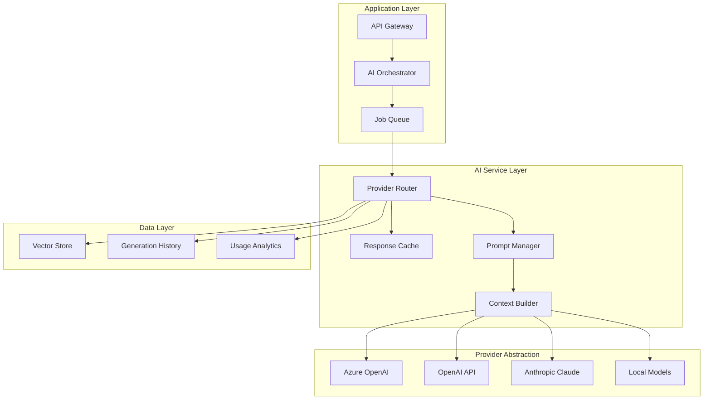

# MixerAI 2.0 AI Integration Specifications
## AI-Powered Features and Implementation Guidelines

Version: 1.0  
Date: December 2024  
[← Back to Index](./00-MASTER-INDEX.md) | [Related: API Specification](./06-API-SPECIFICATION.md)

---

## 📋 Table of Contents

1. [AI Architecture Overview](#1-ai-architecture-overview)
2. [AI Service Providers](#2-ai-service-providers)
3. [Content Generation Features](#3-content-generation-features)
4. [Brand Intelligence Features](#4-brand-intelligence-features)
5. [Content Enhancement Features](#5-content-enhancement-features)
6. [Compliance and Review Features](#6-compliance-and-review-features)
7. [Prompt Engineering](#7-prompt-engineering)
8. [Performance and Optimization](#8-performance-and-optimization)
9. [Cost Management](#9-cost-management)
10. [Future AI Capabilities](#10-future-ai-capabilities)

---

## 1. AI Architecture Overview

### 1.1 High-Level AI Integration Architecture



### 1.2 AI Service Architecture Principles

#### Abstraction Layer
```typescript
interface AIProvider {
  // Core capabilities
  generateText(prompt: string, options: GenerationOptions): Promise<string>
  generateEmbedding(text: string): Promise<number[]>
  analyzeImage(imageUrl: string, prompt: string): Promise<string>
  
  // Provider info
  name: string
  capabilities: AICapability[]
  pricing: PricingModel
  
  // Health and limits
  checkHealth(): Promise<HealthStatus>
  getRateLimits(): Promise<RateLimits>
}

interface AIOrchestrator {
  // Intelligent routing
  selectProvider(task: AITask): AIProvider
  
  // Execution with fallback
  execute(task: AITask): Promise<AIResult>
  
  // Batch processing
  executeBatch(tasks: AITask[]): Promise<AIResult[]>
  
  // Cost optimization
  estimateCost(task: AITask): Promise<CostEstimate>
}
```

#### Multi-Provider Strategy
- **Primary**: Azure OpenAI (enterprise SLA, compliance)
- **Secondary**: OpenAI API (fallback, specialized models)
- **Tertiary**: Anthropic Claude (alternative approach)
- **Local**: ONNX models (privacy-sensitive, offline)

---

## 2. AI Service Providers

### 2.1 Azure OpenAI Configuration

```typescript
interface AzureOpenAIConfig {
  endpoint: string                    // https://{resource}.openai.azure.com
  apiKey: string                      // Secure key management
  deployments: {
    gpt4: string                      // GPT-4 deployment name
    gpt35Turbo: string               // GPT-3.5 Turbo deployment
    embeddings: string               // text-embedding-ada-002
    dalle3: string                   // DALL-E 3 for images
  }
  
  // Rate limits
  rateLimits: {
    tokensPerMinute: number          // 150,000 TPM
    requestsPerMinute: number        // 1,000 RPM
  }
  
  // Retry configuration
  retry: {
    maxAttempts: number              // 3
    backoffMultiplier: number        // 2
    maxDelay: number                 // 60000ms
  }
}
```

### 2.2 Provider Capabilities Matrix

| Feature | Azure OpenAI | OpenAI API | Anthropic | Local Models |
|---------|--------------|------------|-----------|--------------|
| Text Generation | ✅ GPT-4 | ✅ GPT-4 | ✅ Claude 3 | ✅ Llama 2 |
| Embeddings | ✅ Ada-002 | ✅ Ada-002 | ❌ | ✅ BERT |
| Image Analysis | ✅ GPT-4V | ✅ GPT-4V | ✅ Claude 3 | ❌ |
| Image Generation | ✅ DALL-E 3 | ✅ DALL-E 3 | ❌ | ✅ Stable Diffusion |
| Function Calling | ✅ | ✅ | ✅ | ⚠️ Limited |
| Streaming | ✅ | ✅ | ✅ | ✅ |
| Fine-tuning | ⚠️ Preview | ✅ | ❌ | ✅ |

### 2.3 Provider Selection Logic

```typescript
class ProviderSelector {
  selectProvider(task: AITask): AIProvider {
    // Priority order based on task type
    const providers = this.getProviderPriority(task.type)
    
    for (const provider of providers) {
      // Check availability
      if (!provider.isHealthy()) continue
      
      // Check rate limits
      if (provider.isRateLimited()) continue
      
      // Check capabilities
      if (!provider.supports(task.requirements)) continue
      
      // Check cost threshold
      if (task.costSensitive && provider.estimateCost(task) > task.maxCost) continue
      
      return provider
    }
    
    throw new NoAvailableProviderError()
  }
  
  private getProviderPriority(taskType: AITaskType): AIProvider[] {
    switch (taskType) {
      case 'content_generation':
        return [this.azure, this.openai, this.anthropic]
      case 'compliance_review':
        return [this.azure] // Regulatory requirement
      case 'image_analysis':
        return [this.azure, this.openai, this.anthropic]
      case 'quick_suggestion':
        return [this.local, this.azure, this.openai]
      default:
        return [this.azure, this.openai]
    }
  }
}
```

---

## 3. Content Generation Features

### 3.1 Template-Based Content Generation

#### Feature Specification
```typescript
interface ContentGenerationRequest {
  brandId: string
  templateId: string
  inputs: Record<string, any>
  
  options: {
    tone?: 'formal' | 'casual' | 'playful' | 'professional'
    length?: 'short' | 'medium' | 'long'
    includeKeywords?: string[]
    avoidTerms?: string[]
    targetAudience?: string
  }
  
  context: {
    brand: BrandContext
    products?: ProductContext[]
    claims?: ClaimContext[]
    previousContent?: string[]
  }
}

interface GeneratedContent {
  fields: Record<string, string>
  metadata: {
    model: string
    tokensUsed: number
    generationTime: number
    confidence: number
  }
  suggestions: {
    alternativeTitles?: string[]
    keywords?: string[]
    improvements?: string[]
  }
}
```

#### Implementation
```typescript
class ContentGenerator {
  async generateFromTemplate(
    request: ContentGenerationRequest
  ): Promise<GeneratedContent> {
    // Build context-aware prompt
    const prompt = await this.promptBuilder.buildContentPrompt(request)
    
    // Add brand guardrails
    const guardedPrompt = this.applyGuardrails(prompt, request.context.brand)
    
    // Generate content
    const response = await this.aiService.generate({
      prompt: guardedPrompt,
      maxTokens: this.calculateTokenLimit(request),
      temperature: this.getTemperature(request.options.tone),
      functions: this.getTemplateFunctions(request.templateId)
    })
    
    // Post-process and validate
    const content = this.parseResponse(response)
    await this.validateContent(content, request.context)
    
    // Generate suggestions
    const suggestions = await this.generateSuggestions(content, request)
    
    return {
      fields: content,
      metadata: this.extractMetadata(response),
      suggestions
    }
  }
}
```

### 3.2 Dynamic Field Generation

```typescript
interface FieldGenerationStrategy {
  // Field type strategies
  strategies: {
    headline: {
      maxLength: 60,
      style: 'compelling',
      includeBrand: true
    },
    
    body: {
      structure: 'introduction-body-conclusion',
      paragraphs: 3-5,
      sentencesPerParagraph: 3-4
    },
    
    cta: {
      maxLength: 30,
      style: 'action-oriented',
      urgency: 'medium'
    },
    
    metadata: {
      seoTitle: { length: 50-60, includeKeywords: true },
      seoDescription: { length: 150-160, compelling: true }
    }
  }
}
```

### 3.3 Multi-Language Content Generation

```typescript
class MultilingualGenerator {
  async generate(request: ContentRequest): Promise<LocalizedContent> {
    const languages = request.targetLanguages || [request.context.brand.language]
    
    // Generate in primary language first
    const primaryContent = await this.generatePrimary(request)
    
    // Transcreate to other languages
    const localizedVersions = await Promise.all(
      languages
        .filter(lang => lang !== request.context.brand.language)
        .map(lang => this.transcreate(primaryContent, lang, request.context))
    )
    
    return {
      primary: primaryContent,
      localized: localizedVersions,
      crossCulturalNotes: await this.generateCulturalNotes(localizedVersions)
    }
  }
}
```

---

## 4. Brand Intelligence Features

### 4.1 Brand Profile Generation from URLs

#### Feature Specification
```typescript
interface BrandAnalysisRequest {
  brandName: string
  urls: string[]                    // Up to 5 URLs
  options: {
    depth: 'quick' | 'standard' | 'comprehensive'
    includeCompetitors?: boolean
    industryContext?: string
  }
}

interface BrandAnalysisResult {
  identity: {
    description: string             // 100-150 words
    mission?: string
    vision?: string
    values?: string[]
    usp?: string
  }
  
  voice: {
    tone: string                    // 50-75 words
    style: string[]
    personality: string[]
  }
  
  guardrails: string[]             // Min 5 rules
  
  visual: {
    primaryColor?: string          // Hex code
    colorPalette?: string[]
    logoDetected?: boolean
  }
  
  compliance: {
    suggestedAgencies: VettingAgency[]
    industryRegulations?: string[]
  }
  
  insights: {
    targetAudience?: string
    keyThemes?: string[]
    contentStyle?: string
    competitiveDifferentiators?: string[]
  }
}
```

#### Implementation
```typescript
class BrandAnalyzer {
  async analyzeFromUrls(request: BrandAnalysisRequest): Promise<BrandAnalysisResult> {
    // Fetch and process web content
    const webContent = await Promise.all(
      request.urls.map(url => this.webScraper.fetchAndParse(url))
    )
    
    // Extract brand signals
    const signals = this.extractBrandSignals(webContent)
    
    // Generate comprehensive analysis
    const analysis = await this.aiService.analyzeBrand({
      content: webContent,
      signals,
      prompt: this.buildBrandAnalysisPrompt(request),
      functions: [
        this.extractIdentityFunction,
        this.extractVoiceFunction,
        this.extractGuardrailsFunction,
        this.extractComplianceFunction
      ]
    })
    
    // Extract visual elements
    const visual = await this.analyzeVisualElements(webContent)
    
    // Generate insights
    const insights = await this.generateBrandInsights(analysis, signals)
    
    return {
      ...analysis,
      visual,
      insights
    }
  }
  
  private extractBrandSignals(content: WebContent[]): BrandSignals {
    return {
      commonPhrases: this.findCommonPhrases(content),
      emotionalTone: this.analyzeEmotionalTone(content),
      formalityLevel: this.assessFormality(content),
      industryTerms: this.extractIndustryTerminology(content),
      callsToAction: this.identifyCTAs(content),
      valuePropositions: this.extractValueProps(content)
    }
  }
}
```

### 4.2 Competitive Intelligence

```typescript
interface CompetitiveAnalysis {
  async analyzeCompetitiveLandscape(
    brand: Brand,
    competitors: string[]
  ): Promise<CompetitiveLandscape> {
    // Analyze competitor content
    const competitorProfiles = await Promise.all(
      competitors.map(comp => this.analyzeCompetitor(comp))
    )
    
    // Identify differentiation opportunities
    const opportunities = this.findDifferentiationOpportunities(
      brand,
      competitorProfiles
    )
    
    // Generate strategic recommendations
    const recommendations = await this.generateStrategicRecommendations({
      brand,
      competitors: competitorProfiles,
      opportunities
    })
    
    return {
      competitorProfiles,
      opportunities,
      recommendations,
      positioningMap: this.createPositioningMap(brand, competitorProfiles)
    }
  }
}
```

---

## 5. Content Enhancement Features

### 5.1 SEO Metadata Generation

#### Feature Specification
```typescript
interface MetadataGenerationRequest {
  url?: string
  content?: string
  keywords?: string[]
  
  constraints: {
    titleLength: { min: 45, max: 60 }
    descriptionLength: { min: 150, max: 160 }
  }
  
  optimization: {
    targetKeywords?: string[]
    competitorUrls?: string[]
    searchIntent?: 'informational' | 'transactional' | 'navigational'
  }
}

interface GeneratedMetadata {
  title: string
  description: string
  
  analysis: {
    keywordDensity: Record<string, number>
    readabilityScore: number
    emotionalTone: string
    clickThroughPrediction: number
  }
  
  alternatives: {
    titles: string[]
    descriptions: string[]
  }
  
  suggestions: {
    keywords: string[]
    improvements: string[]
  }
}
```

#### Implementation
```typescript
class SEOMetadataGenerator {
  async generateMetadata(request: MetadataGenerationRequest): Promise<GeneratedMetadata> {
    // Fetch and analyze content
    const content = request.content || await this.fetchWebContent(request.url)
    const analysis = await this.analyzeContent(content)
    
    // Generate optimized metadata
    const metadata = await this.aiService.generateSEOMetadata({
      content,
      analysis,
      constraints: request.constraints,
      optimization: request.optimization,
      prompt: this.buildSEOPrompt(request)
    })
    
    // Validate and score
    const scored = this.scoreMetadata(metadata, request.optimization)
    
    // Generate alternatives
    const alternatives = await this.generateAlternatives(metadata, analysis)
    
    return {
      ...scored,
      alternatives,
      suggestions: this.generateSEOSuggestions(analysis, scored)
    }
  }
  
  private scoreMetadata(metadata: Metadata, optimization: OptimizationConfig): ScoredMetadata {
    return {
      ...metadata,
      analysis: {
        keywordDensity: this.calculateKeywordDensity(metadata, optimization.targetKeywords),
        readabilityScore: this.assessReadability(metadata),
        emotionalTone: this.analyzeEmotionalTone(metadata),
        clickThroughPrediction: this.predictCTR(metadata)
      }
    }
  }
}
```

### 5.2 Alt Text Generation

#### Feature Specification
```typescript
interface AltTextRequest {
  imageUrl: string
  context?: {
    pageContent?: string
    surroundingText?: string
    brandGuidelines?: string
  }
  
  options: {
    style: 'descriptive' | 'functional' | 'emotional'
    maxLength?: number              // Default: 125
    language: string
    tone?: string
  }
}

interface AltTextResult {
  altText: string
  
  analysis: {
    elementsDetected: string[]
    accessibility: {
      score: number
      issues: string[]
    }
    brandAlignment: number
  }
  
  variations: {
    short: string                   // < 50 chars
    medium: string                  // 50-125 chars
    detailed: string                // 125-200 chars
  }
}
```

#### Batch Processing
```typescript
class AltTextBatchProcessor {
  async processBatch(images: BatchImageRequest[]): Promise<BatchResult> {
    // Group by language for efficiency
    const grouped = this.groupByLanguage(images)
    
    // Process in parallel with rate limiting
    const results = await this.rateLimiter.processWithLimit(
      grouped,
      async (group) => {
        return Promise.all(
          group.images.map(img => this.generateAltText(img))
        )
      },
      { maxConcurrent: 5, delayMs: 100 }
    )
    
    return {
      successful: results.filter(r => r.success),
      failed: results.filter(r => !r.success),
      summary: this.generateBatchSummary(results)
    }
  }
}
```

### 5.3 Content Transcreation

#### Feature Specification
```typescript
interface TranscreationRequest {
  sourceContent: string
  sourceLanguage: string
  targetLanguage: string
  targetCountry: string
  
  context: {
    brand: BrandContext
    culturalNotes?: string[]
    avoidConcepts?: string[]
    localReferences?: boolean
  }
  
  options: {
    preserveStyle: boolean
    adaptIdioms: boolean
    localizeExamples: boolean
    maintainLength: boolean
  }
}

interface TranscreationResult {
  transcreatedContent: string
  
  adaptations: {
    idioms: Array<{
      original: string
      adapted: string
      explanation: string
    }>
    
    culturalChanges: Array<{
      type: string
      original: string
      adapted: string
      reason: string
    }>
    
    localizations: Array<{
      element: string
      change: string
    }>
  }
  
  quality: {
    culturalAppropriateness: number
    brandAlignment: number
    readability: number
    emotionalResonance: number
  }
  
  warnings: string[]
}
```

#### Cultural Intelligence
```typescript
class CulturalIntelligence {
  private culturalRules: Map<string, CulturalRules> = new Map([
    ['ja-JP', {
      avoidDirectness: true,
      formalityLevel: 'high',
      colorSymbolism: { red: 'luck', white: 'death' },
      numbers: { lucky: [7, 8], unlucky: [4, 9] }
    }],
    ['de-DE', {
      preferPrecision: true,
      formalityLevel: 'medium',
      privacySensitivity: 'high',
      humorStyle: 'dry'
    }]
    // ... more cultural profiles
  ])
  
  async applyCulturalAdaptation(
    content: string,
    targetCulture: string
  ): Promise<CulturallyAdaptedContent> {
    const rules = this.culturalRules.get(targetCulture)
    
    return {
      content: await this.adaptContent(content, rules),
      adaptations: this.documentAdaptations(content, rules),
      confidence: this.assessCulturalFit(content, rules)
    }
  }
}
```

---

## 6. Compliance and Review Features

### 6.1 Claims Compliance Review

#### Feature Specification
```typescript
interface ClaimsReviewRequest {
  claims: Claim[]
  country: string
  
  context: {
    productCategory?: string
    targetAudience?: string
    marketingChannel?: string
  }
  
  options: {
    strictness: 'lenient' | 'standard' | 'strict'
    includeAlternatives: boolean
    checkCompetitors: boolean
  }
}

interface ClaimsReviewResult {
  reviews: Array<{
    claim: Claim
    status: 'approved' | 'needs_revision' | 'rejected'
    
    compliance: {
      isCompliant: boolean
      violations: string[]
      regulations: string[]
      riskLevel: 'low' | 'medium' | 'high'
    }
    
    feedback: {
      issue: string
      suggestion?: string
      alternative?: string
      explanation: string
    }
    
    confidence: number
  }>
  
  summary: {
    totalClaims: number
    approved: number
    needsRevision: number
    rejected: number
    overallRisk: string
  }
  
  recommendations: string[]
}
```

#### Regulatory Knowledge Base
```typescript
class RegulatoryKnowledgeBase {
  private regulations: Map<string, CountryRegulations> = new Map([
    ['US', {
      agencies: ['FDA', 'FTC'],
      claimTypes: {
        health: { requires: 'substantiation', prohibited: ['cure', 'prevent'] },
        environmental: { requires: 'lifecycle_analysis' },
        comparative: { requires: 'direct_comparison_data' }
      }
    }],
    ['EU', {
      agencies: ['EFSA', 'European Commission'],
      claimTypes: {
        health: { requires: 'EFSA_approval', allowedList: 'EU_Register' },
        nutrition: { thresholds: 'EU_Nutrition_Thresholds' },
        environmental: { requires: 'PEF_methodology' }
      }
    }]
    // ... more countries
  ])
  
  async validateClaim(
    claim: string,
    country: string,
    category: string
  ): Promise<ValidationResult> {
    const regulations = this.regulations.get(country)
    const rules = regulations.claimTypes[category]
    
    // AI-powered validation
    const validation = await this.aiService.validateClaim({
      claim,
      rules,
      prompt: this.buildCompliancePrompt(claim, rules)
    })
    
    return {
      isValid: validation.compliant,
      violations: validation.violations,
      suggestions: validation.alternatives,
      confidence: validation.confidence
    }
  }
}
```

### 6.2 Content Guardrail Enforcement

```typescript
interface GuardrailEnforcement {
  async enforceGuardrails(
    content: string,
    guardrails: string[]
  ): Promise<GuardrailResult> {
    // Parse guardrails into rules
    const rules = this.parseGuardrails(guardrails)
    
    // Check each rule
    const violations = await Promise.all(
      rules.map(rule => this.checkRule(content, rule))
    )
    
    // Generate fixes
    const fixes = await this.generateFixes(content, violations.filter(v => v.violated))
    
    return {
      isCompliant: violations.every(v => !v.violated),
      violations: violations.filter(v => v.violated),
      fixes,
      revisedContent: await this.applyFixes(content, fixes)
    }
  }
}
```

---

## 7. Prompt Engineering

### 7.1 Prompt Template System

```typescript
interface PromptTemplate {
  id: string
  name: string
  category: string
  
  template: {
    system: string
    user: string
    functions?: FunctionDefinition[]
  }
  
  variables: Array<{
    name: string
    type: 'string' | 'number' | 'boolean' | 'array'
    required: boolean
    description: string
    validation?: (value: any) => boolean
  }>
  
  examples: Array<{
    input: Record<string, any>
    output: string
  }>
  
  optimization: {
    temperature: number
    maxTokens: number
    topP?: number
    frequencyPenalty?: number
    presencePenalty?: number
  }
}
```

### 7.2 Dynamic Prompt Construction

```typescript
class PromptBuilder {
  buildContentGenerationPrompt(request: ContentRequest): Prompt {
    const base = this.templates.get('content_generation')
    
    // Inject brand context
    const brandContext = this.formatBrandContext(request.brand)
    
    // Add guardrails
    const guardrails = this.formatGuardrails(request.brand.guardrails)
    
    // Include examples
    const examples = this.selectRelevantExamples(request)
    
    // Build final prompt
    return {
      system: this.interpolate(base.system, {
        brandContext,
        guardrails,
        tone: request.brand.toneOfVoice
      }),
      
      user: this.interpolate(base.user, {
        contentType: request.type,
        inputs: request.inputs,
        requirements: request.requirements
      }),
      
      examples,
      
      functions: this.selectFunctions(request.type)
    }
  }
  
  private formatBrandContext(brand: Brand): string {
    return `
Brand: ${brand.name}
Identity: ${brand.identity}
Tone: ${brand.toneOfVoice}
Target Market: ${brand.country} (${brand.language})
Key Messages: ${brand.keyMessages.join(', ')}
    `.trim()
  }
}
```

### 7.3 Prompt Optimization

```typescript
class PromptOptimizer {
  async optimizePrompt(
    basePrompt: string,
    testCases: TestCase[]
  ): Promise<OptimizedPrompt> {
    // Test variations
    const variations = this.generatePromptVariations(basePrompt)
    
    // Evaluate each variation
    const results = await Promise.all(
      variations.map(async (prompt) => {
        const outputs = await this.testPrompt(prompt, testCases)
        return {
          prompt,
          score: this.scoreOutputs(outputs, testCases),
          metrics: this.calculateMetrics(outputs)
        }
      })
    )
    
    // Select best performing
    const best = results.sort((a, b) => b.score - a.score)[0]
    
    return {
      prompt: best.prompt,
      improvement: ((best.score - results[0].score) / results[0].score) * 100,
      metrics: best.metrics
    }
  }
}
```

---

## 8. Performance and Optimization

### 8.1 Response Caching

```typescript
interface CacheStrategy {
  key: (request: AIRequest) => string
  ttl: (request: AIRequest) => number
  shouldCache: (request: AIRequest, response: AIResponse) => boolean
}

class AIResponseCache {
  private strategies: Map<AITaskType, CacheStrategy> = new Map([
    ['brand_analysis', {
      key: (req) => `brand:${req.brandId}:${hash(req.urls)}`,
      ttl: () => 24 * 60 * 60, // 24 hours
      shouldCache: (req, res) => res.success && res.confidence > 0.8
    }],
    
    ['alt_text', {
      key: (req) => `alt:${req.imageUrl}:${req.language}`,
      ttl: () => 7 * 24 * 60 * 60, // 7 days
      shouldCache: (req, res) => res.success
    }],
    
    ['content_generation', {
      key: (req) => `content:${hash(req)}`,
      ttl: () => 60 * 60, // 1 hour
      shouldCache: (req, res) => false // Don't cache creative content
    }]
  ])
  
  async get(request: AIRequest): Promise<AIResponse | null> {
    const strategy = this.strategies.get(request.type)
    if (!strategy) return null
    
    const key = strategy.key(request)
    const cached = await this.redis.get(key)
    
    if (cached) {
      this.metrics.incrementHit(request.type)
      return JSON.parse(cached)
    }
    
    this.metrics.incrementMiss(request.type)
    return null
  }
}
```

### 8.2 Batch Processing Optimization

```typescript
class BatchProcessor {
  async processBatch<T, R>(
    items: T[],
    processor: (item: T) => Promise<R>,
    options: BatchOptions
  ): Promise<BatchResult<R>> {
    // Group similar items for better context
    const groups = this.groupSimilarItems(items)
    
    // Process with rate limiting
    const results = await this.processWithRateLimit(
      groups,
      async (group) => {
        // Use batch-optimized prompts
        if (group.length > 1 && options.allowBatching) {
          return this.processBatchOptimized(group, processor)
        }
        
        // Process individually
        return Promise.all(group.map(processor))
      },
      options.rateLimit
    )
    
    return {
      successful: results.filter(r => r.success),
      failed: results.filter(r => !r.success),
      metrics: this.calculateBatchMetrics(results)
    }
  }
}
```

### 8.3 Token Optimization

```typescript
class TokenOptimizer {
  optimizePrompt(prompt: string, maxTokens: number): OptimizedPrompt {
    // Estimate token count
    const estimatedTokens = this.estimateTokens(prompt)
    
    if (estimatedTokens <= maxTokens) {
      return { prompt, optimized: false }
    }
    
    // Compression strategies
    let optimized = prompt
    
    // 1. Remove redundancy
    optimized = this.removeRedundancy(optimized)
    
    // 2. Compress examples
    optimized = this.compressExamples(optimized)
    
    // 3. Simplify instructions
    optimized = this.simplifyInstructions(optimized)
    
    // 4. Use references instead of repetition
    optimized = this.useReferences(optimized)
    
    return {
      prompt: optimized,
      optimized: true,
      reduction: 1 - (this.estimateTokens(optimized) / estimatedTokens)
    }
  }
}
```

---

## 9. Cost Management

### 9.1 Cost Tracking

```typescript
interface CostTracker {
  models: {
    'gpt-4': { input: 0.03, output: 0.06 },           // per 1K tokens
    'gpt-3.5-turbo': { input: 0.001, output: 0.002 },
    'claude-3-opus': { input: 0.015, output: 0.075 },
    'text-embedding-ada-002': { input: 0.0001 }
  }
  
  async trackUsage(
    request: AIRequest,
    response: AIResponse
  ): Promise<UsageRecord> {
    const cost = this.calculateCost(
      response.model,
      response.usage.promptTokens,
      response.usage.completionTokens
    )
    
    const record: UsageRecord = {
      id: generateId(),
      timestamp: new Date(),
      userId: request.userId,
      brandId: request.brandId,
      type: request.type,
      model: response.model,
      tokens: response.usage,
      cost,
      metadata: request.metadata
    }
    
    await this.storage.save(record)
    await this.updateQuotas(request.userId, request.brandId, cost)
    
    return record
  }
}
```

### 9.2 Cost Optimization Strategies

```typescript
class CostOptimizer {
  async optimizeRequest(request: AIRequest): Promise<OptimizedRequest> {
    const strategies = [
      this.useCache,
      this.selectCheaperModel,
      this.reduceTokens,
      this.batchSimilarRequests,
      this.useLocalModels
    ]
    
    let optimized = request
    const applied: string[] = []
    
    for (const strategy of strategies) {
      const result = await strategy(optimized)
      if (result.applied) {
        optimized = result.request
        applied.push(result.strategyName)
      }
    }
    
    return {
      request: optimized,
      estimatedSavings: this.calculateSavings(request, optimized),
      strategiesApplied: applied
    }
  }
  
  private async selectCheaperModel(request: AIRequest): Promise<OptimizationResult> {
    // Check if task can be handled by cheaper model
    if (request.type === 'simple_generation' && !request.requiresLatestModel) {
      return {
        applied: true,
        strategyName: 'model_downgrade',
        request: {
          ...request,
          model: 'gpt-3.5-turbo'
        }
      }
    }
    
    return { applied: false, request }
  }
}
```

### 9.3 Budget Management

```typescript
interface BudgetManager {
  async checkBudget(
    brandId: string,
    estimatedCost: number
  ): Promise<BudgetStatus> {
    const budget = await this.getBrandBudget(brandId)
    const usage = await this.getCurrentUsage(brandId)
    
    const remaining = budget.monthly - usage.current
    const projectedMonthly = usage.projected + estimatedCost
    
    return {
      canProceed: remaining >= estimatedCost,
      remaining,
      percentUsed: (usage.current / budget.monthly) * 100,
      projectedOverage: Math.max(0, projectedMonthly - budget.monthly),
      recommendations: this.generateBudgetRecommendations(budget, usage)
    }
  }
}
```

---

## 10. Future AI Capabilities

### 10.1 Advanced Features Roadmap

```typescript
interface FutureCapabilities {
  // Q1 2025
  phase1: {
    voiceGeneration: {
      description: "Generate voice-overs for content",
      providers: ['ElevenLabs', 'Azure Speech']
    },
    
    videoGeneration: {
      description: "Create short marketing videos",
      providers: ['Runway', 'Synthesia']
    },
    
    personalAssistant: {
      description: "AI assistant for content creators",
      features: ['suggestions', 'coaching', 'ideation']
    }
  }
  
  // Q2 2025
  phase2: {
    predictiveAnalytics: {
      description: "Predict content performance",
      metrics: ['engagement', 'conversion', 'virality']
    },
    
    autoOptimization: {
      description: "Automatically optimize content",
      targets: ['seo', 'conversion', 'readability']
    },
    
    competitiveIntelligence: {
      description: "Real-time competitor monitoring",
      features: ['alerts', 'analysis', 'recommendations']
    }
  }
  
  // Q3 2025
  phase3: {
    customModels: {
      description: "Brand-specific fine-tuned models",
      capabilities: ['style', 'terminology', 'guidelines']
    },
    
    multimodalGeneration: {
      description: "Generate mixed media content",
      outputs: ['text+image', 'video+audio', 'interactive']
    },
    
    autonomousAgents: {
      description: "AI agents for workflow automation",
      tasks: ['research', 'creation', 'optimization']
    }
  }
}
```

### 10.2 AI Model Management

```typescript
interface ModelManagement {
  registry: {
    models: Map<string, ModelConfig>
    versions: Map<string, ModelVersion[]>
    performance: Map<string, PerformanceMetrics>
  }
  
  async deployModel(
    modelId: string,
    config: DeploymentConfig
  ): Promise<Deployment> {
    // A/B testing setup
    const deployment = await this.createDeployment(modelId, config)
    
    // Traffic routing
    await this.configureTrafficSplit({
      control: config.controlTraffic || 0.9,
      experiment: config.experimentTraffic || 0.1
    })
    
    // Monitoring setup
    await this.setupMonitoring(deployment)
    
    return deployment
  }
  
  async evaluateModel(
    modelId: string,
    testSuite: TestSuite
  ): Promise<EvaluationResults> {
    const results = await this.runEvaluation(modelId, testSuite)
    
    return {
      accuracy: results.accuracy,
      performance: results.performance,
      costEfficiency: results.cost,
      recommendation: this.generateRecommendation(results)
    }
  }
}
```

### 10.3 Continuous Learning

```typescript
interface ContinuousLearning {
  async learnFromFeedback(
    generation: AIGeneration,
    feedback: UserFeedback
  ): Promise<void> {
    // Store feedback
    await this.feedbackStore.save({
      generationId: generation.id,
      feedback,
      context: generation.context
    })
    
    // Update prompt effectiveness
    await this.updatePromptScores(generation.promptId, feedback.score)
    
    // Identify patterns
    const patterns = await this.identifyFeedbackPatterns()
    
    // Generate improvements
    if (patterns.length > 0) {
      await this.generatePromptImprovements(patterns)
      await this.notifyPromptEngineers(patterns)
    }
  }
  
  async improveOverTime(): Promise<ImprovementReport> {
    const metrics = await this.calculateMetrics()
    const trends = await this.analyzeTrends()
    const recommendations = await this.generateRecommendations()
    
    return {
      metrics,
      trends,
      recommendations,
      projectedImprovements: this.projectImprovements(trends)
    }
  }
}
```

---

## 📊 AI Integration Best Practices

### Prompt Engineering Guidelines
1. **Context is King**: Always provide rich brand and product context
2. **Examples Matter**: Include 2-3 high-quality examples in prompts
3. **Iterate and Test**: Continuously refine prompts based on output quality
4. **Version Control**: Track all prompt versions and their performance

### Performance Optimization
1. **Cache Aggressively**: Cache stable outputs like brand analysis
2. **Batch When Possible**: Group similar requests for efficiency
3. **Monitor Token Usage**: Track and optimize token consumption
4. **Use Appropriate Models**: Don't use GPT-4 for simple tasks

### Cost Management
1. **Set Budget Alerts**: Monitor spending at user and brand levels
2. **Implement Quotas**: Prevent runaway costs with hard limits
3. **Track ROI**: Measure value generated vs. cost incurred
4. **Optimize Prompts**: Shorter prompts = lower costs

### Quality Assurance
1. **Human in the Loop**: Always allow human review and editing
2. **Confidence Scoring**: Show AI confidence levels to users
3. **Fallback Strategies**: Have backup plans for AI failures
4. **Continuous Monitoring**: Track quality metrics over time

---

[← Back to Index](./00-MASTER-INDEX.md) | [Related: API Specification](./06-API-SPECIFICATION.md)