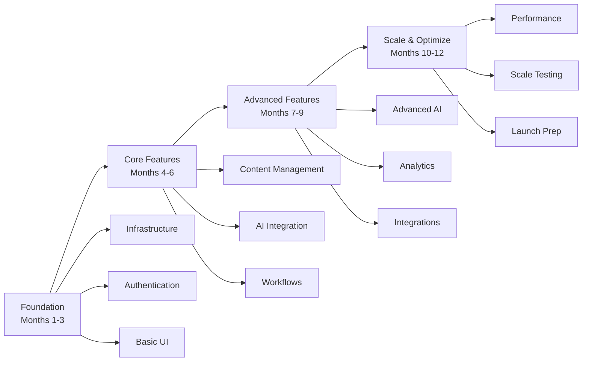

# MixerAI 2.0 Implementation Roadmap
## Phased Delivery Plan and Release Strategy

Version: 1.0  
Date: December 2024  
[← Back to Index](./00-MASTER-INDEX.md) | [Related: Testing Strategy](./11-TESTING-STRATEGY.md)

---

## 📋 Table of Contents

1. [Implementation Overview](#1-implementation-overview)
2. [Phase 1: Foundation (Months 1-3)](#2-phase-1-foundation-months-1-3)
3. [Phase 2: Core Features (Months 4-6)](#3-phase-2-core-features-months-4-6)
4. [Phase 3: Advanced Features (Months 7-9)](#4-phase-3-advanced-features-months-7-9)
5. [Phase 4: Scale & Optimize (Months 10-12)](#5-phase-4-scale--optimize-months-10-12)
6. [Resource Planning](#6-resource-planning)
7. [Risk Management](#7-risk-management)
8. [Success Metrics](#8-success-metrics)
9. [Go-to-Market Strategy](#9-go-to-market-strategy)
10. [Post-Launch Roadmap](#10-post-launch-roadmap)

---

## 1. Implementation Overview

### 1.1 Strategic Approach



### 1.2 Guiding Principles

```yaml
Development Principles:
  - Iterative Development: 2-week sprints
  - Continuous Integration: Daily builds
  - Progressive Deployment: Feature flags
  - User Feedback: Weekly demos
  - Quality First: No technical debt
  
Architecture Principles:
  - Cloud-Native: Kubernetes from day 1
  - API-First: All features via API
  - Security by Design: Built-in, not bolted-on
  - Scalable Foundation: 10x growth ready
  - Observable Systems: Metrics everywhere
  
Team Principles:
  - Cross-Functional: Full-stack teams
  - Autonomous: Empowered decisions
  - Collaborative: Daily standups
  - Learning Culture: Innovation time
  - Documentation: Write as you go
```

### 1.3 Development Methodology

```yaml
Agile Framework:
  Methodology: Scrum with Kanban elements
  Sprint Length: 2 weeks
  Ceremonies:
    - Sprint Planning: Monday Week 1
    - Daily Standup: 9:30 AM
    - Sprint Review: Friday Week 2
    - Retrospective: Friday Week 2
    
Release Cadence:
  Development: Continuous deployment
  Staging: Daily releases
  Production: Bi-weekly releases
  Hotfixes: As needed (< 4 hours)
  
Quality Gates:
  Code Review: Required for all PRs
  Test Coverage: Minimum 80%
  Security Scan: Must pass
  Performance Test: No regression
  Documentation: Updated
```

---

## 2. Phase 1: Foundation (Months 1-3)

### 2.1 Infrastructure Setup

#### Month 1: Core Infrastructure
```yaml
Week 1-2: Platform Foundation
  Deliverables:
    - Vercel team account setup
    - Supabase project creation
    - GitHub repository structure
    - Vercel-GitHub integration
    - Environment configuration
  
  Success Criteria:
    - Preview deployments working
    - Staging and production environments
    - Automatic deployments on push
    
Week 3-4: Database & Auth Setup
  Deliverables:
    - Supabase schema with RLS policies
    - Authentication configuration
    - Storage buckets setup
    - Environment variables managed
    - Database migrations tooling
  
  Success Criteria:
    - RLS policies tested and working
    - Auth flows functional
    - Automatic backups confirmed
```

#### Month 2: Authentication & Core Services
```yaml
Week 5-6: Authentication System
  Deliverables:
    - JWT-based authentication
    - User registration/login
    - Password reset flow
    - Session management
    - Basic MFA support
  
  Success Criteria:
    - Secure authentication working
    - Session renewal automated
    - Account lockout implemented
    
Week 7-8: User & Brand Management
  Deliverables:
    - User CRUD operations
    - Brand creation and setup
    - Role-based permissions
    - Multi-brand user assignment
    - Basic admin panel
  
  Success Criteria:
    - Users can belong to multiple brands
    - Permissions enforced at API level
    - Admin can manage all entities
```

#### Month 3: UI Foundation & API Gateway
```yaml
Week 9-10: Frontend Foundation
  Deliverables:
    - Next.js application setup
    - Component library foundation
    - Authentication UI
    - Dashboard shell
    - Responsive layout system
  
  Success Criteria:
    - Login/logout working
    - Basic navigation functional
    - Mobile responsive
    
Week 11-12: API Gateway & Integration
  Deliverables:
    - API Gateway configuration
    - Rate limiting implementation
    - GraphQL endpoint setup
    - API documentation (OpenAPI)
    - SDK foundation
  
  Success Criteria:
    - All APIs behind gateway
    - Rate limiting enforced
    - API docs auto-generated
```

### 2.2 Phase 1 Milestones

```typescript
interface Phase1Milestones {
  infrastructure: {
    deadline: 'Month 1, Week 4',
    criteria: [
      'All environments operational',
      'CI/CD delivering to all environments',
      'Monitoring and alerting active',
      'Security scans passing'
    ]
  },
  
  authentication: {
    deadline: 'Month 2, Week 4',
    criteria: [
      'Users can register and login',
      'MFA available for setup',
      'Password reset working',
      'Sessions properly managed'
    ]
  },
  
  foundation: {
    deadline: 'Month 3, Week 4',
    criteria: [
      'Basic UI navigable',
      'API Gateway protecting all services',
      'Multi-brand structure working',
      'Phase 2 ready to begin'
    ]
  }
}
```

---

## 3. Phase 2: Core Features (Months 4-6)

### 3.1 Content Management System

#### Month 4: Basic Content Operations
```yaml
Week 13-14: Content CRUD
  Deliverables:
    - Content creation interface
    - Rich text editor integration
    - Content listing and filtering
    - Basic search functionality
    - Version control system
  
  Success Criteria:
    - Users can create/edit content
    - Autosave functioning
    - Version history visible
    
Week 15-16: Template System
  Deliverables:
    - Template creation UI
    - Field type definitions
    - Template assignment to brands
    - Dynamic form generation
    - Template library
  
  Success Criteria:
    - Templates define content structure
    - Forms generated from templates
    - Templates shareable across brands
```

#### Month 5: AI Integration
```yaml
Week 17-18: Basic AI Features
  Deliverables:
    - Azure OpenAI integration
    - Content generation from templates
    - Field-level regeneration
    - Loading states and error handling
    - Token usage tracking
  
  Success Criteria:
    - AI generates quality content
    - Brand voice maintained
    - Errors handled gracefully
    
Week 19-20: AI Enhancement Tools
  Deliverables:
    - SEO metadata generation
    - Alt text generator
    - Title suggestions
    - Basic transcreation
    - AI activity dashboard
  
  Success Criteria:
    - All AI tools functional
    - Multi-language support working
    - Usage tracked and displayed
```

#### Month 6: Workflow Engine
```yaml
Week 21-22: Workflow Builder
  Deliverables:
    - Visual workflow designer
    - Step configuration UI
    - Role-based assignments
    - Email notifications
    - Basic workflow templates
  
  Success Criteria:
    - Workflows created visually
    - Assignments notify users
    - Basic approval flow works
    
Week 23-24: Workflow Execution
  Deliverables:
    - Task management interface
    - Review and approval UI
    - Comment system
    - Workflow history
    - Status tracking
  
  Success Criteria:
    - Content flows through workflow
    - All participants can act
    - Full audit trail maintained
```

### 3.2 Phase 2 Milestones

```typescript
interface Phase2Milestones {
  contentManagement: {
    deadline: 'Month 4, Week 4',
    criteria: [
      'Full content lifecycle working',
      'Templates driving content creation',
      'Search and filter functional',
      'Performance targets met'
    ]
  },
  
  aiIntegration: {
    deadline: 'Month 5, Week 4',
    criteria: [
      'AI generates brand-aligned content',
      'All enhancement tools working',
      'Multi-language support active',
      'Cost tracking implemented'
    ]
  },
  
  workflows: {
    deadline: 'Month 6, Week 4',
    criteria: [
      'Complex workflows possible',
      'All roles can participate',
      'Notifications working',
      'Analytics capturing data'
    ]
  }
}
```

---

## 4. Phase 3: Advanced Features (Months 7-9)

### 4.1 Advanced AI & Claims

#### Month 7: Claims Management
```yaml
Week 25-26: Claims System
  Deliverables:
    - Claims hierarchy UI
    - Country-specific rules
    - Claim import/export
    - Replacement rules engine
    - Claims matrix view
  
  Success Criteria:
    - Claims validate content
    - Country rules applied
    - Matrix view functional
    
Week 27-28: AI Compliance
  Deliverables:
    - AI claims review
    - Compliance scoring
    - Suggested alternatives
    - Guardrail enforcement
    - Compliance dashboard
  
  Success Criteria:
    - AI validates compliance
    - Suggestions are helpful
    - Guardrails prevent issues
```

#### Month 8: Analytics & Reporting
```yaml
Week 29-30: Analytics Platform
  Deliverables:
    - Real-time dashboards
    - Content analytics
    - User activity tracking
    - AI usage analytics
    - Custom report builder
  
  Success Criteria:
    - Dashboards load < 2s
    - Data is real-time
    - Exports available
    
Week 31-32: Business Intelligence
  Deliverables:
    - Executive dashboards
    - Trend analysis
    - Predictive insights
    - ROI calculations
    - Scheduled reports
  
  Success Criteria:
    - Insights are actionable
    - Reports auto-delivered
    - Data accuracy verified
```

#### Month 9: Integrations & Mobile
```yaml
Week 33-34: Third-Party Integrations
  Deliverables:
    - SSO implementation
    - CRM integration
    - DAM connectors
    - Marketing platform APIs
    - Webhook system
  
  Success Criteria:
    - SSO with major providers
    - Bi-directional sync working
    - Webhooks reliable
    
Week 35-36: Mobile Experience
  Deliverables:
    - Progressive Web App
    - Mobile-optimized UI
    - Offline capabilities
    - Push notifications
    - Mobile-specific features
  
  Success Criteria:
    - Full functionality on mobile
    - Offline mode works
    - Performance acceptable
```

### 4.2 Phase 3 Milestones

```typescript
interface Phase3Milestones {
  claimsCompliance: {
    deadline: 'Month 7, Week 4',
    criteria: [
      'Claims system fully operational',
      'AI compliance checking accurate',
      'Multi-country support working',
      'Performance targets met'
    ]
  },
  
  analytics: {
    deadline: 'Month 8, Week 4',
    criteria: [
      'All dashboards functional',
      'Real-time data flowing',
      'Reports generating accurately',
      'Insights driving value'
    ]
  },
  
  ecosystem: {
    deadline: 'Month 9, Week 4',
    criteria: [
      'Major integrations complete',
      'Mobile experience polished',
      'Platform extensible',
      'Ready for scale testing'
    ]
  }
}
```

---

## 5. Phase 4: Scale & Optimize (Months 10-12)

### 5.1 Performance & Scale

#### Month 10: Performance Optimization
```yaml
Week 37-38: Frontend Optimization
  Deliverables:
    - Bundle size optimization
    - Lazy loading implementation
    - CDN configuration
    - Image optimization
    - Cache strategy implementation
  
  Success Criteria:
    - Page load < 2.5s
    - Lighthouse score > 90
    - Bundle size < 500KB
    
Week 39-40: Backend Optimization
  Deliverables:
    - Query optimization
    - Database indexing
    - Caching layer tuning
    - API response optimization
    - Resource pooling
  
  Success Criteria:
    - API response < 200ms p95
    - Database queries < 50ms
    - Zero N+1 queries
```

#### Month 11: Scale Testing
```yaml
Week 41-42: Load Testing
  Deliverables:
    - Load test scenarios
    - 10,000 user simulation
    - Bottleneck identification
    - Auto-scaling verification
    - Performance benchmarks
  
  Success Criteria:
    - Handle 10,000 concurrent users
    - Auto-scaling works properly
    - No performance degradation
    
Week 43-44: Stress Testing
  Deliverables:
    - Failure scenario testing
    - Cascade failure prevention
    - Recovery testing
    - Data integrity verification
    - DR drill execution
  
  Success Criteria:
    - Graceful degradation
    - Recovery within RTO
    - No data loss
```

#### Month 12: Launch Preparation
```yaml
Week 45-46: Security & Compliance
  Deliverables:
    - Penetration testing
    - Security audit completion
    - Compliance certification
    - Documentation finalization
    - Training materials
  
  Success Criteria:
    - All security issues resolved
    - Compliance achieved
    - Documentation complete
    
Week 47-48: Go-Live Preparation
  Deliverables:
    - Production deployment
    - Monitoring enhancement
    - Support team training
    - Launch plan execution
    - Marketing alignment
  
  Success Criteria:
    - Production environment stable
    - Support team ready
    - Launch plan approved
```

### 5.2 Phase 4 Milestones

```typescript
interface Phase4Milestones {
  performance: {
    deadline: 'Month 10, Week 4',
    criteria: [
      'All performance targets met',
      'Optimization complete',
      'User experience smooth',
      'Mobile performance excellent'
    ]
  },
  
  scalability: {
    deadline: 'Month 11, Week 4',
    criteria: [
      'Load tests passing',
      'Auto-scaling verified',
      'Failure recovery tested',
      'DR procedures validated'
    ]
  },
  
  launch: {
    deadline: 'Month 12, Week 4',
    criteria: [
      'Security certified',
      'Compliance achieved',
      'Team trained',
      'Platform production-ready'
    ]
  }
}
```

---

## 6. Resource Planning

### 6.1 Team Structure

```yaml
Core Development Team:
  Engineering Lead: 1
  Backend Engineers: 6
  Frontend Engineers: 4
  Full-Stack Engineers: 4
  DevOps Engineers: 3
  QA Engineers: 4
  
Specialist Roles:
  Security Engineer: 1
  AI/ML Engineer: 2
  Database Administrator: 1
  Performance Engineer: 1
  
Product & Design:
  Product Manager: 2
  UX Designer: 2
  UI Designer: 1
  Technical Writer: 1
  
Management & Support:
  Project Manager: 1
  Scrum Master: 2
  Engineering Manager: 2
  
Total Headcount: 35
```

### 6.2 Budget Allocation

```yaml
Development Costs (12 months):
  Salaries: $5,400,000 (35 people @ $150k average)
  Contractors: $600,000 (specialized skills)
  Training: $100,000
  Total: $6,100,000
  
Infrastructure Costs:
  Vercel Pro: $20/user/month + usage = $30,000
  Supabase Pro: $25/project x 3 = $900/month = $10,800
  Additional Bandwidth/Functions: $60,000
  Monitoring (Sentry, Datadog): $50,000
  Total: $150,800
  
Third-Party Services:
  AI Services (Azure OpenAI): $100,000
  Email (Resend): $20,000
  Vercel KV (Redis): $10,000
  Other APIs: $20,000
  Total: $150,000
  
Other Costs:
  Security Audits: $100,000
  Legal/Compliance: $150,000
  Marketing Prep: $200,000
  Contingency (10%): $680,000
  Total: $1,130,000
  
Grand Total: $7,530,800
```

### 6.3 Skill Requirements

```typescript
interface SkillMatrix {
  technical: {
    required: [
      'Node.js/TypeScript (80% of team)',
      'React/Next.js (all frontend)',
      'PostgreSQL (30% expert level)',
      'Kubernetes (all DevOps)',
      'AI/ML (specialist team)',
      'Security (20% of team)'
    ],
    nice_to_have: [
      'Rust (performance critical)',
      'Go (infrastructure)',
      'Python (AI/ML)',
      'Mobile development'
    ]
  },
  
  domain: {
    required: [
      'Enterprise SaaS',
      'Content Management',
      'Multi-tenant systems',
      'Marketing technology'
    ]
  },
  
  soft_skills: {
    required: [
      'Agile experience',
      'Communication skills',
      'Problem solving',
      'Team collaboration'
    ]
  }
}
```

---

## 7. Risk Management

### 7.1 Technical Risks

```yaml
High-Priority Risks:
  
  AI Service Reliability:
    Probability: Medium
    Impact: High
    Mitigation:
      - Multi-provider strategy
      - Fallback mechanisms
      - Response caching
      - SLA negotiations
    
  Scalability Challenges:
    Probability: Medium
    Impact: High
    Mitigation:
      - Early load testing
      - Architecture reviews
      - Auto-scaling setup
      - Performance budgets
    
  Security Vulnerabilities:
    Probability: Low
    Impact: Critical
    Mitigation:
      - Security-first design
      - Regular audits
      - Automated scanning
      - Bug bounty program
```

### 7.2 Business Risks

```yaml
Market Risks:
  
  Competitor Movement:
    Probability: High
    Impact: Medium
    Mitigation:
      - Rapid feature delivery
      - Unique AI capabilities
      - Strong partnerships
      - Customer lock-in features
    
  Adoption Challenges:
    Probability: Medium
    Impact: High
    Mitigation:
      - Beta customer program
      - Extensive training
      - Migration assistance
      - Success team
```

### 7.3 Operational Risks

```yaml
Team Risks:
  
  Key Person Dependency:
    Probability: Medium
    Impact: Medium
    Mitigation:
      - Knowledge sharing
      - Pair programming
      - Documentation
      - Cross-training
    
  Hiring Challenges:
    Probability: High
    Impact: Medium
    Mitigation:
      - Competitive packages
      - Remote options
      - Contractor network
      - University partnerships
```

---

## 8. Success Metrics

### 8.1 Development Metrics

```yaml
Velocity Metrics:
  Sprint Velocity: 150+ story points
  Release Frequency: Bi-weekly
  Lead Time: < 5 days
  Cycle Time: < 3 days
  
Quality Metrics:
  Defect Rate: < 5 per sprint
  Test Coverage: > 80%
  Code Review Time: < 4 hours
  Technical Debt: < 5%
  
Team Metrics:
  Team Satisfaction: > 4.0/5
  On-time Delivery: > 90%
  Burnout Rate: < 5%
  Knowledge Sharing: Weekly
```

### 8.2 Product Metrics

```yaml
Phase 1 Success:
  Infrastructure Up: 100%
  Auth Working: 100%
  UI Navigable: 100%
  
Phase 2 Success:
  Content Creation: < 5 min
  AI Generation: < 10s
  Workflow Setup: < 15 min
  
Phase 3 Success:
  Analytics Loading: < 2s
  Integration Setup: < 30 min
  Mobile Performance: > 90 score
  
Phase 4 Success:
  Load Capacity: 10k users
  Uptime: 99.9%
  Security: Zero critical issues
```

### 8.3 Business Metrics

```yaml
Customer Acquisition:
  Beta Customers: 10+
  Pilot Success: 80%
  Reference Customers: 5+
  Case Studies: 3+
  
Platform Usage:
  Monthly Active Users: 1,000+
  Content Created: 10,000+
  AI Generations: 50,000+
  Workflow Completions: 5,000+
  
Business Impact:
  Customer Satisfaction: > 4.5/5
  Time to Value: < 30 days
  ROI Demonstration: 3x
  Renewal Intent: > 90%
```

---

## 9. Go-to-Market Strategy

### 9.1 Pre-Launch (Months 10-11)

```yaml
Beta Program:
  Target: 10 enterprise customers
  Duration: 3 months
  Support: Dedicated success team
  Feedback: Weekly sessions
  
Marketing Preparation:
  Website: New design launch
  Content: 50+ pieces ready
  Demos: Recorded and live
  Events: 3 major conferences
  
Sales Enablement:
  Training: 2-week bootcamp
  Materials: Complete deck
  Pricing: Finalized model
  Contracts: Legal approved
```

### 9.2 Launch Plan (Month 12)

```yaml
Week 1: Soft Launch
  - Beta customers go live
  - Press embargo lifts
  - Website updates live
  - Support team ready
  
Week 2: Public Announcement
  - Press release
  - Social media campaign
  - Email campaigns
  - Webinar series
  
Week 3-4: Momentum Building
  - Customer testimonials
  - Case study releases
  - Analyst briefings
  - Partner announcements
```

### 9.3 Post-Launch (Months 13+)

```yaml
Month 13-15: Growth Phase
  - Feature velocity maintained
  - Customer onboarding scaled
  - Support processes refined
  - Feedback incorporated
  
Month 16-18: Expansion Phase
  - International markets
  - Enterprise features
  - Partner ecosystem
  - Platform APIs
  
Month 19-24: Market Leadership
  - Industry recognition
  - Thought leadership
  - Strategic acquisitions
  - IPO preparation
```

---

## 10. Post-Launch Roadmap

### 10.1 Year 2 Priorities

```yaml
Q1 2026:
  - Advanced Analytics AI
  - Predictive Content Performance
  - Auto-optimization Engine
  - Enterprise SSO Providers
  
Q2 2026:
  - Video Content Support
  - Voice Generation
  - Advanced Personalization
  - API Marketplace
  
Q3 2026:
  - Multi-region Deployment
  - White-label Options
  - Advanced Security Features
  - Blockchain Integration
  
Q4 2026:
  - AI Model Customization
  - Industry Verticals
  - Acquisition Integration
  - Platform 3.0 Planning
```

### 10.2 Long-Term Vision

```yaml
3-Year Goals:
  - Market leader position
  - 1000+ enterprise customers
  - $150M+ ARR
  - Global presence
  - IPO ready
  
5-Year Vision:
  - Industry standard platform
  - AI innovation leader
  - Ecosystem of 100+ integrations
  - Expansion into adjacent markets
  - $500M+ valuation
```

---

## 📊 Implementation Dashboard

### Phase Progress Tracker
| Phase | Start | End | Status | Completion |
|-------|-------|-----|--------|------------|
| Foundation | Month 1 | Month 3 | 🟢 On Track | 0% |
| Core Features | Month 4 | Month 6 | ⏳ Pending | 0% |
| Advanced Features | Month 7 | Month 9 | ⏳ Pending | 0% |
| Scale & Optimize | Month 10 | Month 12 | ⏳ Pending | 0% |

### Risk Status
| Risk | Probability | Impact | Mitigation | Status |
|------|-------------|--------|------------|--------|
| AI Reliability | Medium | High | Multi-provider | 🟡 Monitoring |
| Scalability | Medium | High | Early testing | 🟢 Controlled |
| Security | Low | Critical | Continuous audit | 🟢 Controlled |
| Hiring | High | Medium | Multiple channels | 🟡 Monitoring |

---

## ✅ Launch Readiness Checklist

### Technical Readiness
- [ ] All features implemented and tested
- [ ] Performance targets achieved
- [ ] Security audit passed
- [ ] Scalability verified
- [ ] Monitoring comprehensive
- [ ] Documentation complete

### Business Readiness
- [ ] Pricing finalized
- [ ] Sales team trained
- [ ] Marketing materials ready
- [ ] Support team prepared
- [ ] Legal requirements met
- [ ] Beta customers successful

### Operational Readiness
- [ ] Runbooks documented
- [ ] On-call rotation set
- [ ] Escalation paths defined
- [ ] SLAs established
- [ ] Backup procedures tested
- [ ] Communication plan ready

---

[← Back to Index](./00-MASTER-INDEX.md) | [Related: Testing Strategy](./11-TESTING-STRATEGY.md)