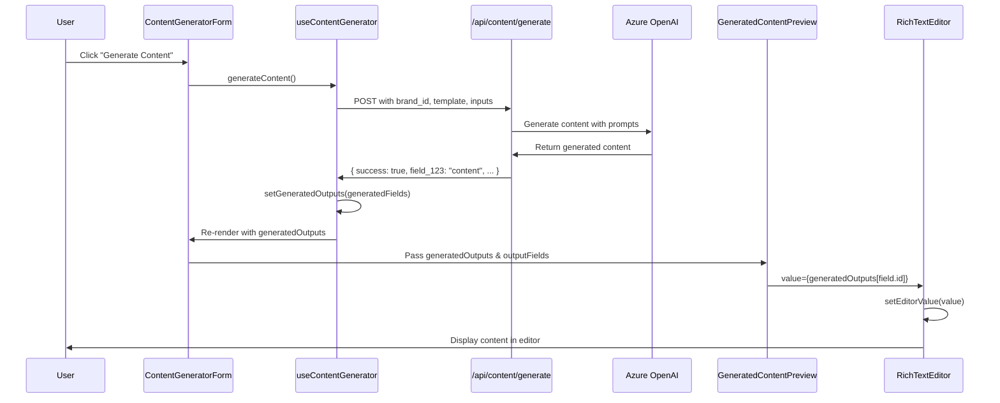

# Content Generation Flow Documentation

This document explains how content generation works in MixerAI 2.0, from user interaction to displaying generated content in the React Quill editor.

## Overview

The content generation flow involves:
1. User selecting a brand and filling template fields
2. Making an API call to generate content
3. Managing state with the `useContentGenerator` hook
4. Displaying generated content in a rich text editor (React Quill)

## 1. User Interface Components

### Content Generation Form (`/src/components/content/content-generator-form-refactored.tsx`)

The main form component that orchestrates the content generation process:

```tsx
export function ContentGeneratorForm({ templateId }: ContentGeneratorFormProps) {
  const {
    // State
    isLoading,
    selectedBrand,
    generatedOutputs,
    template,
    templateFieldValues,
    
    // Actions
    generateContent,
    handleTemplateFieldChange,
  } = useContentGenerator(templateId);

  const handleGenerateContent = async () => {
    if (!selectedBrand) {
      toast.error('Please select a brand before generating content');
      return;
    }
    
    await generateContent();
  };

  return (
    <div className="space-y-6">
      {/* Brand selection and input fields */}
      <Button onClick={handleGenerateContent}>Generate Content</Button>
      
      {/* Display generated content when available */}
      {Object.keys(generatedOutputs).length > 0 && (
        <GeneratedContentPreview
          generatedOutputs={generatedOutputs}
          outputFields={template?.outputFields || []}
          onOutputChange={(fieldId, value) => 
            setGeneratedOutputs(prev => ({ ...prev, [fieldId]: value }))
          }
        />
      )}
    </div>
  );
}
```

## 2. State Management Hook

### useContentGenerator Hook (`/src/hooks/use-content-generator.ts`)

This hook manages all the state and logic for content generation:

```tsx
export function useContentGenerator(templateId: string | null | undefined) {
  const [generatedOutputs, setGeneratedOutputs] = useState<Record<string, NormalizedContent>>({});
  const [selectedBrand, setSelectedBrand] = useState<string>('');
  const [templateFieldValues, setTemplateFieldValues] = useState<Record<string, string>>({});

  const generateContent = useCallback(async () => {
    if (!selectedBrand || !template) {
      toast.error('Please select a brand and ensure template is loaded');
      return;
    }
    
    setIsLoading(true);
    setGeneratedOutputs({}); // Clear previous outputs
    
    try {
      // Prepare input fields with values
      const input_fields_with_values = (template.inputFields || []).map(field => ({
        ...field,
        value: templateFieldValues[field.id] || ''
      }));

      const response = await fetch('/api/content/generate', {
        method: 'POST',
        headers: { 'Content-Type': 'application/json' },
        body: JSON.stringify({
          brand_id: selectedBrand,
          template: {
            id: template.id,
            name: template.name,
            inputFields: input_fields_with_values,
            outputFields: template.outputFields || []
          },
          input: {
            product_context: productContext,
          }
        }),
      });
      
      const data = await response.json();
      
      if (data.success) {
        const normalized = normalizeOutputsMap(
          data.generatedOutputs as Record<string, unknown>,
          template.outputFields || []
        );

        if (Object.keys(normalized).length > 0) {
          setGeneratedOutputs(normalized); // THIS IS WHERE CONTENT IS SET
          toast.success('Content generated successfully!');
        }
      }
    } catch (error) {
      console.error('Generation error:', error);
      setAiError(errorMessage);
    } finally {
      setIsLoading(false);
    }
  }, [selectedBrand, template, templateFieldValues, productContext]);

  return {
    generatedOutputs,
    generateContent,
    // ... other state and functions
  };
}
```

## 3. API Endpoint

### Content Generation API (`/src/app/api/content/generate/route.ts`)

The API endpoint that handles content generation requests:

```tsx
export const POST = withAuthAndMonitoring(async (request: NextRequest, user) => {
  try {
    const data: ContentGenerationRequest = await request.json();
    
    // Log incoming request for debugging
    console.log('Brand ID:', data.brand_id);
    console.log('Template:', data.template?.name);
    console.log('Input Fields:', data.template?.inputFields);
    
    // Fetch brand details
    const supabase = createSupabaseAdminClient();
    const { data: brandData } = await supabase
      .from('brands')
      .select('name, brand_identity, tone_of_voice, guardrails, language, country')
      .eq('id', data.brand_id)
      .single();

    // Generate content using Azure OpenAI
    const generatedContent = await generateContentFromTemplate(
      data.template,
      data.input,
      brandData
    );

    // Return generated content with field IDs as keys
    // Example response structure:
    // {
    //   "success": true,
    //   "field_abc123": "<p>Generated HTML content for main body</p>",
    //   "field_xyz789": "Generated meta description text",
    //   "userId": "user_123"
    // }
    
    return NextResponse.json({
      success: true,
      ...generatedContent,
      userId: user.id
    });
  } catch (error) {
    return handleApiError(error);
  }
});
```

## 4. Generated Content Display

### GeneratedContentPreview Component (`/src/components/content/generated-content-preview.tsx`)

This component displays the generated content and allows editing:

```tsx
export function GeneratedContentPreview({
  generatedOutputs,  // Record<string, string> - fieldId -> content
  outputFields,      // Array of output field definitions
  onOutputChange,
  onRetry,
}: GeneratedContentPreviewProps) {
  
  return (
    <div className="space-y-6">
      {outputFields.map((field) => {
        const value = generatedOutputs[field.id] || '';  // Get content by field ID
        
        return (
          <div key={field.id} className="space-y-2">
            <Label>{field.name}</Label>
            
            {field.type === 'richText' ? (
              <>
                {/* Debug output (temporary) */}
                <div className="mb-2 p-2 bg-yellow-50 border border-yellow-200 rounded text-xs">
                  <p className="font-semibold">Debug - Raw HTML (length: {value?.length || 0}):</p>
                  <pre className="mt-1 overflow-auto max-h-32">{value?.substring(0, 500)}</pre>
                </div>
                
                {/* Rich Text Editor */}
                <RichTextEditor
                  value={value}
                  onChange={(content) => onOutputChange(field.id, content)}
                  placeholder="Generated content will appear here"
                />
              </>
            ) : (
              // Plain text display
              <div className="p-4 border rounded-md bg-muted/50">
                <p className="text-sm whitespace-pre-wrap">{value}</p>
              </div>
            )}
          </div>
        );
      })}
    </div>
  );
}
```

## 5. React Quill Integration

### RichTextEditor Component (`/src/components/content/rich-text-editor.tsx`)

The wrapper component for React Quill:

```tsx
export function RichTextEditor({
  value,
  onChange,
  placeholder,
}: RichTextEditorProps) {
  const [isReady, setIsReady] = React.useState(false);
  const [editorValue, setEditorValue] = React.useState(value || '');
  const isFirstRender = React.useRef(true);
  
  // Update editor when prop changes (after first render)
  React.useEffect(() => {
    if (!isFirstRender.current && value !== editorValue) {
      console.log('=== RichTextEditor: Updating value ===');
      console.log('New value length:', value?.length || 0);
      setEditorValue(value || '');
    }
    isFirstRender.current = false;
  }, [value]);
  
  const handleChange = (newValue: string) => {
    console.log('=== RichTextEditor: onChange ===');
    setEditorValue(newValue);
    onChange(newValue);
  };
  
  return (
    <div className={className}>
      <ReactQuill 
        theme="snow"
        value={editorValue}
        onChange={handleChange}
        modules={defaultModules}
        formats={defaultFormats}
        placeholder={placeholder}
      />
    </div>
  );
}
```

## 6. Data Flow Sequence



## 7. Common Issues and Debugging

### Issue: Content not appearing in React Quill

**Possible Causes:**
1. Field ID mismatch between API response and template output fields
2. State not updating after API call
3. React Quill not re-initializing with new content
4. Empty or malformed HTML content

**Debugging Steps:**

1. **Check API Response**:
```javascript
// In useContentGenerator hook, after line 271:
console.log('API Response:', data);
console.log('Generated Fields:', generatedFields);
console.log('Field IDs:', Object.keys(generatedFields));
```

2. **Monitor State Updates**:
```javascript
// Add this effect to useContentGenerator:
useEffect(() => {
  console.log('=== generatedOutputs STATE CHANGED ===');
  console.log('New generatedOutputs:', generatedOutputs);
  console.log('Keys:', Object.keys(generatedOutputs));
}, [generatedOutputs]);
```

3. **Verify Field Mapping**:
```javascript
// In GeneratedContentPreview, log field matching:
outputFields.map((field) => {
  const value = generatedOutputs[field.id] || '';
  console.log(`Field ${field.id} (${field.name}):`, value ? 'has content' : 'empty');
});
```

4. **Check React Quill Updates**:
```javascript
// The RichTextEditor already has debug logs at lines 75-77 and 83-85
// Check browser console for these logs
```

### Issue: Content generates but displays as empty

**Check:**
- API response structure matches expected format
- Field IDs in template match those in API response
- Content is not being cleared by auto-regeneration logic
- HTML content is properly formatted

### Key Files for Debugging

1. `/src/hooks/use-content-generator.ts` - State management
2. `/src/components/content/generated-content-preview.tsx` - Content display
3. `/src/components/content/rich-text-editor.tsx` - React Quill wrapper
4. `/src/app/api/content/generate/route.ts` - API endpoint
5. `/scripts/debug-ui-display-issue.js` - Debug helper code

## 8. Expected API Response Format

The API should return generated content with field IDs as keys:

```json
{
  "success": true,
  "field_abc123": "<h1>Article Title</h1><p>This is the main content...</p>",
  "field_xyz789": "Meta description for SEO",
  "field_def456": "Short summary text",
  "userId": "user_123"
}
```

The hook extracts these fields and sets them in state:
```javascript
const { success, userId, error, ...generatedFields } = data;
setGeneratedOutputs(generatedFields);
```

This allows the Preview component to access content by field ID:
```javascript
const value = generatedOutputs[field.id] || '';
```
